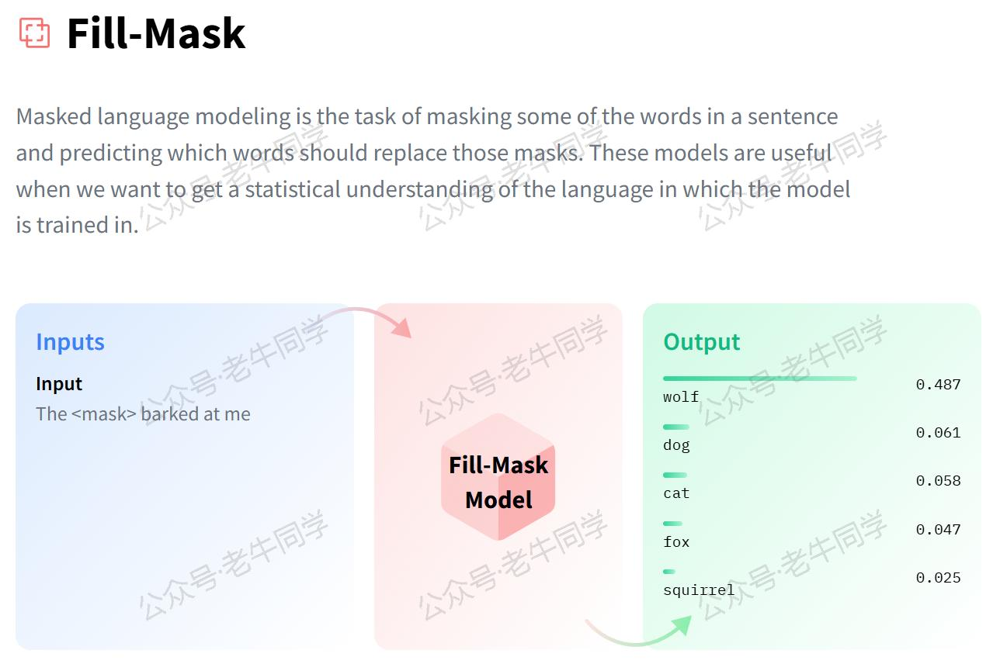
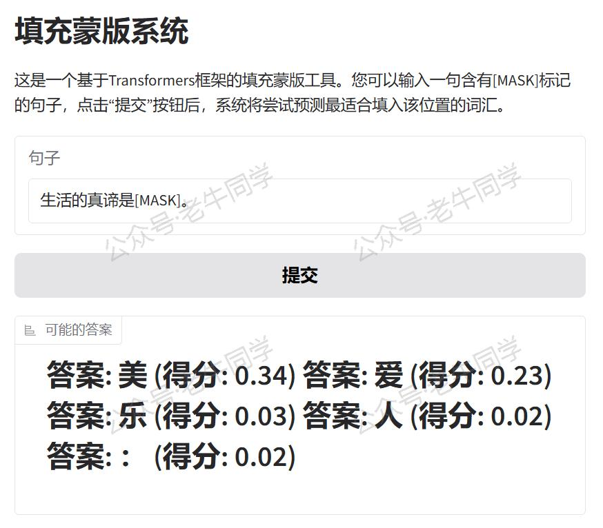
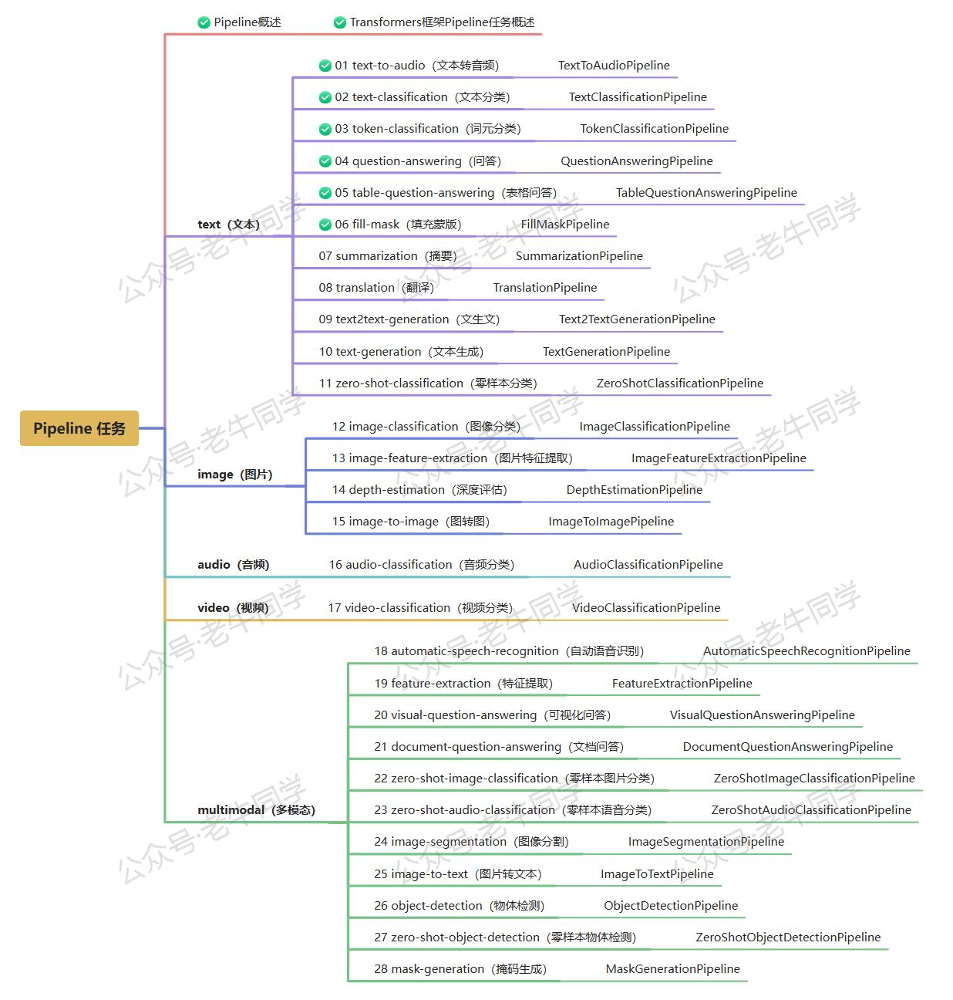

+++
slug = "2024122501"
date = "2024-12-25"
lastmod = "2024-12-25"
title = "Transformers 框架 Pipeline 任务详解（六）：填充蒙版（fill-mask）"
description = "本文介绍了Hugging Face Transformers框架中的fill-mask任务，涵盖其作用、应用场景如机器翻译和文本补全，以及配置方法。通过Python代码示例展示了如何使用预训练模型自动下载或本地加载来创建Pipeline并执行填空任务。此外，还提供了利用Gradio构建WebUI界面的指南，使用户能直观地测试和演示fill-mask功能。文章旨在帮助开发者快速实现高效的填空解决方案……"
image = "00.jpg"
tags = [ "AI", "transformers", "Pipeline", "填充蒙版" ]
categories = [ "人工智能" ]
+++

在自然语言处理（NLP）领域，填空或填补句子中的缺失部分是一项重要的任务。它不仅考验了模型对语言的理解能力，还展示了其生成合理且语义连贯的文本的能力。Hugging Face 的 Transformers 框架通过其 Pipeline API 提供了强大的`fill-mask`功能，允许开发者和研究者轻松构建并应用这种填空技术。本文将详细介绍 Transformers 框架中的`fill-mask`任务，涵盖任务描述、应用场景、配置指南以及实战案例。



# 1. 任务简介

`fill-mask`任务旨在根据上下文预测句子中被遮蔽（mask）的词汇。例如：

- **文学创作**：当给出“[MASK] is the capital of France.”时，系统应当能够预测出“Paris”。
- **语言学习**：对于学习新语言的学生来说，可以用来练习语法结构和词汇选择，如“Je [MASK] à l'école tous les jours.”（我每天都去学校）。

为了完成这一任务，通常需要以下步骤：

1. **输入解析**：识别句子中被标记为`[MASK]`的位置。
2. **上下文理解**：分析句子的上下文，包括前后词语的关系、句法结构等。
3. **词汇预测**：基于对上下文的理解，从词汇表中选出最合适的词来填补空白。

根据 Hugging Face 官网的数据，当前已有**13,576 个**预训练模型支持`fill-mask`任务，这些模型已经在大量的文本数据上进行了微调，以更好地适应特定的任务需求。


# 2. 应用场景

填充蒙版任务的应用非常广泛，以下是几个典型的应用实例：

- **机器翻译**：帮助改进翻译质量，确保译文更加流畅自然。
- **文本补全**：用于自动完成功能，提高用户输入效率，如在搜索引擎或聊天机器人中。
- **教育工具**：作为语言学习辅助工具，增强学生对单词和短语的记忆。
- **内容推荐**：根据用户的阅读历史，预测他们可能感兴趣的主题词，从而提供个性化的内容推荐。
- **智能写作助手**：协助作家克服创作瓶颈，提供灵感启发，比如续写故事或完善段落。

# 3. 任务配置

在 Transformers 框架中，`fill-mask`任务的配置同样直观易懂。下面是配置示例代码片段（位于`./transformers/pipelines/__init__.py`文件）：

```python
SUPPORTED_TASKS = {
    # 其他省略......

    "fill-mask": {
        "impl": FillMaskPipeline,
        "tf": (TFAutoModelForMaskedLM,) if is_tf_available() else (),
        "pt": (AutoModelForMaskedLM,) if is_torch_available() else (),
        "default": {
            "model": {
                "pt": ("distilbert/distilroberta-base", "fb53ab8"),
                "tf": ("distilbert/distilroberta-base", "fb53ab8"),
            }
        },
        "type": "text",
    },

    # 其他省略......
}
```

默认情况下，Transformers 框架会使用`distilroberta-base`作为`fill-mask`任务的预训练模型。这个模型是基于 BERT 架构，在大规模英语语料库上训练而成，特别适合英文的填空任务。

# 4. 填充蒙版实战

确保您已经安装了 Transformers 库和其他必要的依赖包：

```shell
pip install transformers torch
```

## 方法一：自动下载模型

如果您的网络环境允许，可以直接从 Hugging Face 下载模型并创建 Pipeline 任务。如下老牛同学使用 Hugging Face 镜像网站自动下载模型：

```python
import os

# 设置代理
os.environ["HF_ENDPOINT"] = "https://hf-mirror.com"

# 设置本地缓存目录
cache_dir = os.path.join('D:', os.path.sep, 'ModelSpace', 'Cache')
os.environ['HF_HOME'] = cache_dir

from transformers import pipeline

# 创建Pipeline任务
nlp = pipeline("fill-mask", model="google-bert/bert-base-chinese")

# 执行填充蒙版任务
if __name__ == "__main__":
    result = nlp("生活的真谛是[MASK]。")

    print(result)
```

输出结果直接给出了模型认为的最佳答案文本，在这个例子中：输入是`生活的真谛是[MASK]。`，给出了多个输出：

```json
[
  {
    'score': 0.34068214893341064,
    'token': 5401,
    'token_str': '美',
    'sequence': '生 活 的 真 谛 是 美 。'
  },
  {
    'score': 0.22919395565986633,
    'token': 4263,
    'token_str': '爱',
    'sequence': '生 活 的 真 谛 是 爱 。'
  },
  {
    'score': 0.03254768252372742,
    'token': 727,
    'token_str': '乐',
    'sequence': '生 活 的 真 谛 是 乐 。'
  },
  {
    'score': 0.022956570610404015,
    'token': 782,
    'token_str': '人',
    'sequence': '生 活 的 真 谛 是 人 。'
  },
  {
    'score': 0.01942041702568531,
    'token': 8038,
    'token_str': '：',
    'sequence': '生 活 的 真 谛 是 ： 。'
  }
]
```

对于输出结果对象的元素，详细说明如下：

1. `sequence`：完整填充后的句子。
2. `score`：模型对该填充选项的信心程度，值越大表示越有信心。
3. `token`：填充词汇对应的 token ID，在词汇表中的位置。
4. `token_str`：填充词汇内容。

## 方法二：自主下载模型

如果您希望使用本地模型文件，可以按照以下步骤操作：

```python
from transformers import AutoTokenizer, AutoModelForMaskedLM, pipeline
import os

# 下载模型目录
model_dir = '/models/fill_mask'

# 加载分词器和模型
tokenizer = AutoTokenizer.from_pretrained(model_dir, local_files_only=True)
model = AutoModelForMaskedLM.from_pretrained(model_dir, torch_dtype="auto", device_map="auto", local_files_only=True)

# 创建Pipeline任务
nlp = pipeline("fill-mask", tokenizer=tokenizer, model=model)

# 后续用法与自动下载相同
```

# 5. WebUI 界面

为了让`fill-mask` Pipeline 任务更易于使用或演示，我们可以使用 Gradio 创建一个直观的 WebUI 界面。以下是创建界面的代码示例：

```python
import sys

# 直接复用Pipeline实例
sys.path.append("./")
pipeline = __import__("06-fill-mask")

import gradio as gr


# 定义填充蒙版函数
def fill_mask(sentence):
    result = pipeline.nlp(sentence)
    return "\n".join([f"可能的答案: {r['sequence']} (得分: {r['score']:.2f})" for r in result])

# 创建Gradio界面
with gr.Blocks() as demo:
    gr.Markdown("# 填充蒙版系统")
    gr.Markdown(
        "这是一个基于Transformers框架的填充蒙版工具。您可以输入一句含有[MASK]标记的句子，点击“提交”按钮后，系统将尝试预测最适合填入该位置的词汇。")

    with gr.Row():
        input_sentence = gr.Textbox(placeholder="请输入含有[MASK]标记的句子...", label="句子")

    with gr.Row():
        submit_button = gr.Button("提交")

    with gr.Row():
        output_answer = gr.Label(label="可能的答案")

    # 设置按钮点击事件，触发填充蒙版函数
    submit_button.click(fill_mask, inputs=[input_sentence], outputs=output_answer)

# 启动Gradio应用
if __name__ == "__main__":
    demo.launch()
```

运行上述代码，我们可以看到 URL 信息：

```shell
* Running on local URL:  http://127.0.0.1:7860

To create a public link, set `share=True` in `launch()`.
```

通过浏览器打开地址，就可以通过可视化的方式进行填充蒙版实验了。



我们可以用如下句子样例来测试 Fill Mask：

- 输入：“生活的真谛是[MASK]。”
- 答案有：“美”、“爱”、“乐”、“人”等

如果想要分享给更多人，可以在 `launch()` 函数中设置 `share=True` 参数，Gradio 将生成一个公开链接供他人访问。

# 6. 总结

本文全面介绍了 Transformers 框架中的`fill-mask`任务，从基础概念到实际应用，再到如何构建和部署一个交互式的填充蒙版系统。无论是在机器翻译、文本补全还是教育工具等领域，Transformers 框架都能为我们提供强有力的支持，助力我们快速实现高效的填充蒙版解决方案。

老牛同学将持续为大家带来更多有关 Pipeline 任务的文章（共**28**篇）。如果您有任何疑问或建议，请随时在评论区留言交流！



---

Transformers 框架：

<small>[01.包和对象加载中的设计巧思与实用技巧](https://mp.weixin.qq.com/s/lAAIfl0YJRNrppp5-Vuusw)</small>

<small>[02.AutoModel 初始化及 Qwen2.5 模型加载全流程](https://mp.weixin.qq.com/s/WIbbrkf1HjVC1CtBNcU8Ow)</small>

<small>[03.Qwen2.5 大模型的 AutoTokenizer 技术细节](https://mp.weixin.qq.com/s/Shg30uUFByM0tKTi0rETfg)</small>

<small>[04.Qwen2.5/GPT 分词流程与 BPE 分词算法技术细节](https://mp.weixin.qq.com/s/GnoHXsIYKYFU1Xo4u5sE1w)</small>

<small>[05.嵌入（Embedding）机制和 Word2Vec 实战](https://mp.weixin.qq.com/s/qL9vpmNIM1eO9_lQq7QwlA)</small>

Pipeline NLP 任务：

<small>[零·概述](https://mp.weixin.qq.com/s/FR4384AZV2FE2xtweSh9bA) 丨 [01.文本转音频](https://mp.weixin.qq.com/s/uN2BFIOxDFEh4T-W7tsPbg) 丨 [02.文本分类](https://mp.weixin.qq.com/s/9ccEDNfeGNf_Q9pO0Usg2w) 丨 [03.词元分类和命名实体识别](https://mp.weixin.qq.com/s/r2uFCwPZaMeDL_eiQsEmIQ) 丨 [04.问答](https://mp.weixin.qq.com/s/vOLVxRircw5wM1_rCqoAfg) 丨 [05.表格问答](https://mp.weixin.qq.com/s/Q0fWdw3ACVzQFldBScZ2Fw)</small>

往期推荐文章：

<small>[Bolt.new 用一句话快速构建全栈应用：本地部署与应用实战（Ollama/Qwen2.5 等）](https://mp.weixin.qq.com/s/Mq8CvZKdpokbj3mK-h_SAQ)</small>

<small>[基于 Qwen2.5-Coder 模型和 CrewAI 多智能体框架，实现智能编程系统的实战教程](https://mp.weixin.qq.com/s/8f3xna9TRmxMDaY_cQhy8Q)</small>

<small>[vLLM CPU 和 GPU 模式署和推理 Qwen2 等大语言模型详细教程](https://mp.weixin.qq.com/s/KM-Z6FtVfaySewRTmvEc6w)</small>

<small>[基于 Qwen2/Lllama3 等大模型，部署团队私有化 RAG 知识库系统的详细教程（Docker+AnythingLLM）](https://mp.weixin.qq.com/s/PpY3k3kReKfQdeOJyrB6aw)</small>

<small>[使用 Llama3/Qwen2 等开源大模型，部署团队私有化 Code Copilot 和使用教程](https://mp.weixin.qq.com/s/vt1EXVWtwm6ltZVYtB4-Tg)</small>

<small>[基于 Qwen2 大模型微调技术详细教程（LoRA 参数高效微调和 SwanLab 可视化监控）](https://mp.weixin.qq.com/s/eq6K8_s9uX459OeUcRPEug)</small>

<small>[ChatTTS 长音频合成和本地部署 2 种方式，让你的“儿童绘本”发声的实战教程](https://mp.weixin.qq.com/s/9ldLuh3YLvx8oWvwnrSGUA)</small>


