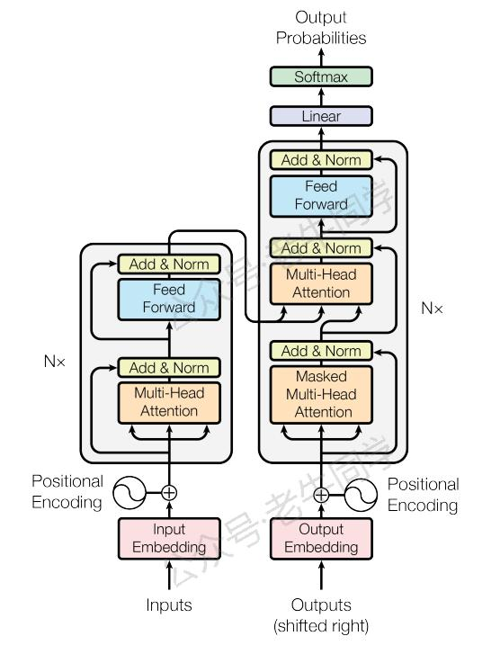
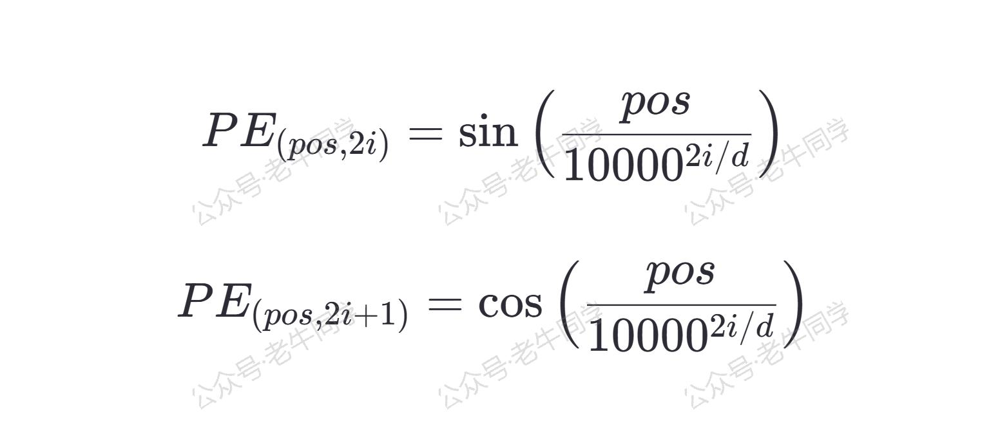
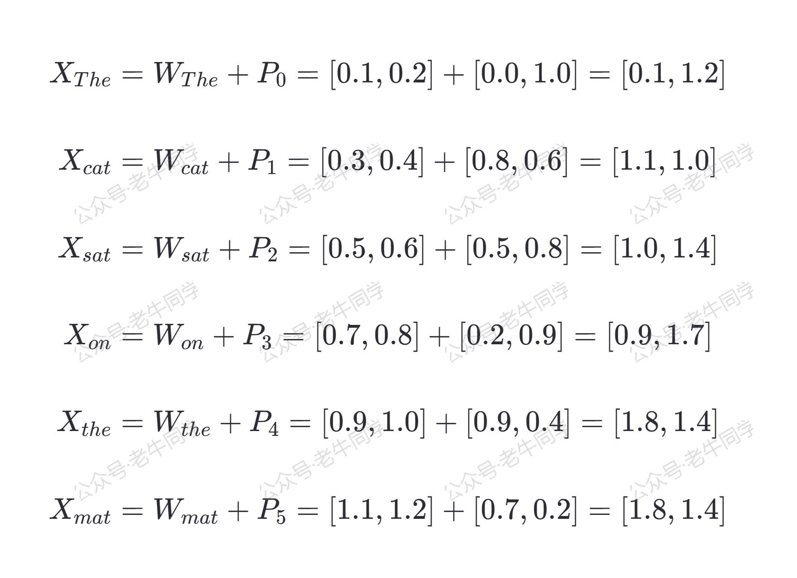

+++
slug = "2024122701"
date = "2024-12-27"
lastmod = "2024-12-27"
title = "深度解析 Transformer 模型中的位置嵌入（Positional Embedding）"
description = "在自然语言处理中，词语的顺序对句子的意义至关重要。然而，传统的自注意力机制无法区分词语的位置。本文深入浅出地介绍了**位置嵌入（Positional Embedding）**的概念及其在Transformer模型中的作用，解释了它如何帮助模型理解词语的顺序，从而提升文本处理的准确性。通过简单的例子和代码实现，带你一步步了解位置嵌入的原理与应用。无论你是NLP初学者还是进阶研究者，这篇文章都将为你揭开Transformer架构中这一关键组件的神秘面纱……"
image = "00.jpg"
tags = [ "AI", "transformers", "Embedding", "位置嵌入" ]
categories = [ "人工智能" ]
+++

在上一篇中，我们探讨了 **[词嵌入（Word Embedding）](https://mp.weixin.qq.com/s/qL9vpmNIM1eO9_lQq7QwlA)** ，它根据词嵌入矩阵将文本序列转换为数值向量，使得计算机能够理解和处理自然语言。现在，让我们进一步了解**位置嵌入（Positional Embedding）**，这是让 Transformer 模型“知晓”词语顺序的关键。



# 1. 位置嵌入的作用

想象一下，如果我们只用词嵌入，那么无论一个词出现在句子的开头还是结尾，它的表示都是相同的。然而，在自然语言中，词语的位置往往影响其意义。例如，“苹果”在“我吃了一个苹果”和“苹果公司发布了新产品”这两个句子中的含义截然不同。因此，我们需要一种机制来告诉模型这些信息，这就是**位置嵌入**的作用。

位置嵌入通过给每个词赋予一个与它在句子中位置相关的独特向量，使得模型不仅能够捕捉到词语的语义，还能理解它们之间的相对顺序，从而更好地建模句子结构和依赖关系。

# 2. 位置嵌入的原理

为了让模型能够学习到位置信息，最直接的方法是为每个位置分配一个固定的、预定义的向量。在原始的 Transformer 模型中，位置嵌入是由**正弦**和**余弦**函数组成的，这样设计的原因在于它具有周期性，可以帮助模型处理比训练时更长的序列，同时保持一定的泛化能力。

具体来说，对于模型维度 **_d_** 、位置 **_pos_** 和维度 **_i_**，位置嵌入 **_PE(<small>pos, 2i</small>)_**（偶数维）和 **_PE(<small>pos, 2i+1</small>)_** （奇数维）分别由以下公式计算：



下面是位置嵌入计算的 Python 代码实现：

```python
import torch
import torch.nn as nn
import math

class PositionalEncoding(nn.Module):
    def __init__(self, d_model, max_len=5000):
        super(PositionalEncoding, self).__init__()

        # 创建一个位置编码矩阵 [max_len, d_model]
        pe = torch.zeros(max_len, d_model)

        position = torch.arange(0, max_len, dtype=torch.float).unsqueeze(1)  # [max_len, 1]
        div_term = torch.exp(torch.arange(0, d_model, 2).float() * (-math.log(10000.0) / d_model))  # [d_model/2]

        pe[:, 0::2] = torch.sin(position * div_term)  # 偶数维
        pe[:, 1::2] = torch.cos(position * div_term)  # 奇数维

        pe = pe.unsqueeze(0)  # [1, max_len, d_model]
        self.register_buffer('pe', pe)  # 不作为模型参数更新

    def forward(self, x):
        seq_len = x.size(1)
        x = x + self.pe[:, :seq_len, :]
        return x
```

这段代码创建了一个`PositionalEncoding`类，用于生成位置嵌入，并将其添加到输入的词嵌入上。`d_model`是模型的维度，而`max_len`则是可以处理的最大序列长度。

# 3. 词嵌入和位置嵌入的作用

为了更好地理解词嵌入和位置嵌入是如何协作的，我们以一句简单的英语句子为例：“The cat sat on the mat.”。首先，我们会将每个词转换成对应的词嵌入向量；然后，为每个词添加与其位置相关的位置嵌入；最后，我们将两者相加，得到最终的隐藏层输入向量。

**特别注意：**

- 为了方便演示，老牛同学此处简化为**2 维**，实际预训练模型的隐藏层远不止 2 维（如：Qwen2.5 有 1536 维）。
- 同时，我们把 Token 简化为单词，实际使用的分词算法，如 **[BPE 分词算法](https://mp.weixin.qq.com/s/GnoHXsIYKYFU1Xo4u5sE1w)**，Token 可能并不一定与单词相同。

## 步骤一：词嵌入

首先，我们需要将句子中的每个词转换为词嵌入，假设我们得到了如下简化版的词嵌入向量（实际预训练模型的维度远高于此）：

```plaintext
W{The} = [0.1, 0.2]
W{cat} = [0.3, 0.4]
W{sat} = [0.5, 0.6]
W{on}  = [0.7, 0.8]
W{the} = [0.9, 1.0]
W{mat} = [1.1, 1.2]
```

## 步骤二：位置嵌入

接下来，我们需要为每个词添加位置嵌入。我们可以根据上述公式计算出每个位置的嵌入向量。假设我们得到了如下位置嵌入向量（同样简化为**2 维**）：

```plaintext
P_0 = [0.0, 1.0]
P_1 = [0.8, 0.6]
P_2 = [0.5, 0.8]
P_3 = [0.2, 0.9]
P_4 = [0.9, 0.4]
P_5 = [0.7, 0.2]
```

## 步骤三：词嵌入 + 位置嵌入

现在，我们将词嵌入和位置嵌入相加，得到最终的输入向量。这一步操作使得每个词的表示不仅包含了其语义信息，还包含了它在句子中的位置信息。具体来说，我们有：

```plaintext
X{The} = W{The} + P_0 = [0.1, 0.2] + [0.0, 1.0] = [0.1, 1.2]
X{cat} = W{cat} + P_1 = [0.3, 0.4] + [0.8, 0.6] = [1.1, 1.0]
X{sat} = W{sat} + P_2 = [0.5, 0.6] + [0.5, 0.8] = [1.0, 1.4]
X{on}  = W{on}  + P_3 = [0.7, 0.8] + [0.2, 0.9] = [0.9, 1.7]
X{the} = W{the} + P_4 = [0.9, 1.0] + [0.9, 0.4] = [1.8, 1.4]
X{mat} = W{mat} + P_5 = [1.1, 1.2] + [0.7, 0.2] = [1.8, 1.4]
```



## 步骤四：隐藏层的输入

最终，这些带有位置信息的词嵌入向量 **X<small>The</small>**, **X<small>cat</small>**, **X<small>sat</small>**, **X<small>on</small>**, **X<small>the</small>**, **X<small>mat</small>** 将作为 Transformer 模型的隐藏层的输入。通过这种方式，模型不仅能够理解每个词的语义，还能捕捉到它们在句子中的相对位置，从而更好地建模句子的结构和依赖关系。

# 4. 总结

位置嵌入是现代 NLP 模型中不可或缺的一部分，它使得模型能够理解词语的顺序，进而提升对文本的理解能力。通过引入位置嵌入，Transformer 架构克服了传统自注意力机制对词序“不可知”的局限，为各种自然语言处理任务提供了强有力的支持。

希望这篇文章能帮助你更深入地理解位置嵌入及其在 Transformer 模型中的作用。如果你还有任何疑问或想要了解更多细节，请随时留言交流！


---

Transformers 框架序列：

<small>[01.包和对象加载中的设计巧思与实用技巧](https://mp.weixin.qq.com/s/lAAIfl0YJRNrppp5-Vuusw)</small>

<small>[02.AutoModel 初始化及 Qwen2.5 模型加载全流程](https://mp.weixin.qq.com/s/WIbbrkf1HjVC1CtBNcU8Ow)</small>

<small>[03.Qwen2.5 大模型的 AutoTokenizer 技术细节](https://mp.weixin.qq.com/s/Shg30uUFByM0tKTi0rETfg)</small>

<small>[04.Qwen2.5/GPT 分词流程与 BPE 分词算法技术细节详解](https://mp.weixin.qq.com/s/GnoHXsIYKYFU1Xo4u5sE1w)</small>

<small>[05.嵌入（Embedding）机制和 Word2Vec 实战](https://mp.weixin.qq.com/s/qL9vpmNIM1eO9_lQq7QwlA)</small>

Pipeline NLP 任务序列：

<small>[零·概述](https://mp.weixin.qq.com/s/FR4384AZV2FE2xtweSh9bA) 丨 [01.文本转音频](https://mp.weixin.qq.com/s/uN2BFIOxDFEh4T-W7tsPbg) 丨 [02.文本分类](https://mp.weixin.qq.com/s/9ccEDNfeGNf_Q9pO0Usg2w) 丨 [03.词元分类和命名实体识别](https://mp.weixin.qq.com/s/r2uFCwPZaMeDL_eiQsEmIQ) 丨 [04.问答](https://mp.weixin.qq.com/s/vOLVxRircw5wM1_rCqoAfg) 丨 [05.表格问答](https://mp.weixin.qq.com/s/Q0fWdw3ACVzQFldBScZ2Fw) | [06.填充蒙版](https://mp.weixin.qq.com/s/hMFCgYovHPVFOjOoihaUHw)</small>

往期推荐文章：

<small>[Bolt.new 用一句话快速构建全栈应用：本地部署与应用实战（Ollama/Qwen2.5 等）](https://mp.weixin.qq.com/s/Mq8CvZKdpokbj3mK-h_SAQ)</small>

<small>[基于 Qwen2.5-Coder 模型和 CrewAI 多智能体框架，实现智能编程系统的实战教程](https://mp.weixin.qq.com/s/8f3xna9TRmxMDaY_cQhy8Q)</small>

<small>[vLLM CPU 和 GPU 模式署和推理 Qwen2 等大语言模型详细教程](https://mp.weixin.qq.com/s/KM-Z6FtVfaySewRTmvEc6w)</small>

<small>[基于 Qwen2/Lllama3 等大模型，部署团队私有化 RAG 知识库系统的详细教程（Docker+AnythingLLM）](https://mp.weixin.qq.com/s/PpY3k3kReKfQdeOJyrB6aw)</small>

<small>[使用 Llama3/Qwen2 等开源大模型，部署团队私有化 Code Copilot 和使用教程](https://mp.weixin.qq.com/s/vt1EXVWtwm6ltZVYtB4-Tg)</small>

<small>[基于 Qwen2 大模型微调技术详细教程（LoRA 参数高效微调和 SwanLab 可视化监控）](https://mp.weixin.qq.com/s/eq6K8_s9uX459OeUcRPEug)</small>

<small>[ChatTTS 长音频合成和本地部署 2 种方式，让你的“儿童绘本”发声的实战教程](https://mp.weixin.qq.com/s/9ldLuh3YLvx8oWvwnrSGUA)</small>


