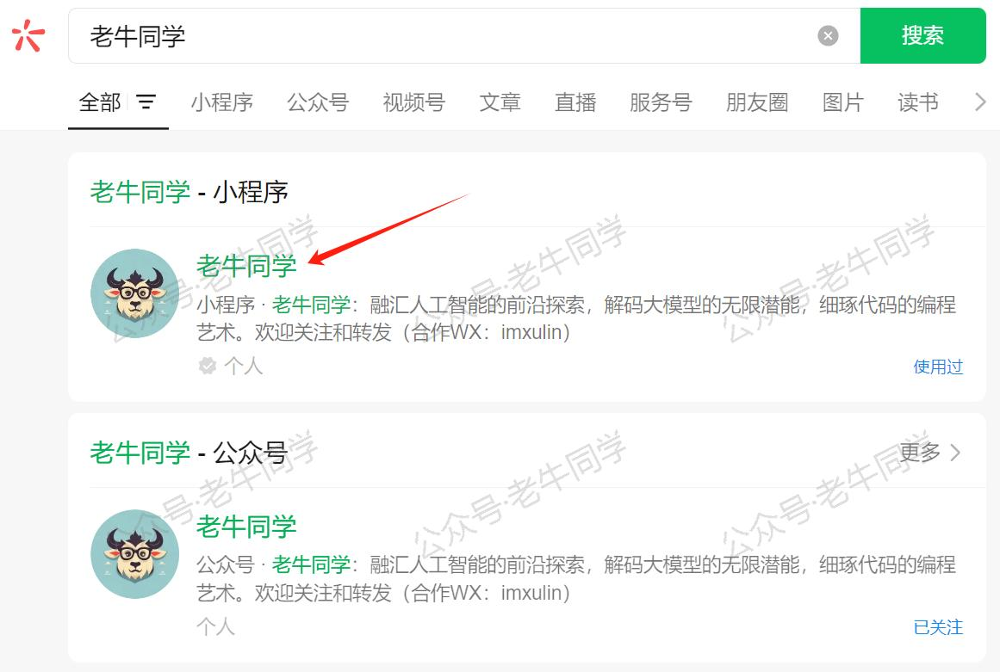
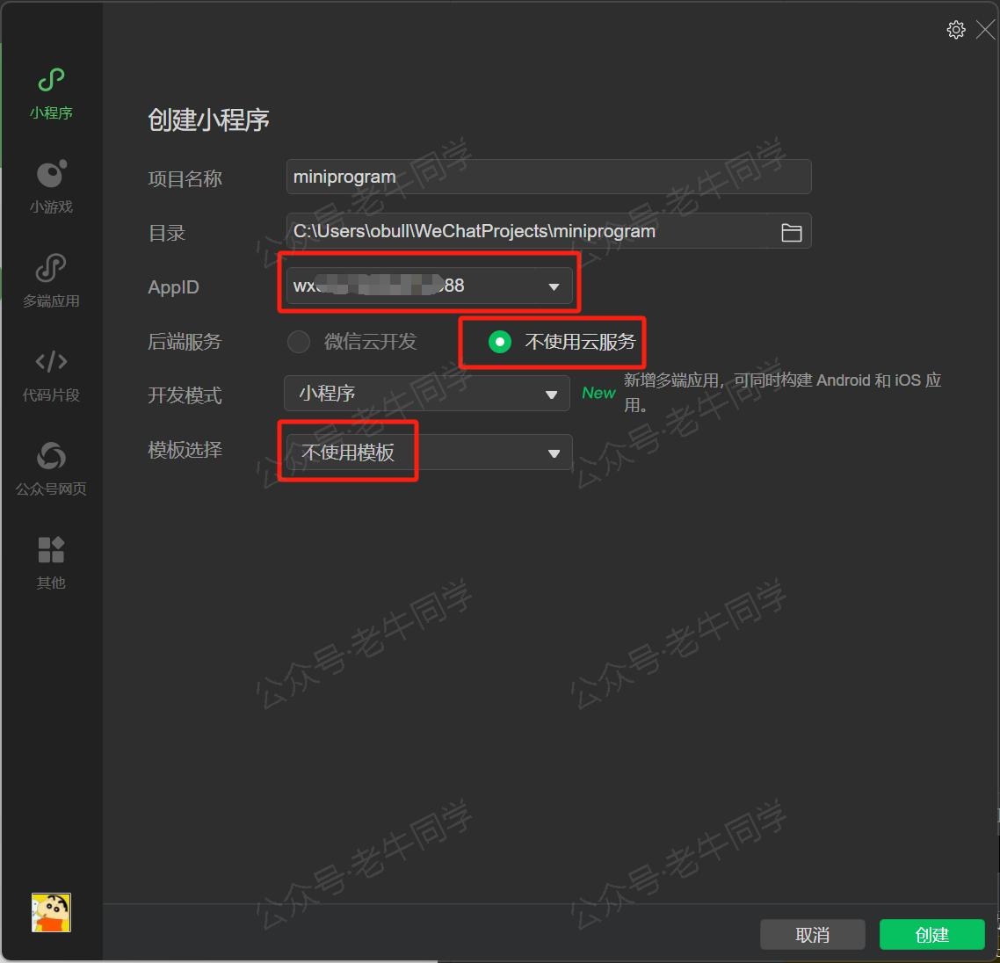
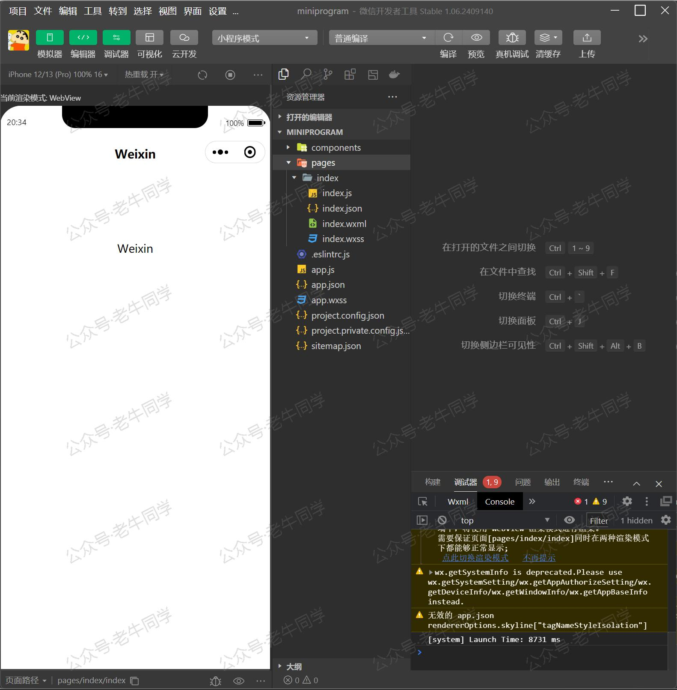
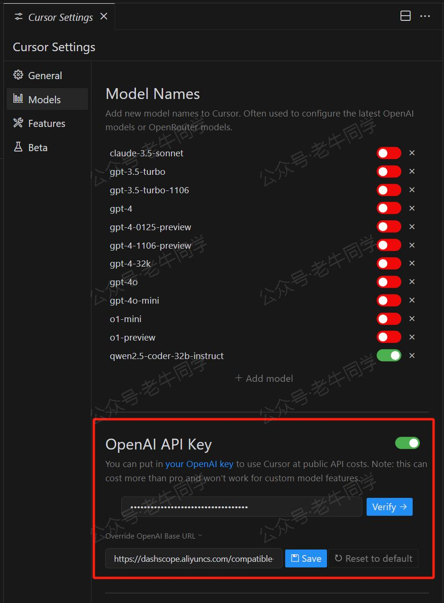
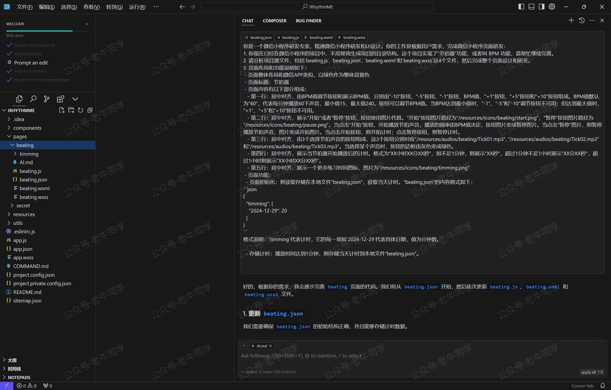
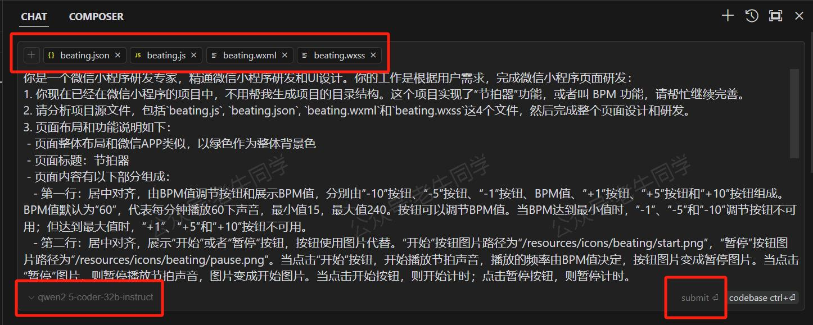
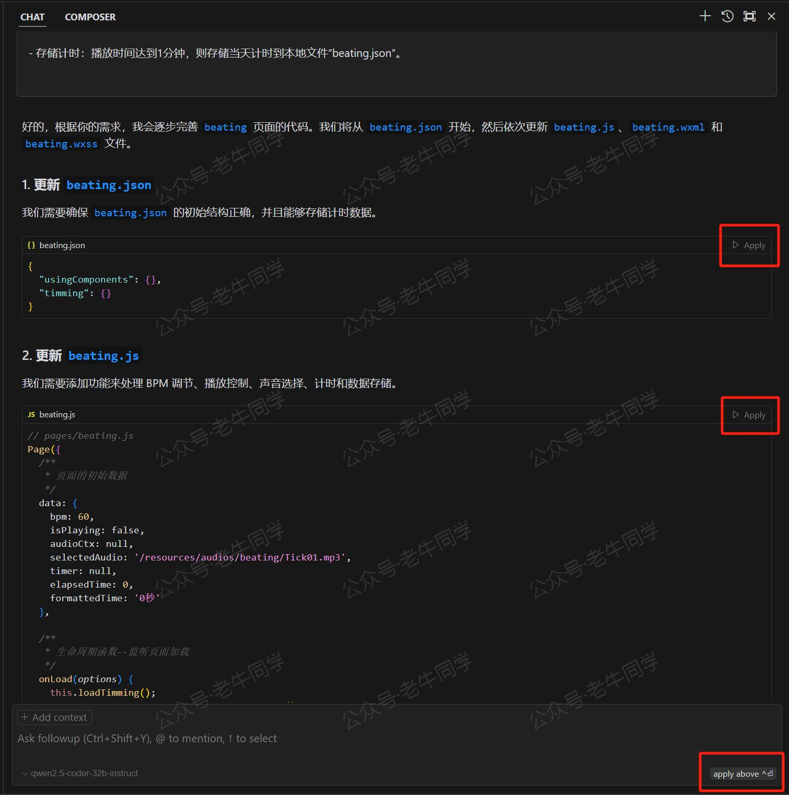

+++
slug = "2025010301"
date = "2025-01-03"
lastmod = "2025-01-03"
title = "使用Cursor + Qwen2.5 大模型 零经验研发微信小程序：自由构建个性化节拍器应用实战"
description = "本文介绍了如何利用Cursor工具结合Qwen2.5大模型快速开发一款个性化的微信小程序——老牛同学节拍器。通过详细的步骤，我们展示了从零开始创建一个功能完备的小程序所需的全部流程……"
image = "01.jpg"
tags = [ "AI", "节拍器", "Cursor", "Qwen" ]
categories = [ "人工智能" ]
+++

最近，小朋友开始学习小提琴，需要一个节拍器来帮助他练习。老牛同学下载了好几个节拍器应用，里面的广告实在是太多了，简直无从下手操作，就算老牛同学是慎之又慎，但还是中招，被运营商扣费。

因此，老牛同学决定自己动手，定制一个专属的微信小程序节拍器。虽然老牛同学没有微信小程序的研发经验，但是借助强大的 AI 工具，最终，还是成功研发完成并上线了：



【老牛同学小程序 · 节拍器 视频】

# 1. 开发环境搭建

## 安装必要的开发工具

为了实现高效开发，我们选择了以下两个主要工具：

- **微信开发者工具**：用于实时预览和调试小程序，确保代码可以在微信环境中正常运行。
- **Cursor**：这是一个集成大模型的智能代码编辑器，能够根据提示词自动生成或优化代码，大大提高了开发效率。

下载地址：

- 微信开发者工具：[官方下载链接](https://developers.weixin.qq.com/miniprogram/dev/devtools/download.html)
- Cursor：[官方网站](https://www.cursor.com)

请务必完成注册并登录到 Cursor 平台，以便使用其全部功能。

## 配置开发环境

### 微信开发者工具配置

启动微信开发者工具后，创建一个新的小程序项目。选择“不使用云服务”和“不适用模板”，以获得更高的灵活性。记得填写正确的**AppID**，这是与微信平台关联的关键信息。



创建完成后，你将进入如下的研发和预览界面，准备好迎接下一步的挑战。



### Cursor 工具配置

打开 Cursor，按照指引配置好**Qwen2.5-Coder-32B**大模型，并选择刚刚创建的小程序目录作为工作区。这样，你就可以在 Cursor 中看到与微信开发者工具一致的文件结构，方便进行同步操作。





# 3. AI 辅助编程实战

现在，让我们一起探索如何利用 AI 的力量来加速开发进程。在 Cursor 中按下`Ctrl` + `i`，打开 Chat 面板，输入精心设计的 Prompt 提示词。以下是老牛同学首次尝试时所用的提示内容：

```plaintext
你是一位资深的微信小程序开发者，擅长UI设计和交互逻辑构建。当前任务是在现有基础上完善一个名为“节拍器”的小程序，它允许用户调整BPM（每分钟拍数），并通过点击按钮控制节拍声的播放与停止。请根据以下要求继续完成页面布局和功能实现：
- 页面标题：节拍器
- 内容布局：
  - 第一行：居中对齐，包括四个按钮（“-10”、“-5”、“+5”、“+10”）用于调节BPM值，默认值设为60。
  - 第二行：显示计时器，格式为“小时:分:秒”。
  - 第三行：“开始”按钮，点击后启动节拍声，频率由BPM值决定。
  - 第四行：“停止”按钮，用于暂停节拍声。
```





提交后，等待 AI 生成代码片段，并通过`Apply`将其应用到项目中。之后，我们切换回**微信开发者工具**界面，默认会自动刷新，或者按`Ctrl` + `r`强制刷新页面，即可查看最新的页面效果。

不断迭代这一过程，直到小程序完全符合预期为止。

# 4. 结语

最后，当我们使用外部 API 服务时，对于涉及敏感数据或有较高保密需求的项目，请务必注意保护用户隐私和数据安全。

通过上述步骤，即使是没有专业背景的人也能轻松上手，借助现代 AI 工具的力量，快速且高效地开发出属于自己的微信小程序。

---

Transformers 框架序列：

<small>[01.包和对象加载中的设计巧思与实用技巧](https://mp.weixin.qq.com/s/lAAIfl0YJRNrppp5-Vuusw)</small>

<small>[02.AutoModel 初始化及 Qwen2.5 模型加载全流程](https://mp.weixin.qq.com/s/WIbbrkf1HjVC1CtBNcU8Ow)</small>

<small>[03.Qwen2.5 大模型的 AutoTokenizer 技术细节](https://mp.weixin.qq.com/s/Shg30uUFByM0tKTi0rETfg)</small>

<small>[04.Qwen2.5/GPT 分词流程与 BPE 分词算法技术细节详解](https://mp.weixin.qq.com/s/GnoHXsIYKYFU1Xo4u5sE1w)</small>

<small>[05.嵌入（Embedding）机制和 Word2Vec 实战](https://mp.weixin.qq.com/s/qL9vpmNIM1eO9_lQq7QwlA)</small>

<small>[06.位置嵌入（Positional Embedding）](https://mp.weixin.qq.com/s/B0__TRnlI7zgwn0OhguvXA)</small>

Pipeline NLP 任务序列：

<small>[零·概述](https://mp.weixin.qq.com/s/FR4384AZV2FE2xtweSh9bA) 丨 [01.文本转音频](https://mp.weixin.qq.com/s/uN2BFIOxDFEh4T-W7tsPbg) 丨 [02.文本分类](https://mp.weixin.qq.com/s/9ccEDNfeGNf_Q9pO0Usg2w) 丨 [03.词元分类和命名实体识别](https://mp.weixin.qq.com/s/r2uFCwPZaMeDL_eiQsEmIQ) 丨 [04.问答](https://mp.weixin.qq.com/s/vOLVxRircw5wM1_rCqoAfg) 丨 [05.表格问答](https://mp.weixin.qq.com/s/Q0fWdw3ACVzQFldBScZ2Fw) | [06.填充蒙版](https://mp.weixin.qq.com/s/hMFCgYovHPVFOjOoihaUHw)</small>

往期推荐文章：

<small>[Bolt.new 用一句话快速构建全栈应用：本地部署与应用实战（Ollama/Qwen2.5 等）](https://mp.weixin.qq.com/s/Mq8CvZKdpokbj3mK-h_SAQ)</small>

<small>[基于 Qwen2.5-Coder 模型和 CrewAI 多智能体框架，实现智能编程系统的实战教程](https://mp.weixin.qq.com/s/8f3xna9TRmxMDaY_cQhy8Q)</small>

<small>[vLLM CPU 和 GPU 模式署和推理 Qwen2 等大语言模型详细教程](https://mp.weixin.qq.com/s/KM-Z6FtVfaySewRTmvEc6w)</small>

<small>[基于 Qwen2/Lllama3 等大模型，部署团队私有化 RAG 知识库系统的详细教程（Docker+AnythingLLM）](https://mp.weixin.qq.com/s/PpY3k3kReKfQdeOJyrB6aw)</small>

<small>[使用 Llama3/Qwen2 等开源大模型，部署团队私有化 Code Copilot 和使用教程](https://mp.weixin.qq.com/s/vt1EXVWtwm6ltZVYtB4-Tg)</small>

<small>[基于 Qwen2 大模型微调技术详细教程（LoRA 参数高效微调和 SwanLab 可视化监控）](https://mp.weixin.qq.com/s/eq6K8_s9uX459OeUcRPEug)</small>

<small>[ChatTTS 长音频合成和本地部署 2 种方式，让你的“儿童绘本”发声的实战教程](https://mp.weixin.qq.com/s/9ldLuh3YLvx8oWvwnrSGUA)</small>


