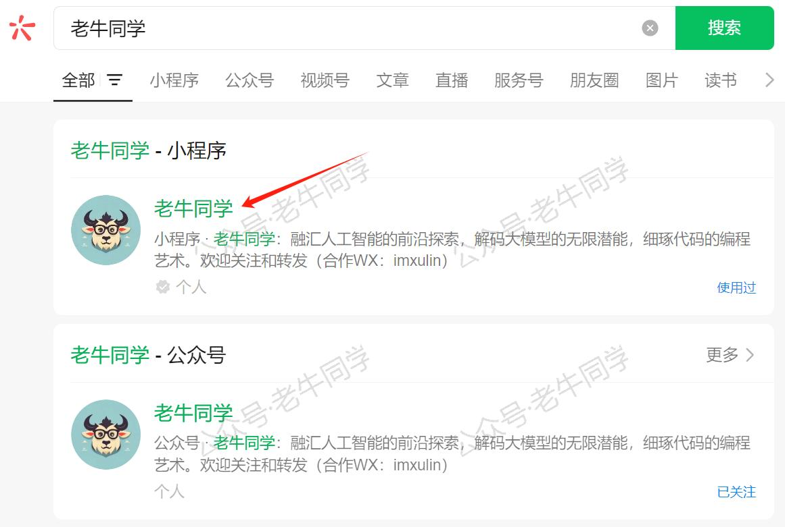
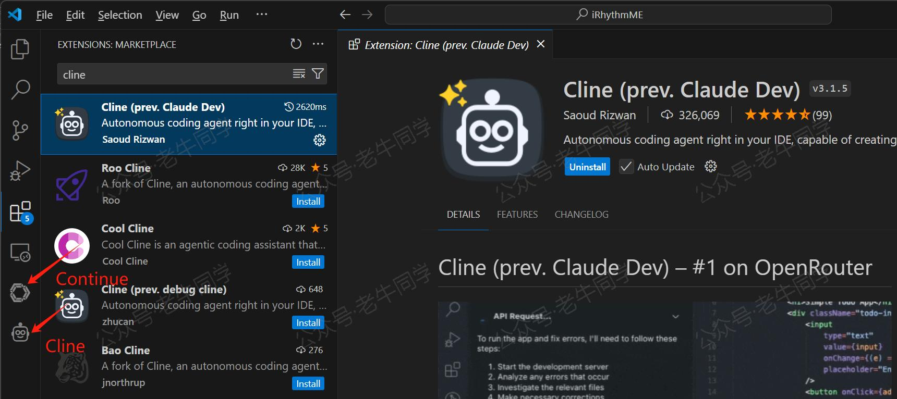
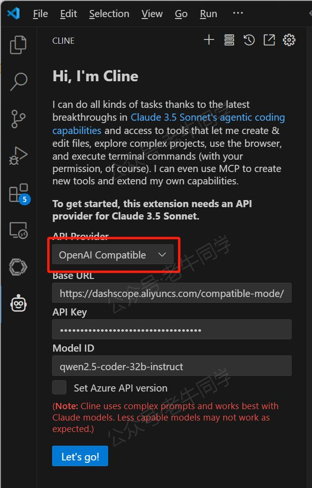
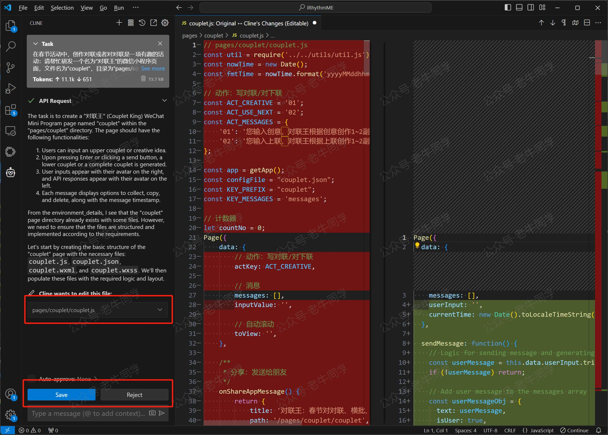

+++
slug = "2025011201"
date = "2025-01-12"
lastmod = "2025-01-12"
title = "Cline 免费插件 + Qwen2.5 大模型，零经验也能开发“对联王”微信小程序"
description = "本文详细介绍了如何利用免费的 Cline 插件辅助开发一款名为“对联王”的微信小程序，特别适合希望在春节期间创作春联的用户。文章不仅比较了 Cline 与 Cursor 两款工具的优缺点，还分享了作者实际操作中的经验和建议。通过具体步骤演示，即使是编程新手也能跟随指导，结合微信开发者工具，完成自己的小程序开发，享受创作的乐趣……"
image = "00.jpg"
tags = [ "AI", "对联王", "Cline", "Qwen", "Continue" ]
categories = [ "人工智能" ]
+++

小朋友即将放寒假了，意味着春节就不远了。在我们湖北老家，当我还是学生的时候，每年临近春节，写春联、贴春联和对春联是读书人一件乐事。

如今，老牛同学早已不是读书人，但还是怀念那时快乐时光，因此想在春节前撸一个“对联王”微信小程序，专门用于创作春联和对春联。

上次零经验的我们，借助 Cursor 写了一个“节拍器”小程序，本次我们来用免费的 Cline 插件，辅助完成“对联王”微信小程序编程。下面是已发布的小程序，欢迎大家来体验：

【对联王微信小程序】

大家也可以在微信中搜索“老牛同学”找到“对联王”小程序：



同时，本次借助 Cline 插件完成的“对联王”小程序的演示录屏如下：

【对联王演示视频，请到公众号或视频号查看】

接下来，老牛同学就把 Cline 插件的使用主要过程，与大家分享。

# 1. Cline 与 Cursor 区别

老牛同学根据自己编写 2 个小程序页面的经验，先说说两者的区别、使用感受和建议：

- 工具形态：Cline 是一个 VS Code 插件，在 VS Code 直接安装或卸载，无需注册即可使用，灵活方便；而 Cursor 则是一个专门的 IDE，需要单独下载并安装，还需要用户注册和登陆方可使用，稍微笨重一些。
- 费用：Cline 是开源免费的插件（[https://github.com/cline/cline](https://github.com/cline/cline)）；而 Cursor 则是闭源的，且是收费的，它为新注册用户提供 2 周 2000 次调用的免费试用期。
- 支持的大模型：Cline 支持多种大模型，只需要兼容 OpenAI 接口规范且支持 Stream 流式输出即可，比如 Qwen 大模型；而 Cursor 内置了几种大模型，对兼容模型的支持并不很友好，比如总是有一些警告等。
- 功能和体验：两者在功能上感觉差不太多，Cline 在请求上下文、文件 Diff 比较界面稍逊 Cursor 一筹，但其实对编程影响并不大，总体来说 Cursor 体验上更优一点。

**总体体感**：这 2 个工具的功能都差不多，那么它对我们的实际帮助，其实还是依赖于底层大模型的能力，好马还得配好鞍。老牛同学之前常用 Continue 插件，在体验上，感觉 Cline 有点像增强版的 Continue 插件，只是它额外提供了文件生成、差异比对、系统调用的能力。在“对联王”小程序的整个研发过程中，老牛同学其实同时使用了这 2 个插件。

- Cline 主要用于页面框架搭建、页面主要元素的布局、小程序主要逻辑代码等生成。
- Continue 则用于细节部分调优，主要是对 Cline 生成的代码进行微调，比如：右下角“收藏夹”悬浮按钮的上下移动细节逻辑、悬浮按钮最后移动位置存储等逻辑。

**使用建议**：如果大家预算充裕，且使用比较频繁，建议直接上付费的 Cursor IDE（20 美元每月和 40 美元每人每月两种收费价格）；如果使用免费的 Cline，建议搭配 Continue 一起使用。

关于 Continue 的使用教程，可以参考老牛同学之前文章：[Code Copilot 和使用教程](https://mp.weixin.qq.com/s/vt1EXVWtwm6ltZVYtB4-Tg)

# 2. Cline 插件配置

## 安装插件

安装好 VS Code 软件之后，Cline 插件安装就比较简单了，搜索“Cline”安装即可：



安装成功之后，我们可以看到再左侧有个“机器人”的小图标。

## 配置插件

首次点击安装好的 Cline 插件图标，或者后续点击 Cline 插件的齿轮状的配置按钮，均可进入配置页面：



几个配置项比较简单，其中`API Provider`如果选择的是**OpenAI Compatible**，则需要保证接口符合 OpenAI 规范且支持 Stream 流式输出。

## 其他配置

- 微信开发者工具：和上次“节拍器”小程序一样，我们需要下载**微信开发者工具**，用于实时预览和调试小程序，确保代码可以在微信环境中正常运行。

[官方下载链接](https://developers.weixin.qq.com/miniprogram/dev/devtools/download.html)

- Continue 插件：关于插件的配置和详细使用方法，可以参考老牛同学之前文章。

[使用 Llama3/Qwen2 等开源大模型，部署团队私有化 Code Copilot 和使用教程](https://mp.weixin.qq.com/s/vt1EXVWtwm6ltZVYtB4-Tg)

# 3. “对联王”实战

准备就绪，现在，让我们一起探索如何利用 AI 的力量来加速开发进程，让基本零经验的新书也能开发一个小程序等应用。

打开 Chat 面板，输入精心设计的 Prompt 提示词。以下是老牛同学首次尝试时所用的提示内容：

```plaintext
在春节活动中，创作对联或者对对联是一项有趣的活动：请帮忙研发一个名为“对联王”的微信小程序页面，文件名为"couplet"，目录为“pages/couplet”，实现以下功能：
1. 用户输入上联，或者用户输入创意，回车或点击发送按钮，生成下联或者创作一副对联
2. 回车后的函数名为`sendMessage`，这个函数逻辑由用户实现
3. 整个页面的布局与微信App的聊天界面一致，布局如下：
 - 用户输入的消息，头像在右边
 - API返回的消息，头像在左边
 - 每一条消息的下面，均展示收藏、复制和删除操作按钮，同时展示消息的时间，时间格式为`小时:分钟:秒钟`，如`12:07:05`。
```



提交后，等待 Cline 生成代码文件（一般为 3 个文件），对于每个文件代码差异，我们可以选择“**Save**”接受或者“**Reject**”操作。

之后，我们切换回**微信开发者工具**界面，默认会自动刷新，或者按`Ctrl` + `r`强制刷新页面，即可查看最新的页面效果。

- 如果页面布局和我们期望差异较大，那么我们继续使用 Cline 插件生成代码
- 如果页面布局和我们期望差不多，需要进行局部微调，就可以使用 Continue 插件进行部分调整

不断迭代上述过程，直到小程序完全符合预期为止。

由于提示老牛同学提示词太多了，后面调整的提示词没有保存，就不一一展示了，期望大家均能快速研发出满意的小程序。

# 4. 结语

最后，当我们使用外部 API 服务时，对于涉及敏感数据或有较高保密需求的项目，请务必注意保护用户隐私和数据安全。

通过上述步骤，即使是没有专业背景的人也能轻松上手，借助现代 AI 工具的力量，快速且高效地开发出属于自己的微信小程序。

---

Transformers 框架序列：

<small>[01.包和对象加载中的设计巧思与实用技巧](https://mp.weixin.qq.com/s/lAAIfl0YJRNrppp5-Vuusw)</small>

<small>[02.AutoModel 初始化及 Qwen2.5 模型加载全流程](https://mp.weixin.qq.com/s/WIbbrkf1HjVC1CtBNcU8Ow)</small>

<small>[03.Qwen2.5 大模型的 AutoTokenizer 技术细节](https://mp.weixin.qq.com/s/Shg30uUFByM0tKTi0rETfg)</small>

<small>[04.Qwen2.5/GPT 分词流程与 BPE 分词算法技术细节详解](https://mp.weixin.qq.com/s/GnoHXsIYKYFU1Xo4u5sE1w)</small>

<small>[05.嵌入（Embedding）机制和 Word2Vec 实战](https://mp.weixin.qq.com/s/qL9vpmNIM1eO9_lQq7QwlA)</small>

<small>[06.位置嵌入（Positional Embedding）](https://mp.weixin.qq.com/s/B0__TRnlI7zgwn0OhguvXA)</small>

Pipeline NLP 任务序列：

<small>[零·概述](https://mp.weixin.qq.com/s/FR4384AZV2FE2xtweSh9bA) 丨 [01.文本转音频](https://mp.weixin.qq.com/s/uN2BFIOxDFEh4T-W7tsPbg) 丨 [02.文本分类](https://mp.weixin.qq.com/s/9ccEDNfeGNf_Q9pO0Usg2w) 丨 [03.词元分类和命名实体识别](https://mp.weixin.qq.com/s/r2uFCwPZaMeDL_eiQsEmIQ) 丨 [04.问答](https://mp.weixin.qq.com/s/vOLVxRircw5wM1_rCqoAfg) 丨 [05.表格问答](https://mp.weixin.qq.com/s/Q0fWdw3ACVzQFldBScZ2Fw) | [06.填充蒙版](https://mp.weixin.qq.com/s/hMFCgYovHPVFOjOoihaUHw)</small>

往期推荐文章：

<small>[使用Cursor + Qwen2.5 大模型 零经验研发微信小程序：自由构建个性化节拍器应用实战](https://mp.weixin.qq.com/s/vraegr_5AJG7bPo6mBgvbQ)</small>

<small>[Bolt.new 用一句话快速构建全栈应用：本地部署与应用实战（Ollama/Qwen2.5 等）](https://mp.weixin.qq.com/s/Mq8CvZKdpokbj3mK-h_SAQ)</small>

<small>[基于 Qwen2.5-Coder 模型和 CrewAI 多智能体框架，实现智能编程系统的实战教程](https://mp.weixin.qq.com/s/8f3xna9TRmxMDaY_cQhy8Q)</small>

<small>[vLLM CPU 和 GPU 模式署和推理 Qwen2 等大语言模型详细教程](https://mp.weixin.qq.com/s/KM-Z6FtVfaySewRTmvEc6w)</small>

<small>[基于 Qwen2/Lllama3 等大模型，部署团队私有化 RAG 知识库系统的详细教程（Docker+AnythingLLM）](https://mp.weixin.qq.com/s/PpY3k3kReKfQdeOJyrB6aw)</small>

<small>[使用 Llama3/Qwen2 等开源大模型，部署团队私有化 Code Copilot 和使用教程](https://mp.weixin.qq.com/s/vt1EXVWtwm6ltZVYtB4-Tg)</small>

<small>[基于 Qwen2 大模型微调技术详细教程（LoRA 参数高效微调和 SwanLab 可视化监控）](https://mp.weixin.qq.com/s/eq6K8_s9uX459OeUcRPEug)</small>

<small>[ChatTTS 长音频合成和本地部署 2 种方式，让你的“儿童绘本”发声的实战教程](https://mp.weixin.qq.com/s/9ldLuh3YLvx8oWvwnrSGUA)</small>


