+++
slug = "2025011501"
date = "2025-01-15"
lastmod = "2025-01-15"
title = "感恩有你，共赴未来：2024年微信公众号总结 · 老牛同学"
description = ""
image = "00.png"
categories = [ "年度总结" ]
+++

在春节来临之际，微信公众号给我推送了年度总结，实在是有心了。

2024年5月我开始学习大模型，同时开通了“老牛同学”微信公众号，想不到短短的几个月，竟然积累了这么多的收获！

就像总结里面提到的：‘创作是孤独的坚持’。是你们的支持给予了我无尽的动力。每一次阅读、每一个点赞、每一条评论，都让我感受到背后的期待和温暖的心。

特别感谢那些一直默默支持我的忠实读者，是你们的鼓励让我持续前行，不断探索新的领域，提升自我。

2025年，我将继续在技术这条道路上，发现更多的美好，分享更多的内容。

再次感谢每一位陪伴在我身边的你。

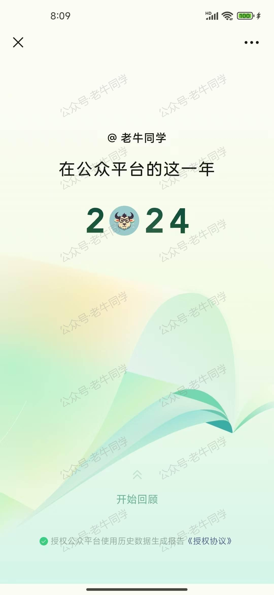

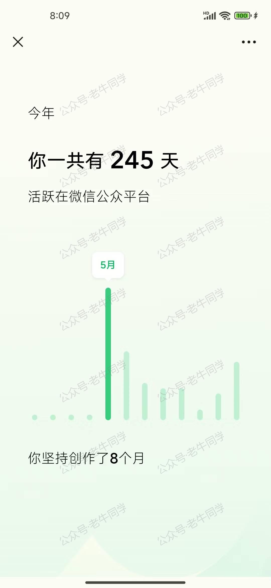

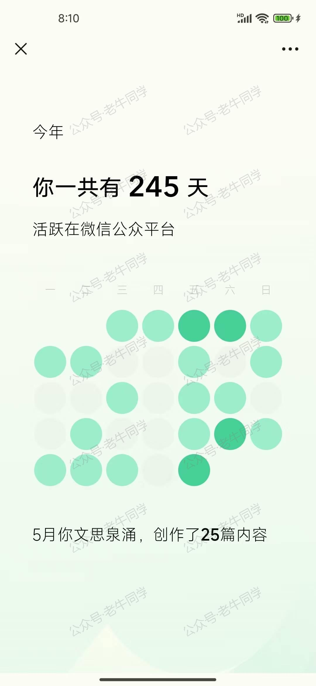

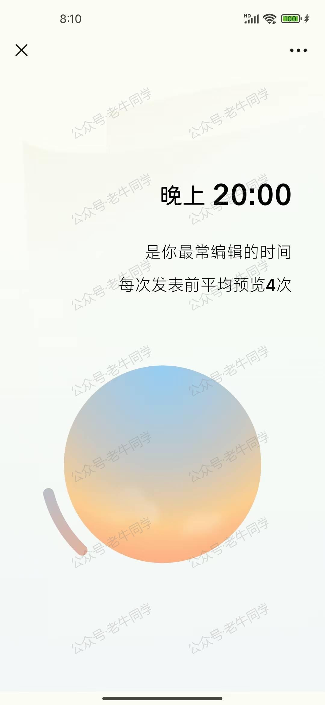

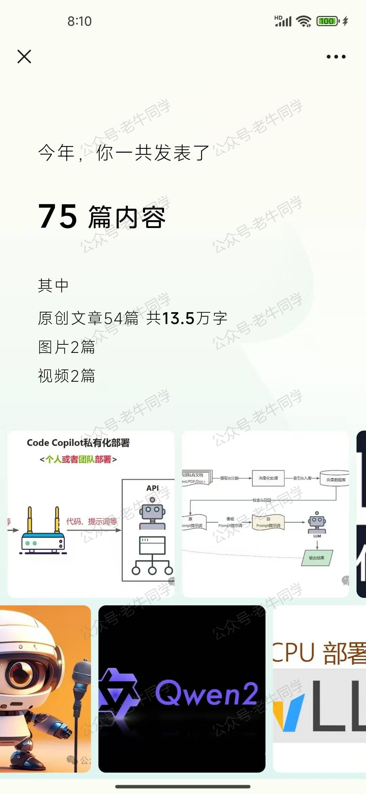

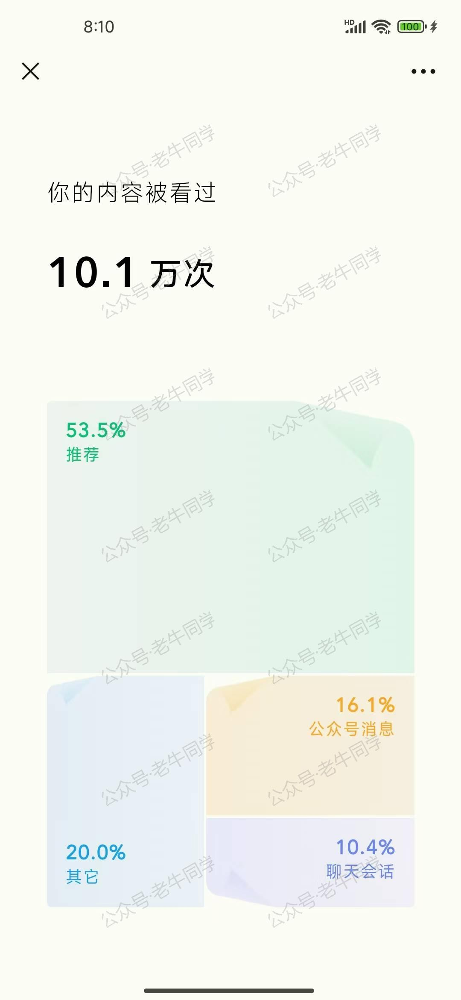

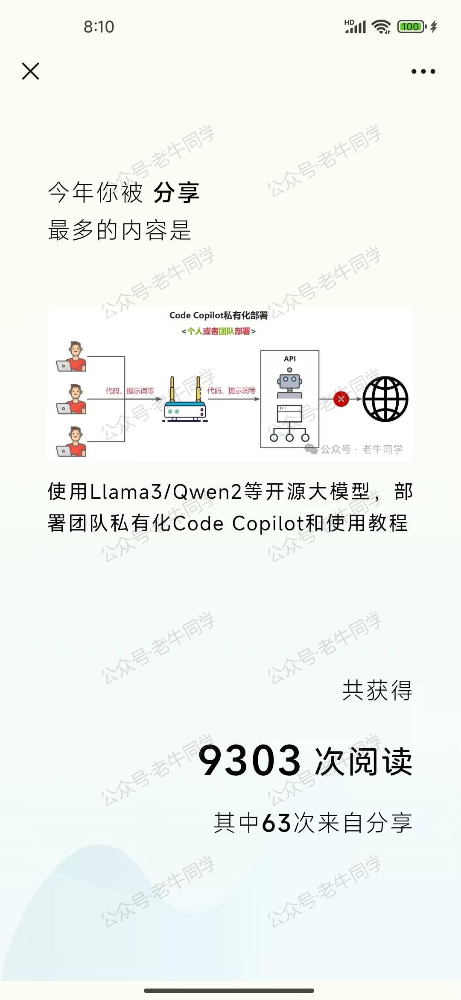

[使用 Llama3/Qwen2 等开源大模型，部署团队私有化 Code Copilot 和使用教程](https://mp.weixin.qq.com/s/vt1EXVWtwm6ltZVYtB4-Tg)

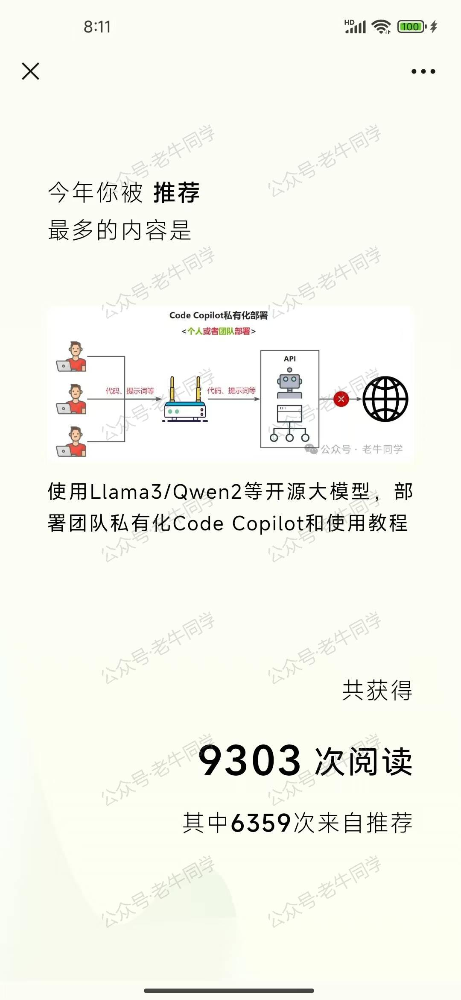

[使用 Llama3/Qwen2 等开源大模型，部署团队私有化 Code Copilot 和使用教程](https://mp.weixin.qq.com/s/vt1EXVWtwm6ltZVYtB4-Tg)

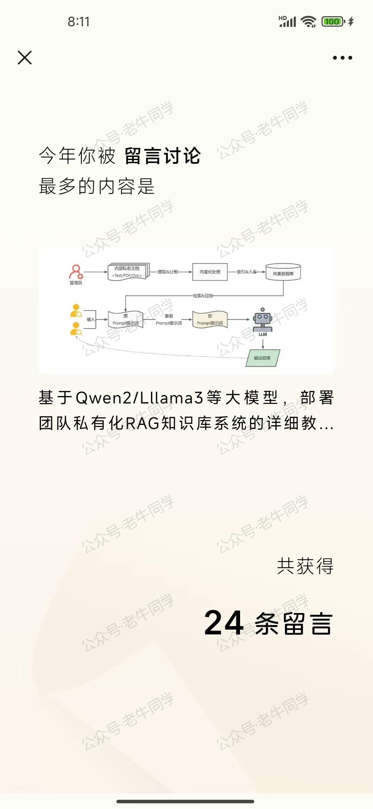

[基于 Qwen2/Lllama3 等大模型，部署团队私有化 RAG 知识库系统的详细教程（Docker+AnythingLLM）](https://mp.weixin.qq.com/s/PpY3k3kReKfQdeOJyrB6aw)

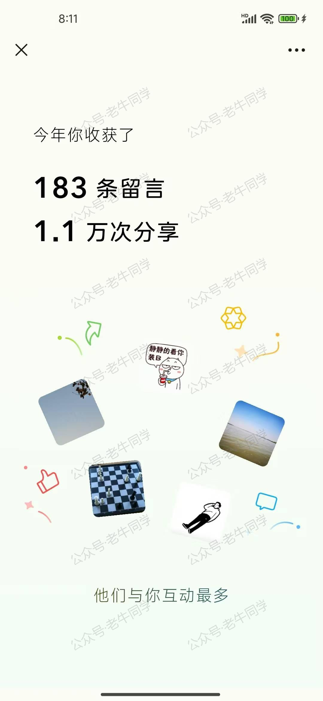

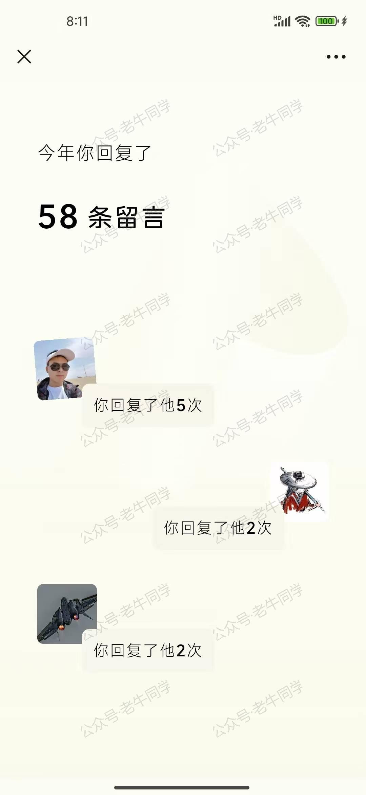

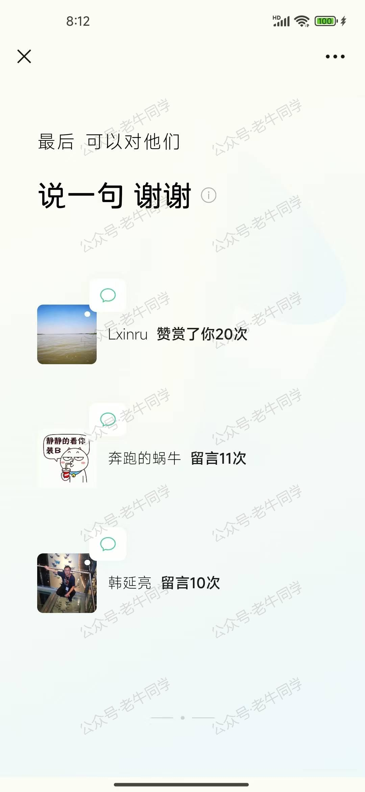

[使用 Llama3/Qwen2 等开源大模型，部署团队私有化 Code Copilot 和使用教程](https://mp.weixin.qq.com/s/vt1EXVWtwm6ltZVYtB4-Tg)

[基于 Qwen2/Lllama3 等大模型，部署团队私有化 RAG 知识库系统的详细教程（Docker+AnythingLLM）](https://mp.weixin.qq.com/s/PpY3k3kReKfQdeOJyrB6aw)

