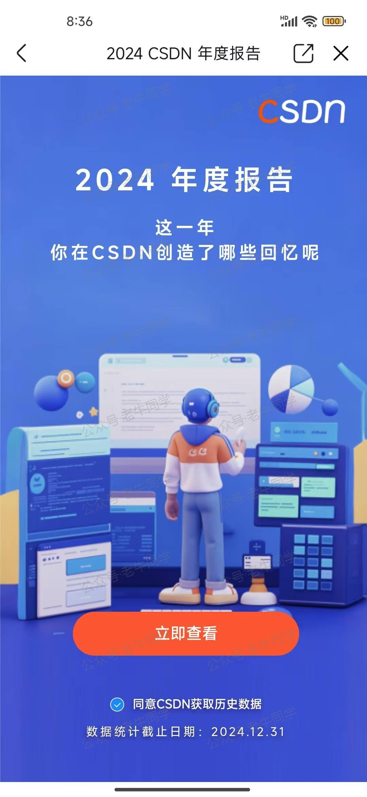
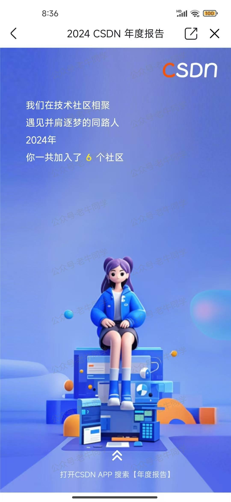

+++
slug = "2025012201"
date = "2025-01-22"
lastmod = "2025-01-22"
title = "感谢有你，共赴未来：2024年CSDN技术博客创作总结 · 老牛同学"
description = ""
image = "00.jpg"
categories = [ "年度总结" ]
+++

创作是孤独的坚持，在2025春节来临之际，我收到了CSDN技术博客给我推送的年度总结，实在是有心了。

让我意想不到的是，我竟然在CSDN技术博客中积累了这么多的收获，我想把这份惊喜与大家一同分享：

原来我是在**2007年4月2号**开通了CSDN技术博客，到今天已经有**18个年头**了，这个日子我应该牢记于心：

2024年5月我开始学习大模型，从0开始，持续学习也持续在CSDN中分享自己的所学。在CSDN技术博客中，2024年，我的原力值已经达到了**1420**，超越了**99.98%**的用户，给自己点个赞：

我在CSDN技术博客中的每一篇文章，都来自我的精心创作，同样的，也得到了CSDN技术社区、CSDN读者的认可：

同样的，CSDN技术社区也给了我很多技术帮助，我也在CSDN学习了大量知识：

我觉得是自己兴趣，更是CSDN技术博客的广大读者的支持给予了我无尽的动力。每一次阅读、每一个点赞、每一条评论，都让我感受到背后的期待和温暖的心。

特别感谢那些一直默默支持我的忠实读者，是你们的鼓励让我持续前行，不断探索新的领域，提升自我。

2025年，我将继续在技术这条道路上，发现更多的美好，分享更多的内容。

再次感谢每一位陪伴在我身边的你。
