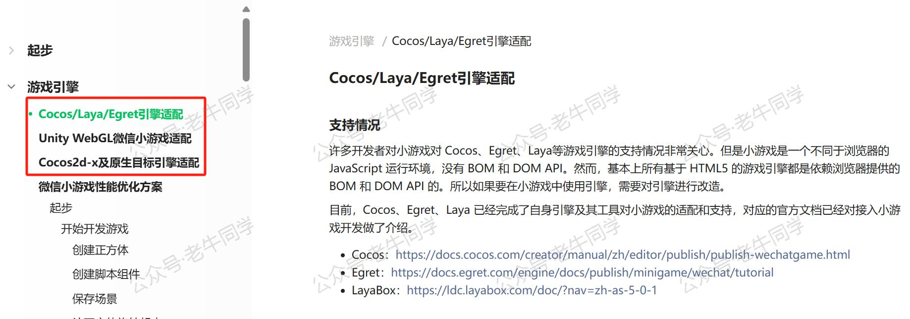
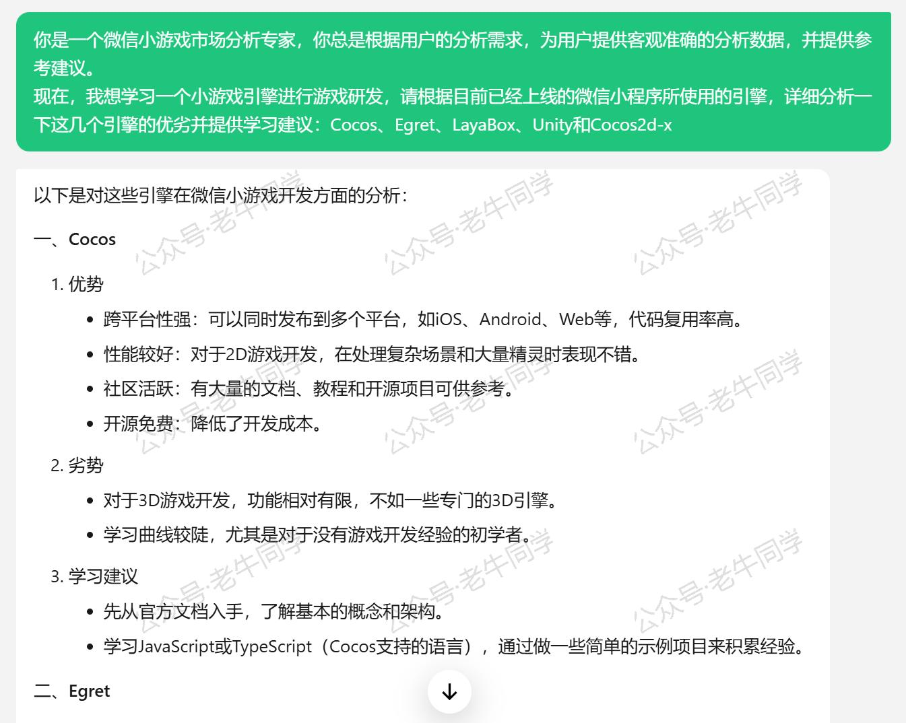
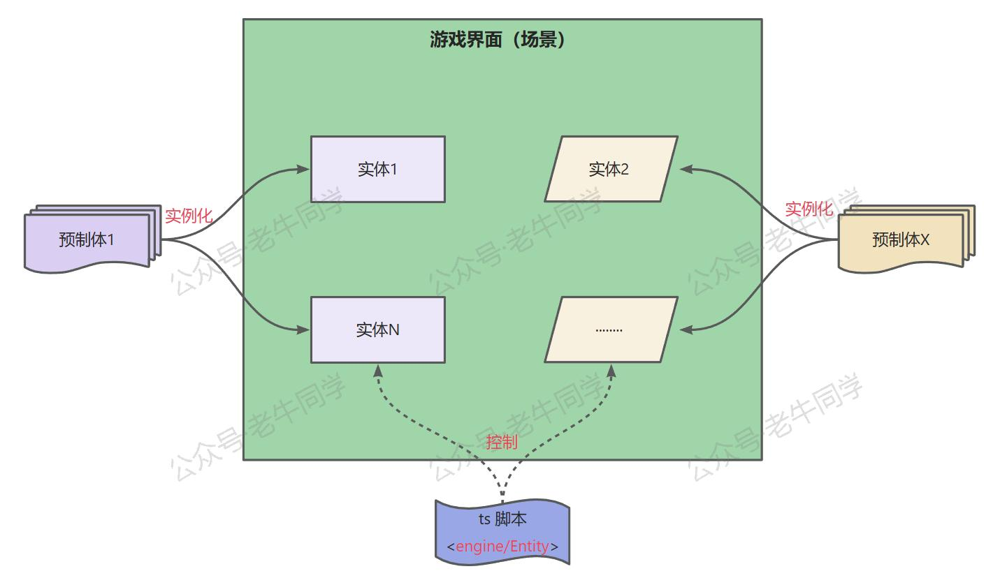
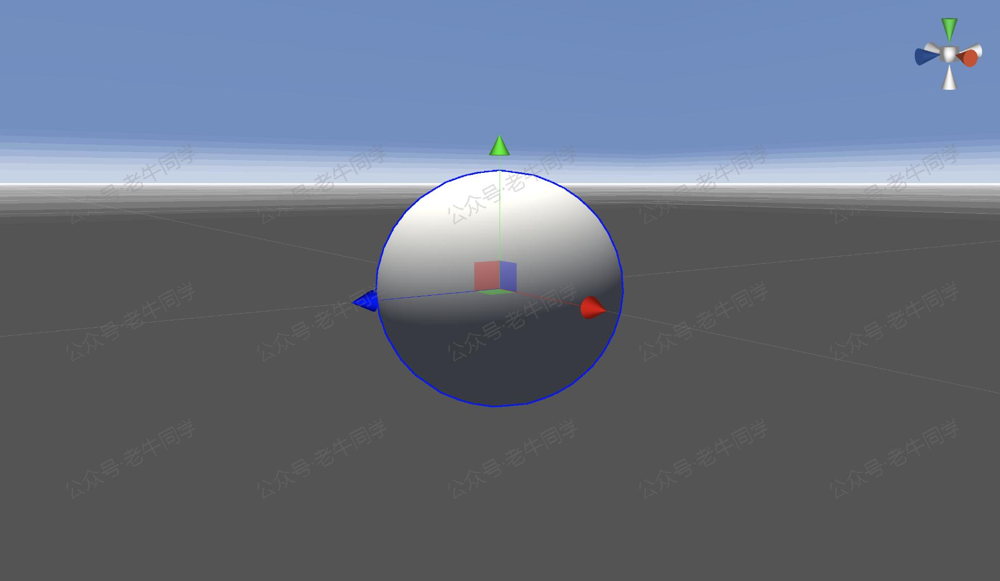
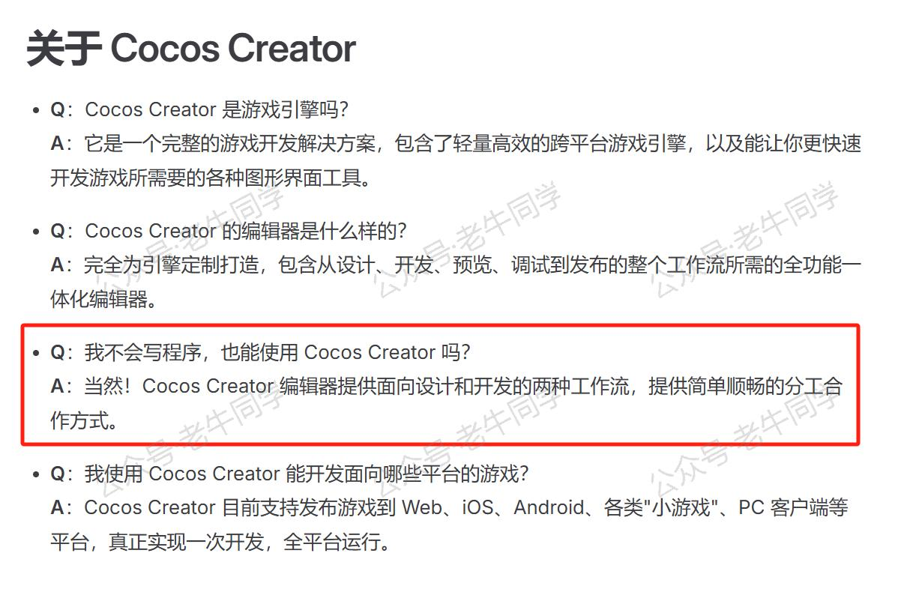

+++
slug = "2025012301"
date = "2025-01-23"
lastmod = "2025-01-23"
title = "新春“码”启 | 0 基础开发微信小游戏，Cocos 游戏引擎 + AI 辅助编程（第1天）"
description = "春节期间，老牛同学计划借助 AI 开启一场挑战自我和为小朋友开发微信小游戏的系列计划，0 基础开始了第1天的体验。目标是采用 Cocos 游戏引擎框架，借助 AI 辅助编程，最终完成微信小游戏研发。目前已对相关概念有了初步了解，后续将持续探索……"
image = "00.jpg"
tags = [ "AI", "Cocos", "小游戏" ]
categories = [ "人工智能" ]
+++

好羡慕小朋友们，已经放了快两周的寒假了，还好从今天开始，我这个“大朋友”也要开始放飞自我了。

今年春节假期，我给自己定了一个小目标：**给小朋友们研发一款小游戏！** 这也是我为小朋友们预定的一份特别的新春礼物！

# 缘起：做个能写游戏的程序员父亲

我一直对游戏兴趣不大，总觉得一个真实世界的人在一个虚拟的世界里玩得不亦乐乎，除了是浪费时间之外，实在是无可取之处。

可是，每当我看到小朋友站在别的小朋友身边，聚精会神的看着别的小朋友玩游戏的时候，我总觉得我是不是对游戏有什么偏见？也许游戏还真的挺不错。

我完全不懂写游戏，但是又有点担心小朋友误入暴力、杀戮、血腥等这些有害身心的游戏，于是硬着头皮承诺小朋友们：**今年春节，我给他们写一个更好玩的游戏。** 谁叫她们有个程序员的父亲呢？程序员不应该懂得电脑的一切吗，包括修电脑、装系统、布网线、做黑客，还有写游戏等……

虽然我从没有写过游戏代码，但我还是有那么点信心，因为今年已经是 2025 年了，AI 时代早已来临，有 AI 辅助编程，应该可行！

# 选择 Cocos 游戏引擎

于是乎，我信心满满地打开了微信小游戏的官方指导文档，以为能和微信小程序一样，立马就可以动手干了：[https://developers.weixin.qq.com/minigame/dev/guide/](https://developers.weixin.qq.com/minigame/dev/guide/)

- 第 1 章：**起步** 账号注册，这个后续上线的时候可以再补，不着急；微信开发者工具目前已经有了。
- 第 2 章：**游戏引擎** 到这章，感觉计划要泡汤了，`小游戏是一个不同于浏览器的 JavaScript 运行环境，没有 BOM 和 DOM API` ，也就是说，我之前的这些 Java GUI、Flutter、Web 等可视化编程的经验全都用不上了！

要想编写微信小游戏，我必须得学习一个全新的游戏引擎，幸运的是，微信小游戏已经适配好了好几个游戏引擎：`Cocos`/`Egret`/`LayaBox`、`Unity`和`Cocos2d-x`



那么现在我需要做的是，从这几个已经适配好的游戏引擎中，选择一个更适合自己的游戏引擎即可。为了了解这几个引擎的优劣，我首先使用“腾讯元宝”大模型进行分析，因为考虑到对于微信小游戏来说，元宝预训练的数据也行比其他大模型要丰富一些，毕竟微信小游戏是自家产品。

Prompt 提示词：

```
你是一个微信小游戏市场分析专家，你总是根据用户的分析需求，为用户提供客观准确的分析数据，并提供参考建议。
现在，我想学习一个小游戏引擎进行游戏研发，请根据目前已经上线的微信小程序所使用的引擎，详细分析一下这几个引擎的优劣并提供学习建议：Cocos、Egret、LayaBox、Unity和Cocos2d-x
```



同时，我通过 Bing 同步搜索了这个几个引擎的优劣，加上元宝的分析结果，总结如下：

- **Unity** 丰富的生态，被全球广泛使用，适合做 3D 游戏，可惜采用的是 **C#** 研发语音。
- **Cocos** 社区比较活跃，文档齐全，性能较好，2D 和 3D 游戏均可，重点是**开源免费**和采用**JavaScript**或**TypeScript**研发语音。
- **Egret** 专注于 HTML5 游戏开发，学习门槛低，社区不如 Cocos 引擎。
- **LayaBox** 可研发 2D 和 3D 游戏，社区不如 Cocos 引擎。
- **Cocos2d-x** 同 Cocos 引擎，是它的 2D 版本，统一到 Cocos 引擎即可，无需单独分析。

对于初学者来说，可预料到会遇到很多的问题，因此活跃的社区和丰富的文档就显得相当重要。同时，春节时间有限，需要减少不确定性，不宜专门学习一门 C# 编程语言。

因此，老牛同学最终选择的是：**Cocos**游戏引擎

# 了解微信小游戏

选好了 Cocos 游戏研发引擎，接下来就是通读一遍微信小游戏的研发手册，看看还有什么不理解的地方，避免成为后续研发的卡点。

打包发布相关的内容，老牛同学暂时都先跳过了，因为这些是最后发布才需要学习的内容。首先重点学习了解游戏框架部分内容：

- **Scenes** 场景，顾名思义，就是一个游戏界面；它是一种资源，每个关卡可以代表一个场景。
- **Entities** 实体，也叫节点，分为 2D 节点和 3D 节点，游戏中的承载功能的对象，而功能通过组件来实现。
- **Prefabs** 预制体，它是一种资源，是创建节点实例的模板。
- **关键类型** 最常用的有 engine 对象，节点类 Entity 等。
- **脚本组件** 代码脚本（样例全部都是 TypeScript 脚本），操纵实体（Entity），实现游戏逻辑。
- **序列化系统** 实例存储和加载，如保存与加载组件或是资源。
- **生命周期** 声明周期钩子函数。

上面几个概念理解感觉都不难，简单理解：场景就是游戏操作界面，实体/节点就是界面上的内容，预制体实例化后生成实体/节点；在整个生命周期钩子函数中，通过 TypeScript 脚本组件控制实体/节点，这样实现了游戏操作功能；而在脚本组件中，engine 和 Entity 会比较常用，因此后续我们需要重点关注他们的 API 和相关属性。



对于一个游戏引擎来说，当一个游戏界面的展示内容、操控脚步都准备好了，那么解下来就是展示给用户和用户操作了，即：**渲染**

- 资源，即需要展示的内容。
- 渲染器，包括网格、蒙皮网格、线段和尾迹共 4 种渲染器。
- 相机，简单理解就是窗口，即用户可以看到的游戏界面部分。
- 光照，让游戏界面更加真实，包括不同光源、阴影等。
- Gizmos 可视化工具，用于绘制基础图形，包括网格、实体选中后的辅助线等。



# 初识 Cocos 游戏引擎

微信小游戏的官方文档中，对小游戏的整体进行了介绍，示例中使用大量的 TypeScript 脚本，老牛同学目前还没有细看，等后续用到了详细了解。

接下来，来看看 Cocos 游戏研发引擎：[https://docs.cocos.com/creator/3.8/manual/zh/](https://docs.cocos.com/creator/3.8/manual/zh/)



简单理解：**Cocos**是游戏引擎，**Cocos Creator**是制作游戏的可视化工具，它包含了游戏引擎、资源管理、场景编辑、游戏预览和发布等游戏开发所需的全套功能，感觉像是个 Cocos 游戏研发的超级 IDE。

同时，Cocos 在 B 站还发布有学习视频，同时还有 2D 和 3D 游戏实例教程，果然文档很丰富。

在功能模块部分，和微信小游戏的文档基本能一一对应上，包括：图像渲染、2D 对象、动画系统、音频系统、物理系统、粒子系统、缓动系统、地形系统、资源管理，还有多语音系统。

针对每个功能章节，都有详细的文字和截图使用说明，非常详细。

老牛同学今天先初略浏览一番，明天开始，正式启动小游戏的构思和研发之旅。敬请期待！

---

Transformers 框架序列：

<small>[01.包和对象加载中的设计巧思与实用技巧](https://mp.weixin.qq.com/s/lAAIfl0YJRNrppp5-Vuusw)</small>

<small>[02.AutoModel 初始化及 Qwen2.5 模型加载全流程](https://mp.weixin.qq.com/s/WIbbrkf1HjVC1CtBNcU8Ow)</small>

<small>[03.Qwen2.5 大模型的 AutoTokenizer 技术细节](https://mp.weixin.qq.com/s/Shg30uUFByM0tKTi0rETfg)</small>

<small>[04.Qwen2.5/GPT 分词流程与 BPE 分词算法技术细节详解](https://mp.weixin.qq.com/s/GnoHXsIYKYFU1Xo4u5sE1w)</small>

<small>[05.嵌入（Embedding）机制和 Word2Vec 实战](https://mp.weixin.qq.com/s/qL9vpmNIM1eO9_lQq7QwlA)</small>

<small>[06.位置嵌入（Positional Embedding）](https://mp.weixin.qq.com/s/B0__TRnlI7zgwn0OhguvXA)</small>

Pipeline NLP 任务序列：

<small>[零·概述](https://mp.weixin.qq.com/s/FR4384AZV2FE2xtweSh9bA) 丨 [01.文本转音频](https://mp.weixin.qq.com/s/uN2BFIOxDFEh4T-W7tsPbg) 丨 [02.文本分类](https://mp.weixin.qq.com/s/9ccEDNfeGNf_Q9pO0Usg2w) 丨 [03.词元分类和命名实体识别](https://mp.weixin.qq.com/s/r2uFCwPZaMeDL_eiQsEmIQ) 丨 [04.问答](https://mp.weixin.qq.com/s/vOLVxRircw5wM1_rCqoAfg) 丨 [05.表格问答](https://mp.weixin.qq.com/s/Q0fWdw3ACVzQFldBScZ2Fw) | [06.填充蒙版](https://mp.weixin.qq.com/s/hMFCgYovHPVFOjOoihaUHw)</small>

往期推荐文章：

<small>[Cline 免费插件 + Qwen2.5 大模型，零经验也能开发“对联王”微信小程序](https://mp.weixin.qq.com/s/F-CUuaZwmqt6X7QkI_IrVA)</small>

<small>[使用 Cursor + Qwen2.5 大模型 零经验研发微信小程序：自由构建个性化节拍器应用实战](https://mp.weixin.qq.com/s/vraegr_5AJG7bPo6mBgvbQ)</small>

<small>[Bolt.new 用一句话快速构建全栈应用：本地部署与应用实战（Ollama/Qwen2.5 等）](https://mp.weixin.qq.com/s/Mq8CvZKdpokbj3mK-h_SAQ)</small>

<small>[基于 Qwen2.5-Coder 模型和 CrewAI 多智能体框架，实现智能编程系统的实战教程](https://mp.weixin.qq.com/s/8f3xna9TRmxMDaY_cQhy8Q)</small>

<small>[vLLM CPU 和 GPU 模式署和推理 Qwen2 等大语言模型详细教程](https://mp.weixin.qq.com/s/KM-Z6FtVfaySewRTmvEc6w)</small>

<small>[基于 Qwen2/Lllama3 等大模型，部署团队私有化 RAG 知识库系统的详细教程（Docker+AnythingLLM）](https://mp.weixin.qq.com/s/PpY3k3kReKfQdeOJyrB6aw)</small>

<small>[使用 Llama3/Qwen2 等开源大模型，部署团队私有化 Code Copilot 和使用教程](https://mp.weixin.qq.com/s/vt1EXVWtwm6ltZVYtB4-Tg)</small>

<small>[基于 Qwen2 大模型微调技术详细教程（LoRA 参数高效微调和 SwanLab 可视化监控）](https://mp.weixin.qq.com/s/eq6K8_s9uX459OeUcRPEug)</small>

<small>[ChatTTS 长音频合成和本地部署 2 种方式，让你的“儿童绘本”发声的实战教程](https://mp.weixin.qq.com/s/9ldLuh3YLvx8oWvwnrSGUA)</small>


