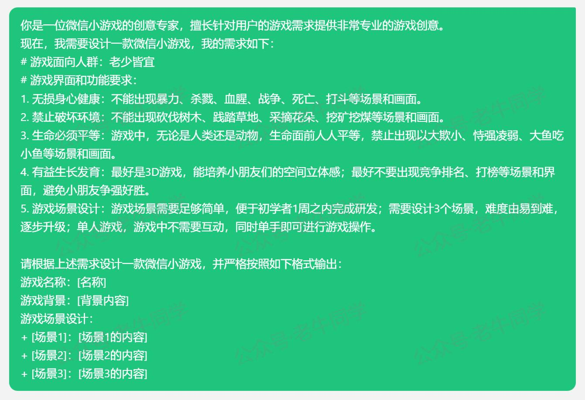
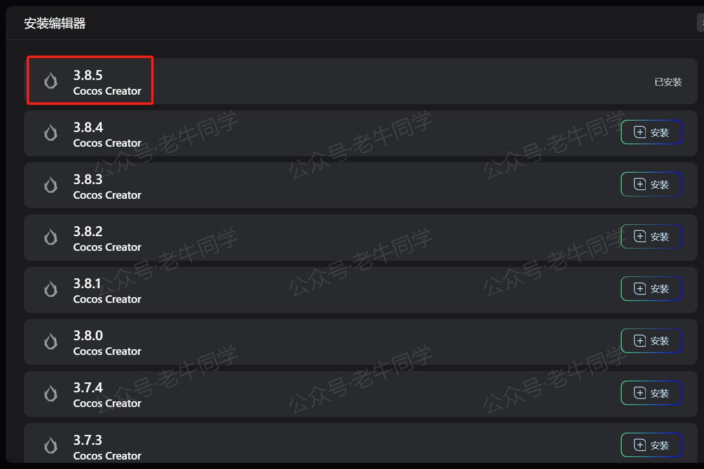
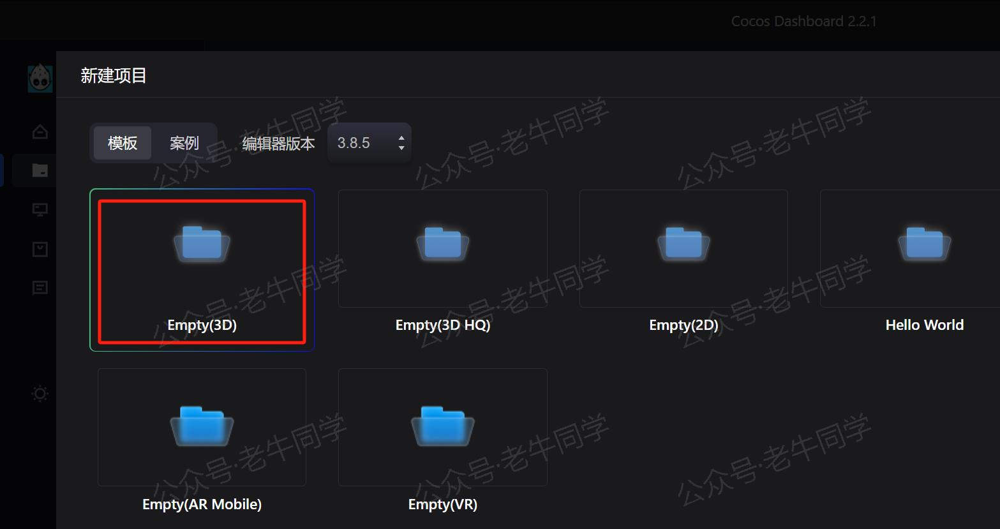
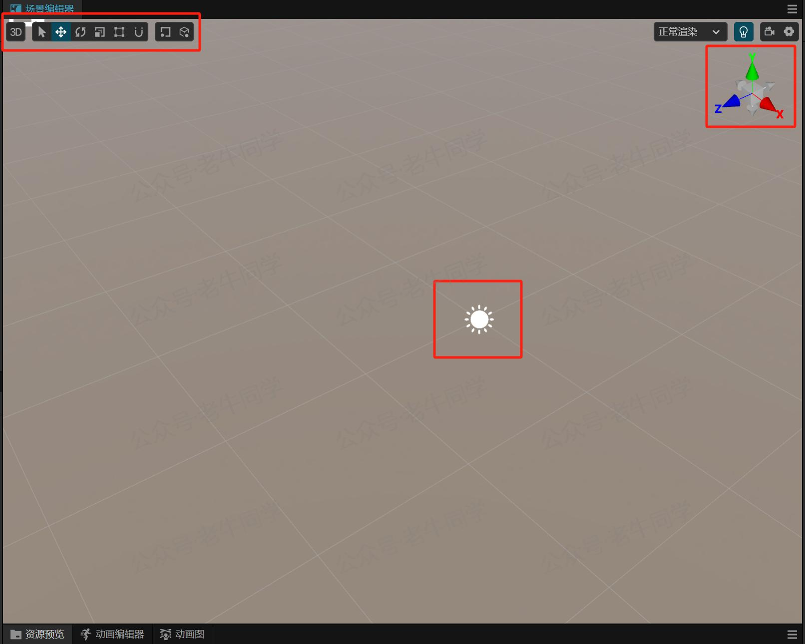
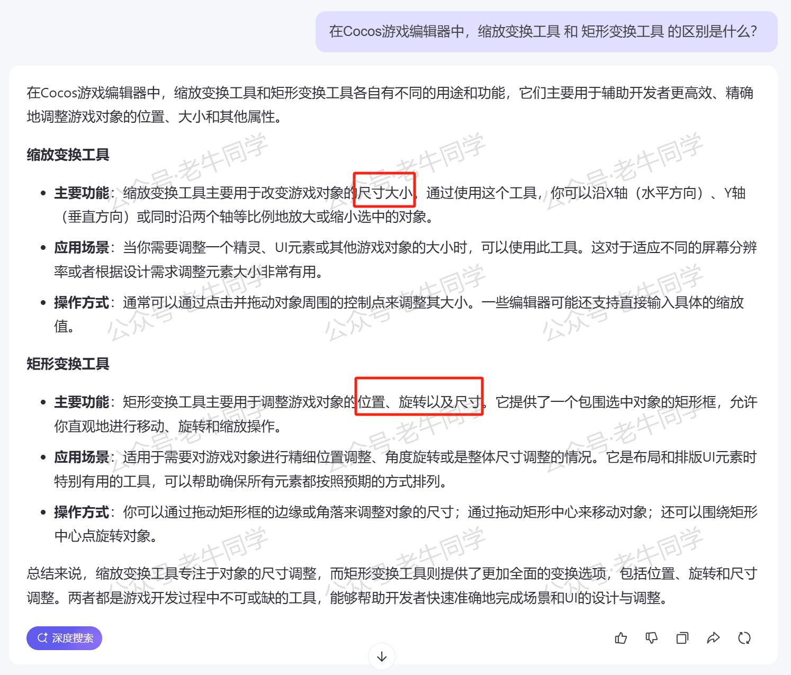
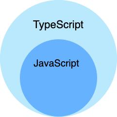

+++
slug = "2025012401"
date = "2025-01-24"
lastmod = "2025-01-24"
title = "新春“码”启 | 0 基础开发微信小游戏，Cocos 游戏引擎 + AI 辅助编程（第2天）"
description = "本文是“新春“码”启 | 从零开始开发微信小游戏”第2天的学习历程，包括如何设计一个适合小朋友玩的游戏创意和使用Cocos Creator进行初步开发的过程。虽然在游戏创意上遇到了一些挑战，但通过不断尝试和学习Cocos的基础操作，逐渐找到了方向。同时，我们还探讨了TypeScript的基础知识，为后续开发打下坚实基础……"
image = "00.jpg"
tags = [ "AI", "Cocos", "小游戏" ]
categories = [ "人工智能" ]
+++

🎉 二十六，去买肉 🎉

《春节童谣》

---

新春计划的第1天确定了技术选型，并通读了微信小游戏的研发手册，了解了一些游戏研发的基本概念：[新春“码”启 | 0 基础开发微信小游戏，Cocos 游戏引擎 + AI 辅助编程（第1天）](https://mp.weixin.qq.com/s/TlgNKvGYMuGMmU0dIBPn4A)

今天是第2天，老牛同学开始正式进入研发了，主要包括以下2部分：

+ 精心设计一个游戏创意：明确我们最终的交付物是什么？
+ 熟悉Cocos游戏研发流程

# 设计游戏创意

说实话，我目前还不知道该给小朋友们研发一款什么主题的游戏。我还是优先选择腾讯元宝来帮忙，针对这款小游戏，我有如下要求：

1. 无损身心健康：不能出现暴力、杀戮、血腥、战争、死亡、打斗等场景和画面。
2. 禁止破坏环境：不能出现砍伐树木、践踏草地、采摘花朵、挖矿挖煤等场景和画面。
3. 生命必须平等：游戏中，无论是人类还是动物，生命面前人人平等，禁止出现以大欺小、恃强凌弱、大鱼吃小鱼等场景和画面。
4. 有益生长发育：最好是3D游戏，能培养小朋友们的空间立体感；最好不要出现竞争排名、打榜等场景和界面，避免小朋友争强好胜。
5. 游戏场景设计：游戏场景需要足够简单，便于初学者1周之内完成研发；需要设计3个场景，难度由易到难，逐步升级；单人游戏，游戏中不需要互动，同时单手即可进行游戏操作。

在和元宝来来回回对话基础之后，感觉都不太满意，要么就是游戏场景太复杂，要么就是任务过于简单，不具备挑战性。

关于游戏创意，可能一时半会儿也无法确定，因此先暂时放放，优先先熟悉一下Cocos研发界面。

# Cocos研发体验

**建议**：现在就去买个鼠标吧，ToucPad操作很不方便。

首先去官网下载Cocos Creator：[https://www.cocos.com/creator-download](https://www.cocos.com/creator-download)

安装之后打开后是一个Cocos Dashboard，也就是它只是一个壳。接着就去安装编辑器，老牛同学选择的是最新版本：**3.8.5**

Cocos编辑器安装好之后，就可以创建项目了，也就是我们的小游戏了：

进入小游戏编辑器之后，我们就可以放飞自我了，先瞎点一通在说：左键、右键、中键、滚动、上下左右移动、界面上的小图标等等，先看看都有什么效果。

天旋地转，一通操作猛如虎之后，老牛同学发现自己有点晕乎了，不知道我到底在哪儿了！

于是快速浏览一遍Cocos官方文档，找到了编辑器的使用文档，一定要先好好熟悉一下，否则人都晕了怎么能完成计划呢：[https://docs.cocos.com/creator/3.8/manual/zh/editor/scene/](https://docs.cocos.com/creator/3.8/manual/zh/editor/scene/)

其实所有的操作，主要就是上图的红框部分内容，根据官网文档的内容和实际操作，总结如下：

+ 视图：分为2D和3D，可相互切换，`2`为快捷键。
+ 变换工具组： 包括平移（`W`）、旋转（`E`）、缩放（`R`）、矩形（`T`）、吸附、位置（锚点/中心）、坐标系（本地/世界坐标系）这些操作工具，快捷键`Q`则退出这些变换工具。
 - 平移：可以沿着`X`/`Y`/`Z`轴上移动，每个轴的颜色都不一样。
 - 旋转：和平移类似，可以分别沿着3个轴进行360°旋转。
 - 缩放：和平移类似，可以分别沿着3个轴放大和缩小。
 - 矩形：只适合于UI节点，也可以放大和缩小，它和缩放的**区别**是啥？
 - 吸附：在使用移动/旋转/缩放变换工具时，按照设定的步长进行操作；或者矩阵工具对齐操作。
 - 位置：变换工具的操作锚点是在中心还是坐标系，操作下来没有看出有啥效果，暂时先忽略。
 - 坐标系：有参照物的相对坐标系还是绝对的世界坐标系。
+ Gizmo：显示场景相机的方向，可以点击切换观察角度（6个角度：上下左右前后）。

**经验之谈**：以下是老牛同学在不断瞎操作后得出的经验，可以借鉴一下。

+ 牢记Gizmo的设置（默认：Y垂直向上，X右下角，Z左下角）：当我们转晕了，不知道在哪儿了的时候，首先把Gizmo的坐标还原。
+ 在左边“层级管理器”中，随便选择一个节点，然后按一下`F`键（Focus聚焦），你就会发现，我们又回来了，又可以瞎点瞎按了。
+ 用鼠标吧，TouchPad操作是真的不方便，建议前期把鼠标的灵活度稍微调低一点，这样能保证你晕得慢一点。

对于老牛同学来说，0开发经验就直接上手3D游戏，感觉起点高了，有点Hold不住了~

# TypeScript了解

微信小游戏采用TypeScript编程语言，提取初步了解一下：[https://www.runoob.com/typescript/ts-tutorial.html](https://www.runoob.com/typescript/ts-tutorial.html)

总体来说，TypeScript 是 JavaScript 的超集，扩展了 JavaScript 的语法，因此如果熟悉JavaScript语音的话，学习起来问题不大：

今天的分享就先到这里，继续鼓捣Cocos编辑器，明天继续！

---

Transformers 框架序列：

<small>[01.包和对象加载中的设计巧思与实用技巧](https://mp.weixin.qq.com/s/lAAIfl0YJRNrppp5-Vuusw)</small>

<small>[02.AutoModel 初始化及 Qwen2.5 模型加载全流程](https://mp.weixin.qq.com/s/WIbbrkf1HjVC1CtBNcU8Ow)</small>

<small>[03.Qwen2.5 大模型的 AutoTokenizer 技术细节](https://mp.weixin.qq.com/s/Shg30uUFByM0tKTi0rETfg)</small>

<small>[04.Qwen2.5/GPT 分词流程与 BPE 分词算法技术细节详解](https://mp.weixin.qq.com/s/GnoHXsIYKYFU1Xo4u5sE1w)</small>

<small>[05.嵌入（Embedding）机制和 Word2Vec 实战](https://mp.weixin.qq.com/s/qL9vpmNIM1eO9_lQq7QwlA)</small>

<small>[06.位置嵌入（Positional Embedding）](https://mp.weixin.qq.com/s/B0__TRnlI7zgwn0OhguvXA)</small>

Pipeline NLP 任务序列：

<small>[零·概述](https://mp.weixin.qq.com/s/FR4384AZV2FE2xtweSh9bA) 丨 [01.文本转音频](https://mp.weixin.qq.com/s/uN2BFIOxDFEh4T-W7tsPbg) 丨 [02.文本分类](https://mp.weixin.qq.com/s/9ccEDNfeGNf_Q9pO0Usg2w) 丨 [03.词元分类和命名实体识别](https://mp.weixin.qq.com/s/r2uFCwPZaMeDL_eiQsEmIQ) 丨 [04.问答](https://mp.weixin.qq.com/s/vOLVxRircw5wM1_rCqoAfg) 丨 [05.表格问答](https://mp.weixin.qq.com/s/Q0fWdw3ACVzQFldBScZ2Fw) | [06.填充蒙版](https://mp.weixin.qq.com/s/hMFCgYovHPVFOjOoihaUHw)</small>

往期推荐文章：

<small>[Cline 免费插件 + Qwen2.5 大模型，零经验也能开发“对联王”微信小程序](https://mp.weixin.qq.com/s/F-CUuaZwmqt6X7QkI_IrVA)</small>

<small>[使用Cursor + Qwen2.5 大模型 零经验研发微信小程序：自由构建个性化节拍器应用实战](https://mp.weixin.qq.com/s/vraegr_5AJG7bPo6mBgvbQ)</small>

<small>[Bolt.new 用一句话快速构建全栈应用：本地部署与应用实战（Ollama/Qwen2.5 等）](https://mp.weixin.qq.com/s/Mq8CvZKdpokbj3mK-h_SAQ)</small>

<small>[基于 Qwen2.5-Coder 模型和 CrewAI 多智能体框架，实现智能编程系统的实战教程](https://mp.weixin.qq.com/s/8f3xna9TRmxMDaY_cQhy8Q)</small>

<small>[vLLM CPU 和 GPU 模式署和推理 Qwen2 等大语言模型详细教程](https://mp.weixin.qq.com/s/KM-Z6FtVfaySewRTmvEc6w)</small>

<small>[基于 Qwen2/Lllama3 等大模型，部署团队私有化 RAG 知识库系统的详细教程（Docker+AnythingLLM）](https://mp.weixin.qq.com/s/PpY3k3kReKfQdeOJyrB6aw)</small>

<small>[使用 Llama3/Qwen2 等开源大模型，部署团队私有化 Code Copilot 和使用教程](https://mp.weixin.qq.com/s/vt1EXVWtwm6ltZVYtB4-Tg)</small>

<small>[基于 Qwen2 大模型微调技术详细教程（LoRA 参数高效微调和 SwanLab 可视化监控）](https://mp.weixin.qq.com/s/eq6K8_s9uX459OeUcRPEug)</small>

<small>[ChatTTS 长音频合成和本地部署 2 种方式，让你的“儿童绘本”发声的实战教程](https://mp.weixin.qq.com/s/9ldLuh3YLvx8oWvwnrSGUA)</small>

