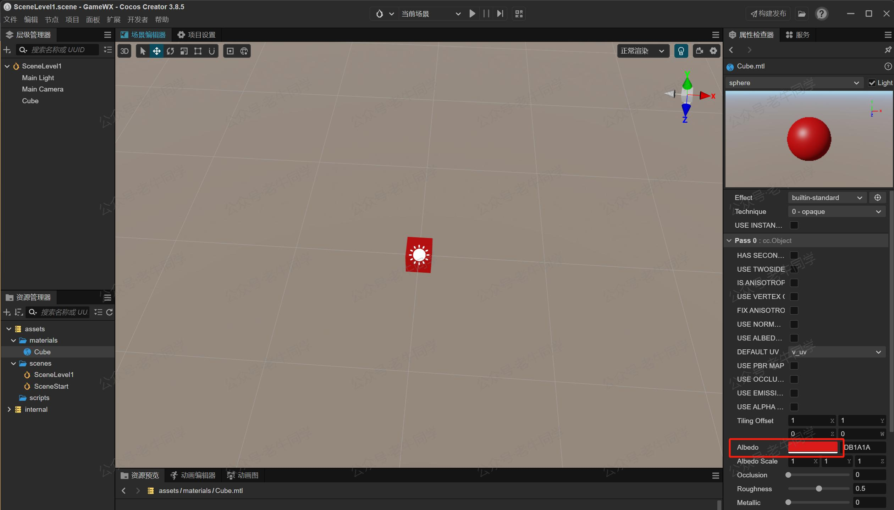

+++
slug = "2025012501"
date = "2025-01-25"
lastmod = "2025-01-28"
title = "新春“码”启 | Cocos 3D 开发微信小游戏（第3天）：场景搭建与游戏链路基础开发"
description = "新春开发 Cocos 3D 微信小游戏计划的第3天，包括总体设计方案，包括关卡模式、时间限制、复活机制等。接着详细展示基础框架研发，如开始场景和游戏场景（关卡一）的开发，包括创建场景、画布、立方体、材质，以及按钮的功能实现和场景切换等……"
image = "00.jpg"
tags = [ "AI", "Cocos", "小游戏" ]
categories = [ "人工智能" ]
+++

今天是实施新春小游戏计划的第 3 天，前面 2 天主要是入门和了解，我们对微信小游戏以及 Cocos 编辑器有了初步的认识。

- 第 1 天：[新春“码”启 | 0 基础开发微信小游戏，Cocos 游戏引擎 + AI 辅助编程（第 1 天）](https://mp.weixin.qq.com/s/TlgNKvGYMuGMmU0dIBPn4A)
- 第 2 天：[新春“码”启 | 0 基础开发微信小游戏，Cocos 游戏引擎 + AI 辅助编程（第 2 天）](https://mp.weixin.qq.com/s/qlOYpjREXBKb7vl1kuujlg)

接下来，现在我们就开始正式实战研发小游戏了：

- 设计小游戏的总体方案，包括场景及其内容等方面。
- 开发小游戏基础框架，跑通整个游戏链路，细节部分就后续逐步完善补充。

# 总体设计方案

到现在，老牛同学还尚未确定小游戏的创意，这时候大模型好像没什么用了，给的想法总是达不到要求。

虽然没有明确的创意，但是老牛同学玩了几款热门的微信小游戏，再结合自己的经验，初步设计出了这个小游戏：


老牛同学的设计思路是这样的：

- 游戏采用通关模式，最少有 1 个关卡，关卡难度由易到难递增。
- 明确每个关卡的通关时间限制，如果时间用完或者工具用完（像子弹、生命等），就算通关失败。
- 要是通关成功了，就进入下一个关卡；如果失败了，还可以选择复活，不过复活需要玩家参与互动（比如学习游戏操作手册等）。

由于这个游戏不允许有杀戮、战争等场景，所以通关的方式就不能是用子弹之类的了。

# 研发基础框架

接下来，开始用 Cocos 研发基础框架，目的是串联整个游戏流程，那些不明确的部分就先跳过。例如，我们可以通过点击“成功”和“失败”这两个按钮，分别代表通关成功和失败。

今天核心目标完成前面 3 个场景的研发：

## 场景一：开始场景

开始场景主要表达角色设定、背景介绍、任务说明，还有进入游戏或者退出游戏的操作按钮。

在“资源管理器”面板中，在`assets`目录右键新建目录`scenes`，用于存放小游戏场景内容，我们新建一个名为`SceneStart`的场景并双击打开它。

由于小游戏主要在手机端运行，需要设置小游戏的宽度和高度：

- 打开项目设置面板，路径：“项目” - “项目设置”
- 在“项目数据”配置项中，调整参数：“设计宽度”为`720`（像素），“设计高度”为`1280`（像素），同时勾选“适配屏幕宽度”和“适配屏幕高度”复选框


我们在“场景一”中，创建一个“开始游戏”按钮，点击按钮则进入“场景二”：

1. 在“层级管理器”中创建画布：右键 - “创建” - “UI 组件” - “Canvas (画布)”，并重命名为“CavansStart”
2. 在“场景编辑器”中，切换到“2D”视图，点击“3D”或者按下`2`快捷键
3. 在“层级管理器”中空接口，UI 节点都放到这个节点下：“Canvas”右键 - “创建” - “空节点”，并命名为“MenuView”，代表一个菜单
4. 在“层级管理器”中创建按钮：“Canvas”右键 - “创建” - “2D 对象” - “Sprite (精灵)”，主要是用于设置背景
5. 在精灵的“属性检测器”中，调整精灵的大小、背景和组件：

- 大小：“Content Size”中，宽`600`（像素），高`700`（像素）
- 背景：“Sprite Frame”中，选择“default_panel”；“type”中，选择“SLICED”
- 增加“cc.Widget”组件，并设置为“水平居中”、“垂直居中”

5. 在“层级管理器”中创建按钮：“Canvas”右键 - “创建” - “UI 组件” - “Button (按钮)”，并重命名为“BtnStart”
6. 在按钮的“属性检测器”中，调整按钮大小和文案（“Label”的内容）


接下来，对“开始游戏”按钮增加点击事件，点击则切换到“场景二”界面：

- 在“资源管理器”面板中，在`assets`中右键新建目录`scripts`，用户存放小游戏 TypeScript 脚本文件，我们新建一个名为`BtnStart`的脚本并双击打开它。
- 在`BtnStart`的脚本内容如下：

```typescript
import { _decorator, Component, director, Node } from 'cc';
const { ccclass, property } = _decorator;

@ccclass('BtnStart')
export class BtnStart extends Component {
    start() {
        this.node.on(Node.EventType.TOUCH_END, this.toScene1, this);
    }

    protected onDestroy(): void {
        this.node.off(Node.EventType.TOUCH_END, this.toScene1, this);
    }

    private toScene1() {
        director.loadScene('SceneLevel1');
    }
}
```

- 我们用`director.loadScene`方法切换不同的场景，从脚本可以看出：点击开始按钮，则切换到`SceneLevel1`场景。
- 接下来，在“层级管理器”中选择“BtnStart”按钮，在“属性检查器”中，绑定点击事件：
  - 点击事件：设置“Click Events”为`1`，即代表只有 1 个事件
  - 点击函数：选择“BtnStart”节点，选择“BtnStart”脚本，最后选择“toScene1”函数


最终，我们运行“场景一”，就可以看到场景切换效果了。

## 场景二：游戏场景（关卡一）

在“资源管理器”面板中，在`assets`中右键新建目录`scenes`，用户存放小游戏场景内容，我们新建一个名为`SceneLevel1`的场景并双击打开它。

然后，在“层级管理器”中创建画布：右键 - “创建” - “3D 对象” - “Cube (立方体)”，并命名为`cube`

为了使“场景二”中“立方体”的效果更明确，我们给他创建红色材质：

- 在“资源管理器”面板中，在`assets`中右键新建目录`materials`，用户存放小游戏节点的材质
- 在`materials`创建材质：右键 - “创建” - “材质”，并命名为`cube`
- 在`cube`材质的“属性检测器”中，设置“Albedo”颜色为红色（或者：其他颜色，只要看起来有效果即可），并保存材质
- 拖动`cube`材质到`cube`立方体上，可以看到，立方体变成了红色



## 其他场景和问题

我们可以采用同样的方式，创建“场景三”、“场景四”和“场景五”，保证我们的场景之间就能串联起来。

各个场景串联是正常的了，但是老牛同学发现个问题：在点击按钮，即使用`director.loadScene()`进行场景切换时有点生硬，老牛同学感觉有应该有更好的方案解决。

老牛同学一个新的想法：一个关卡一个场景，UI 通过显示和隐藏的方式呈现，包括开始菜单 UI、游戏失败提示 UI 和游戏成功提示 UI 等。比如“场景一”包含了开始菜单，点击“开始游戏”之后，隐藏菜单。

若大家有其他想法或经验，特别欢迎大家与老牛同学进行交流，非常感谢~

# 总结

今天的分享先到这里，在小游戏的创意没有明确之前，我们就先搭建小游戏的整体流程，同时在过程中不断进行优化，因为无论小游戏的创意如何，这些流程和优化经验都是比不可少的。

最后，给大家拜个早年，祝大家：新年快乐，🐍 蛇年吉祥～ 😆 笑口常开～ 🎉 好运连连～心想事成～ 🧧 福气满满！

老牛同学友情提示：新春写对联、对下联，就用“对联王”小程序 ↓↓↓

【微信搜索“老牛同学”小程序，即可打开“对联王”页面】

---

Cocos 0基础小游戏：

<small>[01.技术选型](https://mp.weixin.qq.com/s/TlgNKvGYMuGMmU0dIBPn4A) 丨 [02.研发流程](https://mp.weixin.qq.com/s/qlOYpjREXBKb7vl1kuujlg)</small>

Transformers 框架序列：

<small>[01.包和对象加载中的设计巧思与实用技巧](https://mp.weixin.qq.com/s/lAAIfl0YJRNrppp5-Vuusw)</small>

<small>[02.AutoModel 初始化及 Qwen2.5 模型加载全流程](https://mp.weixin.qq.com/s/WIbbrkf1HjVC1CtBNcU8Ow)</small>

<small>[03.Qwen2.5 大模型的 AutoTokenizer 技术细节](https://mp.weixin.qq.com/s/Shg30uUFByM0tKTi0rETfg)</small>

<small>[04.Qwen2.5/GPT 分词流程与 BPE 分词算法技术细节详解](https://mp.weixin.qq.com/s/GnoHXsIYKYFU1Xo4u5sE1w)</small>

<small>[05.嵌入（Embedding）机制和 Word2Vec 实战](https://mp.weixin.qq.com/s/qL9vpmNIM1eO9_lQq7QwlA)</small>

<small>[06.位置嵌入（Positional Embedding）](https://mp.weixin.qq.com/s/B0__TRnlI7zgwn0OhguvXA)</small>

Pipeline NLP 任务序列：

<small>[零·概述](https://mp.weixin.qq.com/s/FR4384AZV2FE2xtweSh9bA) 丨 [01.文本转音频](https://mp.weixin.qq.com/s/uN2BFIOxDFEh4T-W7tsPbg) 丨 [02.文本分类](https://mp.weixin.qq.com/s/9ccEDNfeGNf_Q9pO0Usg2w) 丨 [03.词元分类和命名实体识别](https://mp.weixin.qq.com/s/r2uFCwPZaMeDL_eiQsEmIQ) 丨 [04.问答](https://mp.weixin.qq.com/s/vOLVxRircw5wM1_rCqoAfg) 丨 [05.表格问答](https://mp.weixin.qq.com/s/Q0fWdw3ACVzQFldBScZ2Fw) | [06.填充蒙版](https://mp.weixin.qq.com/s/hMFCgYovHPVFOjOoihaUHw)</small>

往期推荐文章：

<small>[Cline 免费插件 + Qwen2.5 大模型，零经验也能开发“对联王”微信小程序](https://mp.weixin.qq.com/s/F-CUuaZwmqt6X7QkI_IrVA)</small>

<small>[使用Cursor + Qwen2.5 大模型 零经验研发微信小程序：自由构建个性化节拍器应用实战](https://mp.weixin.qq.com/s/vraegr_5AJG7bPo6mBgvbQ)</small>

<small>[Bolt.new 用一句话快速构建全栈应用：本地部署与应用实战（Ollama/Qwen2.5 等）](https://mp.weixin.qq.com/s/Mq8CvZKdpokbj3mK-h_SAQ)</small>

<small>[基于 Qwen2.5-Coder 模型和 CrewAI 多智能体框架，实现智能编程系统的实战教程](https://mp.weixin.qq.com/s/8f3xna9TRmxMDaY_cQhy8Q)</small>

<small>[vLLM CPU 和 GPU 模式署和推理 Qwen2 等大语言模型详细教程](https://mp.weixin.qq.com/s/KM-Z6FtVfaySewRTmvEc6w)</small>

<small>[基于 Qwen2/Lllama3 等大模型，部署团队私有化 RAG 知识库系统的详细教程（Docker+AnythingLLM）](https://mp.weixin.qq.com/s/PpY3k3kReKfQdeOJyrB6aw)</small>

<small>[使用 Llama3/Qwen2 等开源大模型，部署团队私有化 Code Copilot 和使用教程](https://mp.weixin.qq.com/s/vt1EXVWtwm6ltZVYtB4-Tg)</small>

<small>[基于 Qwen2 大模型微调技术详细教程（LoRA 参数高效微调和 SwanLab 可视化监控）](https://mp.weixin.qq.com/s/eq6K8_s9uX459OeUcRPEug)</small>

<small>[ChatTTS 长音频合成和本地部署 2 种方式，让你的“儿童绘本”发声的实战教程](https://mp.weixin.qq.com/s/9ldLuh3YLvx8oWvwnrSGUA)</small>


