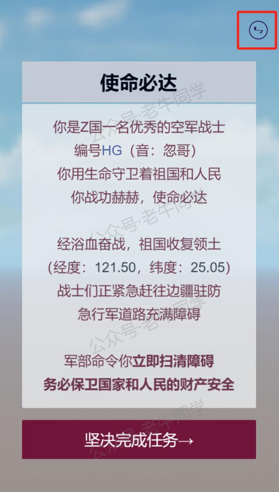
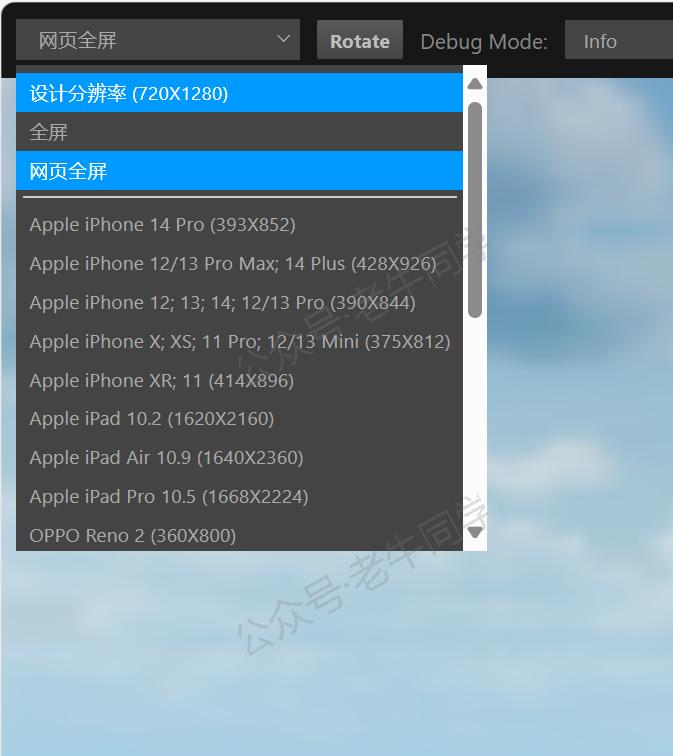
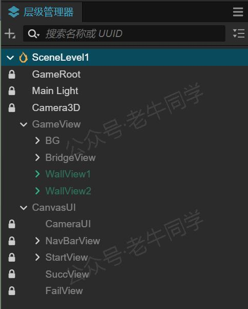
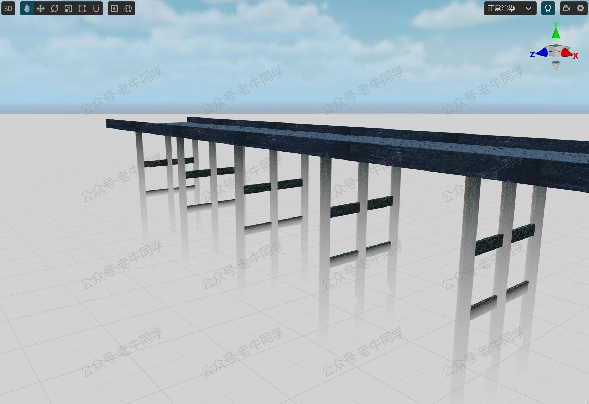
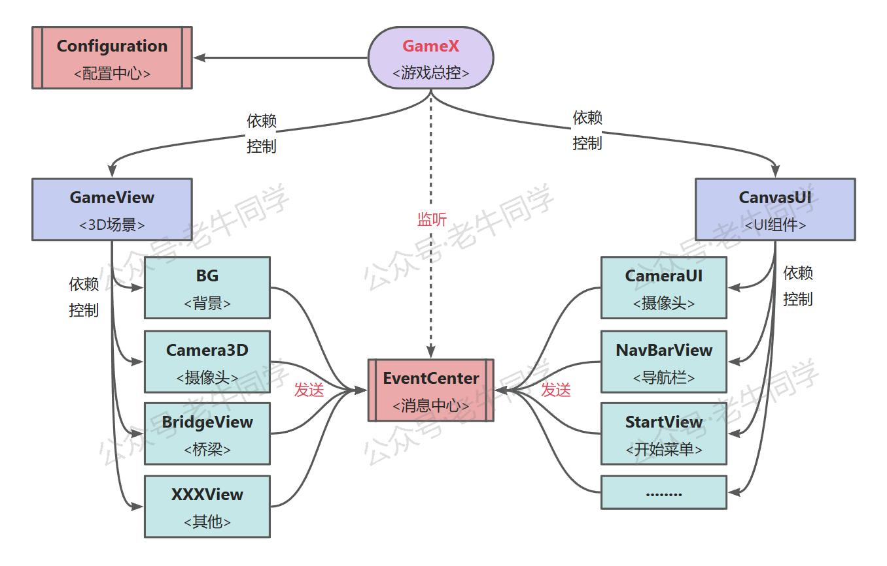

+++
slug = "2025020101"
date = "2025-02-01"
lastmod = "2025-02-01"
title = "新春“码”启 | Cocos 3D 开发微信小游戏（第4天）：游戏资源设计和核心框架源代码"
description = "新春开发 Cocos 3D 微信小游戏计划的第 4 天，包括游戏资源设计建议，如 UI 背景自适应、碰撞检测组件选用；游戏控制逻辑设计方面，包括组件层级管理及核心代码框架，还有配置中心和消息中心代码，所有的资源与代码均可免费下载……"
image = "00.jpg"
tags = [ "AI", "Cocos", "小游戏" ]
categories = [ "人工智能" ]
+++

放飞自我的时光总是过得很快，一晃春节就过去 3 天了，在这几天里老牛同学玩了不少款微信小游戏，在体验这些小游戏的同时，也分析了大佬们是如何设计小游戏的。对于一个 0 基础来研发小游戏的技术来说，市面上的这些小游戏就是最好的老师。

老牛同学的“新春小游戏计划”感觉这几天取得了一定的进展，因此本文分享给大家：

1. 关于游戏资源的设计，几天走了不少的弯路，有了自己心得体会，提供了几个参考建议。
2. 针对游戏控制逻辑，老牛同学抽取了共用核心代码，包括设计思路、配置中心、消息中心等，后续游戏可直接复用。

**提示：**本游戏所有的资源和代码均可下载，打开“**老牛同学**”微信小程序->点击“**更多**”Tab->“**源代码**”获取下载链接。

【“老牛同学”微信小程序】

老牛同学的小游戏目前进展如下图，包括原始：UI 组件自适应，背景蓝天白云在飘动，背景音乐在播放、可点击暂停启动等：



# 游戏资源的建议

老牛同学为了设计开始菜单的背景、和游戏主场景中的 3D 桥梁，浪费了近 2 天时间，几个小的建议，仅供参考。

## 建议一：UI 组件满屏背景的自适应问题

游戏的开始场景是一个 UI 组件，老牛同学为了美观，花费大精力通过 AI 大模型设计了好几款背景图片，并且经过精心处理和裁剪，保证图片大小完美匹配小游戏设计的尺寸（宽：`720像素`，高：`1280像素`）。

在 Cocos Creator 场景编辑器中，效果确实达到了预期（组件：`SpriteFrame`）。可是，当运行预览时，由于不同运行设备的尺寸差异较大，而背景图又无法自动拉伸，会导致背景图片无法做到满屏，没有覆盖的地方就太突兀、太难看了。

那么最好的办法就是：**不做无法确定尺寸的满屏背景图片**，直接使用原生背景即可！比如就像下面的这个背景，使用默认的蓝天白云就行了。



## 建议一：需要碰撞检测的组件使用原生组件

老牛同学想在游戏场景中展示一座 3D 桥梁，并且需要对桥梁增加碰撞组件（组件：`Collider`）。Cocos 原生的碰撞组件列表如下：



老牛同学不会 3D 建模，于是就直接到网上买了一座 3D 桥梁（`FBX`格式），桥梁本身没有问题，看起来还挺不错。可接下来问题就来了：由于桥梁设计比较复杂，Cocos 自有的碰撞组件一个也用不了！

那么最好的办法就是：对于游戏中的**核心资源**，使用 Cocos 自带的组件进行搭建！比如下面是老牛同学采用 Cocos 自带的圆柱体和立方体组件搭建的桥梁组件，丑是丑了一点，但是功能全部具备：



# 游戏控制逻辑设计

在上一篇中，老牛同学采用`director.loadScene()`来进行场景控制，但遇到个问题：场景切换比较生硬，没有连贯性，体验不好！

老牛同学这几天在玩游戏过程中，发现绝大多数的游戏设计，应该都是在同一个场景中，通过“**显示/隐藏**”不同区块的组件来实现控制游戏场景界面，并不是采用`director.loadScene()`来进行场景页面控制。

## 游戏组件层级设计

也就是说，小游戏中虽然有不同的场景、需要控制不同的界面，其实在大多数情况下，只需要设计一个`Scene`即可。

**注意：**这只是老牛同学理解的一般情况，并非绝对，如果游戏比较复杂，或不同的场景地图有着明显差别，建议还是设计多个`Scene`，以便于进行设计和管理！

那么如何控制不同组件的显示和隐藏呢？这就是“**层级管理器**”发挥威力的地方了：我们可以根据区块，把子组件放到不同的父层级组件中，然后程序控制父组件的显示和隐藏即可！

下面是老牛同学设计的层级：

1. 总体设计思路：游戏组件由“3D 主场景”和“UI 组件”组成。
2. `GameRoot`是一个空节点，由它控制整个游戏逻辑，包括：`GameView`游戏主场景、`CanvasUI`游戏 UI 组件。
3. `GameView`是一个空节点，由它控制游戏主场景，包括主摄像头、游戏背景、游戏节点等。
4. `CanvasUI`是一个`Canvas`组件，由它控制游戏 UI 组件，包括 UI 摄像头、游戏导航栏、开始菜单、游戏成功和失败界面等。


**注意：**这只是老牛同学自己根据自己经验的设计结果，并非标准！

## 核心代码框架设计

游戏中存在大量组件显示/隐藏、组件实例化/销毁、动画执行、音乐和音效播放/暂停、UI 交互、碰撞检测等等大量逻辑控制。

可能的方案：组件之间通过函数相互调用直接触发逻辑，它们相互依赖；优点是单独的 2 个组件之间的关系比较直观，缺点是整个游戏组件直接深度耦合，依赖关系可能是一张蜘蛛网，随着游戏复杂度上升，维护会越来越难。老牛同学认为这种设计不可取。

优化的方案：也是老牛同学推荐的办法，就像“层级管理器”一样，分层管理，**上层只依赖（或控制）它的直接下层，下层不能依赖上层，或同层之间不可直接依赖**，但它们可以通过**发送消息**给顶层，有顶层来驱动游戏逻辑。

优化的方案也是老牛同学的设计原则，下面是一张依赖关系图：



通过上述设计框架，层级分明，职责明确，维护方便！

## 核心代码：配置中心

配置中心核心职责是数据存储，包括：用户偏好设计、游戏运行状态数据等。

1. 配置中心为单聊模式，初始化则缓存当前数据，存储的内容就是一个 Map 对象。
2. 当发送数据更新时，则自动完成数据存储，通过`setInterval`每 500 毫秒存储一次。

设计优点：

1. 数据缓存内存，读取效率高。
2. 数据更新，自动存储，失败重试，调用者无需关系中间异常等。

```typescript
// 游戏存储配置ID
const GAME_CONFIG_KEY: string = 'GameConfigID';

/**
 * 存储工具类
 */
export class Configuration {

    // 自动保存标
    private autoSaveFlag = false;

    /**
     * 数据缓存
     */
    private data = {};

    /**
     * 单例实例化
     */
    static _instance: Configuration = null;
    public static instance() {
        if (!this._instance) {
            this._instance = new Configuration();
            this._instance.init();
        }

        return this._instance;
    }

    /**
     * 构造器
     */
    constructor() {
        console.log('Configuration对象初始化.');
    }

    /**
     * 初始化
     */
    private init() {
        const storage = sys.localStorage.getItem(GAME_CONFIG_KEY);
        if (storage) {
            this.data = JSON.parse(storage);
        }

        // 缓存数据
        console.log(`Configuration配置数据: ${storage}`);

        // 定时存储
        setInterval(this.doScheduleSave.bind(this), 500);
    }

    /**
     * 定时存储数据
     */
    private doScheduleSave() {
        if (!this.autoSaveFlag) {
            return;
        }

        console.log('Configuration开始存储数据.');

        try {
            const content = JSON.stringify(this.data);
            sys.localStorage.setItem(GAME_CONFIG_KEY, content);
            this.autoSaveFlag = false;

            console.log('Configuration存储数据完成.');
        } catch (e) {
            console.error(`Configuration存储数据异常 | ${e}`);

            // 继续存储
            this.autoSaveFlag = true;
        }
    }

    /**
     * 存储数据（`string`类型）
     */
    public storeString(key: string, value: string) {
        this.data[key] = value;
        this.autoSaveFlag = true;
    }

    /**
     * 获取数据（`string`类型）
     */
    public fetchString(key: string, defaultValue: string): string {
        const value = this.data[key];
        return value || defaultValue;
    }

    /**
     * 存储数据（`boolean`类型）
     */
    public storeBoolean(key: string, value: boolean) {
        this.data[key] = value;
        this.autoSaveFlag = true;
    }

    /**
     * 获取数据（`boolean`类型）
     */
    public fetchBoolean(key: string, defaultValue: boolean): boolean {
        const value = this.data[key];
        if (value == null) {
            return defaultValue;
        }

        return (value === true) || (value === 'true') || (value === 'ON');
    }

    /**
     * 存储数据（`number`类型）
     */
    public storeNumber(key: string, value: number) {
        this.data[key] = value;
        this.autoSaveFlag = true;
    }

    /**
     * 获取数据（`number`类型）
     */
    public fetchNumber(key: string, defaultValue: number): number {
        return this.data[key] || defaultValue;
    }
}
```

## 核心代码：消息中心

在本小游戏中，消息中心是小游戏逻辑控制的枢纽，它的使用方式：

1. 游戏总控监听所有的消息事件，当子节点发生特定事件（如：点击开始游戏按钮），需要通知上游或其他节点时，他就发送消息。
2. 游戏总控接收到消息时，开始层层驱动下游节点执行，如监听到开始游戏事件，则驱动游戏主场景显示、UI 组件隐藏开始菜单等。

```typescript
/**
 * 事件常量
 */
export enum EventName {
    GAME_LAUCH = 'GAME_LAUCH',
    GAME_START = 'GAME_START',
}

/**
 * 游戏事件
 */
interface GameEvent {
    // 回调函数
    func: Function;

    // 函数对象
    target: any;
}

/**
 * 事件总线
 */
export class EventCenter {
    /**
     * 事件处理器（1个事件，存在多个处理器）
     */
    private static handlers: { [key: string]: GameEvent[] } = {};

    /**
     * 注册监听事件
     *
     * @param eventName 事件名
     * @param cb 回调函数
     * @param target 函数所在对象（可空）
     */
    public static on(eventName: string, cb: Function, target?: any): void {
        if (!this.handlers[eventName]) {
            this.handlers[eventName] = [];
        }

        this.handlers[eventName].push({
            func: cb,
            target: target,
        });

        console.log(`注册游戏事件：(${eventName})->(${target?.name}.${cb.name})`);
    }

    /**
     * 取消监听事件
     *
     * @param eventName 事件名
     * @param cb 回调函数
     * @param target 函数所在对象（可空）
     */
    public static off(eventName: string, cb: Function, target?: any): void {
        const eventList = this.handlers[eventName];
        if (!eventList || eventList.length <= 0) {
            return;
        }

        console.log(`取消游戏事件：(${eventName})->(${target?.name}.${cb.name})`);

        for (let i = 0; i < eventList.length; i++) {
            const event = eventList[i];
            if (event.func === cb && (!target || target === event.target)) {
                eventList.splice(i, 1);
                break;
            }
        }
    }

    /**
     * 发送事件
     *
     * @param eventName 事件名
     * @param args 参数列表
     */
    public static dispatch(eventName: string, ...args: any): void {
        const eventList = this.handlers[eventName];
        if (!eventList || eventList.length <= 0) {
            return;
        }

        console.log(`发送游戏事件：(${eventName})->(${args})`);

        for (let i = 0; i < eventList.length; i++) {
            const event = eventList[i];
            event.func.apply(event.target, args);
        }
    }
}
```

# 总结

以上部分只是老牛同学挑选的部分内容，小游戏完整的资源和源代码：打开“**老牛同学**”微信小程序->点击“**更多**”Tab->“**源代码**”获取下载链接。

【“老牛同学”微信小程序】

---

Cocos 0基础小游戏：

<small>[01.技术选型](https://mp.weixin.qq.com/s/TlgNKvGYMuGMmU0dIBPn4A) 丨 [02.研发流程](https://mp.weixin.qq.com/s/qlOYpjREXBKb7vl1kuujlg) 丨 [03.小游戏框架](https://mp.weixin.qq.com/s/V3CIhswW3CVcTY1aPaALTw)</small>

Transformers 框架序列：

<small>[01.包和对象加载中的设计巧思与实用技巧](https://mp.weixin.qq.com/s/lAAIfl0YJRNrppp5-Vuusw)</small>

<small>[02.AutoModel 初始化及 Qwen2.5 模型加载全流程](https://mp.weixin.qq.com/s/WIbbrkf1HjVC1CtBNcU8Ow)</small>

<small>[03.Qwen2.5 大模型的 AutoTokenizer 技术细节](https://mp.weixin.qq.com/s/Shg30uUFByM0tKTi0rETfg)</small>

<small>[04.Qwen2.5/GPT 分词流程与 BPE 分词算法技术细节详解](https://mp.weixin.qq.com/s/GnoHXsIYKYFU1Xo4u5sE1w)</small>

<small>[05.嵌入（Embedding）机制和 Word2Vec 实战](https://mp.weixin.qq.com/s/qL9vpmNIM1eO9_lQq7QwlA)</small>

<small>[06.位置嵌入（Positional Embedding）](https://mp.weixin.qq.com/s/B0__TRnlI7zgwn0OhguvXA)</small>

Pipeline NLP 任务序列：

<small>[零·概述](https://mp.weixin.qq.com/s/FR4384AZV2FE2xtweSh9bA) 丨 [01.文本转音频](https://mp.weixin.qq.com/s/uN2BFIOxDFEh4T-W7tsPbg) 丨 [02.文本分类](https://mp.weixin.qq.com/s/9ccEDNfeGNf_Q9pO0Usg2w) 丨 [03.词元分类和命名实体识别](https://mp.weixin.qq.com/s/r2uFCwPZaMeDL_eiQsEmIQ) 丨 [04.问答](https://mp.weixin.qq.com/s/vOLVxRircw5wM1_rCqoAfg) 丨 [05.表格问答](https://mp.weixin.qq.com/s/Q0fWdw3ACVzQFldBScZ2Fw) | [06.填充蒙版](https://mp.weixin.qq.com/s/hMFCgYovHPVFOjOoihaUHw)</small>

往期推荐文章：

<small>[Cline 免费插件 + Qwen2.5 大模型，零经验也能开发“对联王”微信小程序](https://mp.weixin.qq.com/s/F-CUuaZwmqt6X7QkI_IrVA)</small>

<small>[使用Cursor + Qwen2.5 大模型 零经验研发微信小程序：自由构建个性化节拍器应用实战](https://mp.weixin.qq.com/s/vraegr_5AJG7bPo6mBgvbQ)</small>

<small>[Bolt.new 用一句话快速构建全栈应用：本地部署与应用实战（Ollama/Qwen2.5 等）](https://mp.weixin.qq.com/s/Mq8CvZKdpokbj3mK-h_SAQ)</small>

<small>[基于 Qwen2.5-Coder 模型和 CrewAI 多智能体框架，实现智能编程系统的实战教程](https://mp.weixin.qq.com/s/8f3xna9TRmxMDaY_cQhy8Q)</small>

<small>[vLLM CPU 和 GPU 模式署和推理 Qwen2 等大语言模型详细教程](https://mp.weixin.qq.com/s/KM-Z6FtVfaySewRTmvEc6w)</small>

<small>[基于 Qwen2/Lllama3 等大模型，部署团队私有化 RAG 知识库系统的详细教程（Docker+AnythingLLM）](https://mp.weixin.qq.com/s/PpY3k3kReKfQdeOJyrB6aw)</small>

<small>[使用 Llama3/Qwen2 等开源大模型，部署团队私有化 Code Copilot 和使用教程](https://mp.weixin.qq.com/s/vt1EXVWtwm6ltZVYtB4-Tg)</small>

<small>[基于 Qwen2 大模型微调技术详细教程（LoRA 参数高效微调和 SwanLab 可视化监控）](https://mp.weixin.qq.com/s/eq6K8_s9uX459OeUcRPEug)</small>

<small>[ChatTTS 长音频合成和本地部署 2 种方式，让你的“儿童绘本”发声的实战教程](https://mp.weixin.qq.com/s/9ldLuh3YLvx8oWvwnrSGUA)</small>


