+++
slug = "2025020501"
date = "2025-02-05"
lastmod = "2025-02-05"
title = "新春“码”启 | Cocos 3D 微信小游戏（第5天）：分包构建和上传体验（完美收官）"
description = "新春开发 Cocos 3D 微信小游戏计划的第 5 天，详细介绍了如何利用Cocos Creator开发并发布一款3D微信小游戏，包括游戏状态机的设计理念，和微信小游戏主包大小限制时的解决方案——分包策略。从游戏设计、开发、调试到最后成功发布的全过程，为想要进入微信小游戏开发领域的开发者提供了宝贵的经验……"
image = "00.jpg"
tags = [ "AI", "Cocos", "小游戏" ]
categories = [ "人工智能" ]
+++

老牛同学这几天七赶八赶，终于在假期结束前，完成了 Cocos 3D 小游戏功能研发和测试调试，节前制定的“新春小游戏计划”也算是完美收官了。

接下来就是把在 Cocos Creator 中研发完成的小游戏上传到微信小游戏平台，可直接通过手机进行游玩体验。

上传过程中遇到了包大小无法上传的问题（微信小游戏主包限制**4MB**大小），老牛同学把解决版本的过程（即：分包）记录一下，共网友参考。

**提示：** 本游戏所有的资源和代码均可免费下载，过打开“**老牛同学**”微信小程序->点击“**更多**”Tab->“**源代码**”获取下载链接。

【“老牛同学”微信小程序】

源代码文件夹中有 2 个 Zip 包：1 个是 Cocos Creator 的**源代码**；1 个是通过 Cocos Creator 构建的**微信小游戏**代码，可直接导入到“微信开发者工具”中即可进行预览和上传发布。

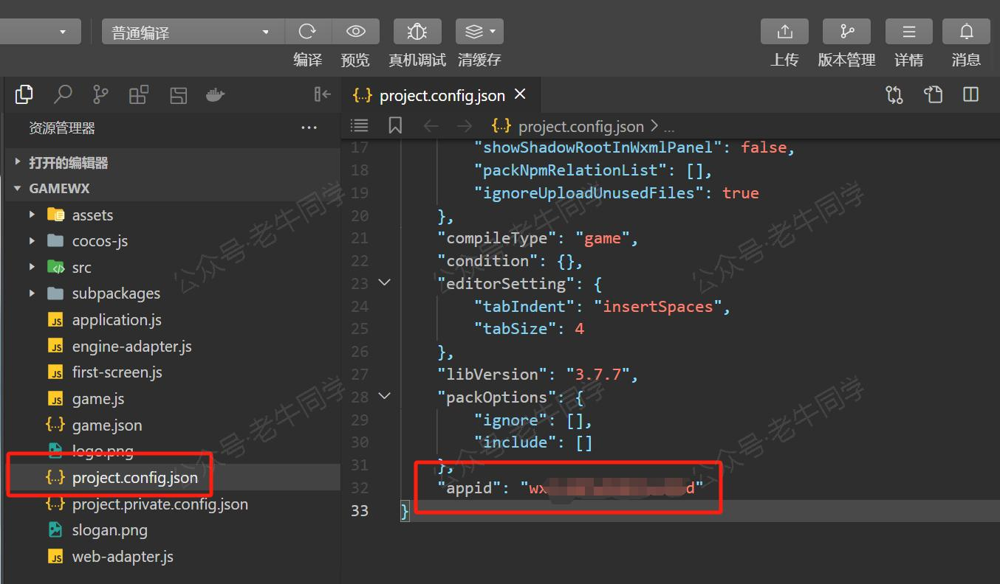

**特别注意：** 在上传发布到微信小游戏平台之前，请务必修改一下微信小游戏 AppID 内容！

# 小游戏状态机设计

在分包发布之前，老牛同学补充一下这款小游戏的状态机设计图，这也是这款小游戏的最后一张设计图。之前的总体设计方案、框架设计图等，请参考前面的几篇文章。

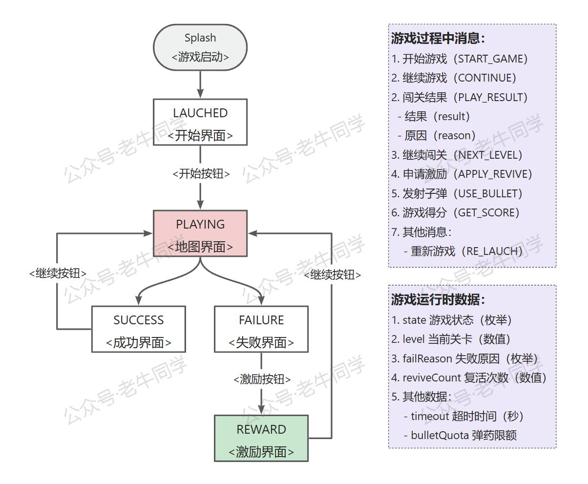

老牛同学把小游戏运行的状态机，抽象设计为以下 5 个：

- **LAUCHED** 启动状态，或者重新开始状态：这是一个入口状态，初始化游戏场景。
- **PLAYING** 闯关状态，包括首次进入关卡或者复活进入关卡，是游戏的主场景。
- **SUCCESS** 闯关成功状态，如果有更多关卡，则又进入“闯关状态”，可不断完成闯关。
- **FAILURE** 闯关失败状态，可以申请复活或者重新开始游戏。
- **REWARD** 闯关失败状态，可以申请复活或者重新开始游戏。

只有状态机还不够，因为小游戏在运行过程中，场景中需要展示或者隐藏不同组件，这就涉及到运行时数据，包括：

- `state` 游戏当前状态，以上 5 个枚举值。
- `level` 当前所在关卡
- `failReason` 闯关失败的原因，本小游戏只有 2 个枚举值
- `reviveCount` 当前关卡复活的失败次数
- 其他数据，包括：关卡的“超时时间”和“工具限额”数量等。

通过状态机和运行时数据，我们可以确保游戏整体运行按照期望执行。

# 微信小游戏发布

接下来就是把小游戏发布成微信小游戏了，这样就可以通过手机进行游玩了。

## 微信小游戏类目设置

首先注册个微信小程序，和注册普通小程序注册无差异。需要注意的是，小程序的类目必须设置为“小游戏”，否则它就是一个普通的小程序，是无法使用游戏引擎。

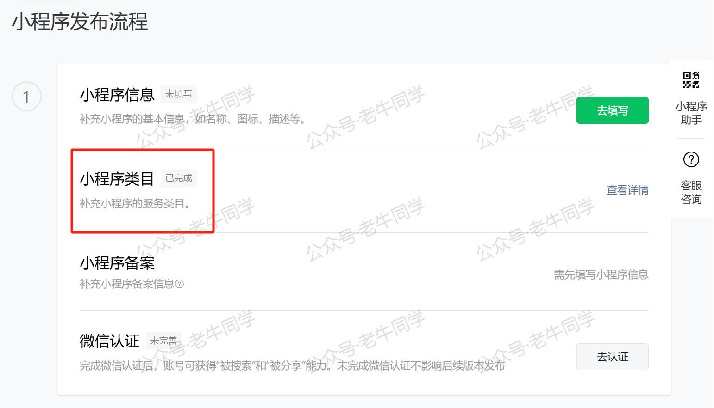

对于小程序来说，我们只需要设置“小程序类目”即可，其他小程序的一切设置均可在后续我们有空了在操作，不影响我们上传和体验。

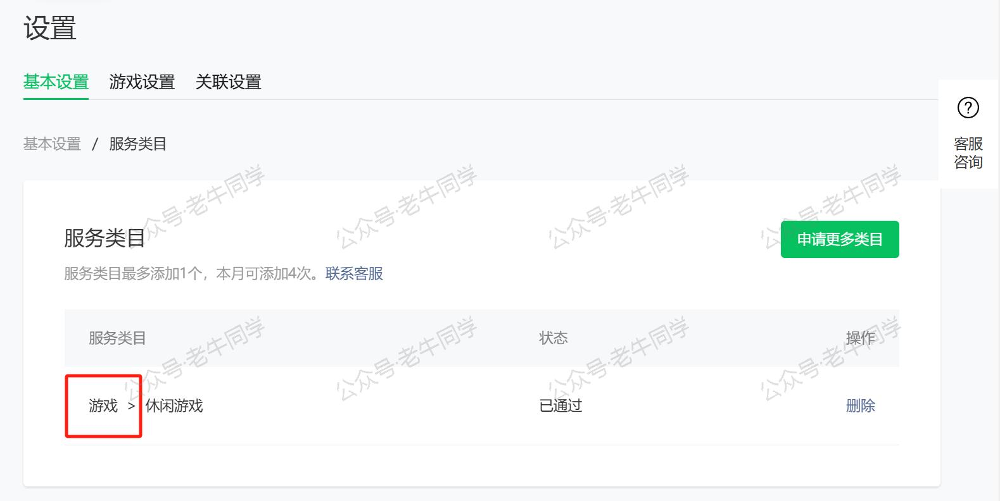

如果我们需要把小程序发布上线的话，则每年都需要进行一次认证，且每次认证需要**300 元**的认证费用。因为这是老牛同学的第 1 个小游戏，核心目的是为了学习和试试水，所以暂时未设置小程序其他内容，包括名称等。

设置完成小程序类目之后，我们可以复制一下“小游戏 AppID”，准备到 Cocos Creator 进行构建了：

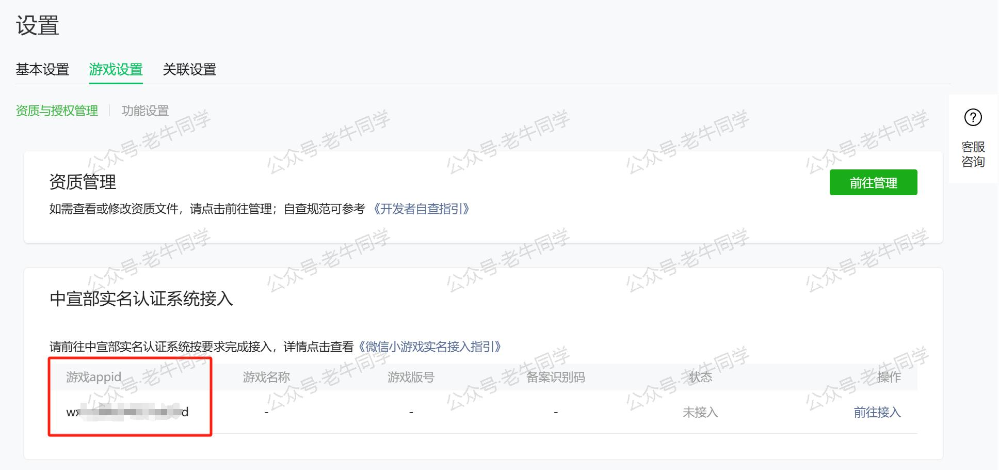

## Cocos Creator 代码分包配置

如果直接使用 Cocos Creator 项目构建出微信小游戏，然后通过微信开发者工具进行上传时，必然会报错：`系统错误，错误码：80051,source size 7874KB exceed max limit 4MB`

原因是微信小游戏的**主包**大小超过了**4MB**限制。解决办法就是**分包**，以尽可能缩小主包大小。

- 什么是主包，简单理解就是我们打开微信小游戏时，小游戏必须加载的数据，包括文件、资源等内容。如果文件很大，那么我们打开游戏就会等待。
- 什么是分包，简单理解就是在我们打开为小游戏之后，可以通过程序异步加载的数据。就是先让用户进入游戏，先玩起来，后面的数据内容在边玩边加载。

Cocos Creator 分包的操作如下：

1. 在 Cocos Creator 资源管理中，新增一个目录，暂且为`subpkg`，然后把目前游戏所有的资源都拖放进去。同时，在资源管理器中选择`subpkg`目录，把它设置为一个`Bundle`（即：分包）：

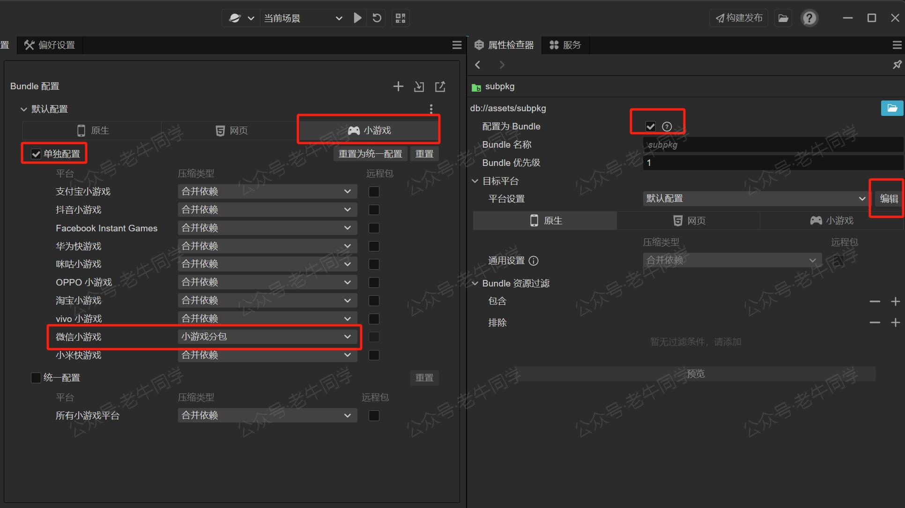

2. 由于我们把目前场景设置成了 Bundle，我们需要一个场景来启动我们的游戏。新建一个场景，暂且为`Start`，在场景中新建一个`Start`空节点；同时新建一个名为`Start.ts`脚本，并把该脚本挂到`Start`空节点上：

```typescript
import { _decorator, AssetManager, assetManager, Component, director, Node } from 'cc';
const { ccclass, property } = _decorator;

@ccclass('Start')
export class Start extends Component {

    /**
     * 主包启动
     */
    protected start(): void {
        assetManager.loadBundle('subpkg', (e, bundle: AssetManager.Bundle) => {
            director.loadScene('GameX');
        });
    }
}
```

从代码可以看出，我们的目的最终是通过`Start.ts`启动我们的游戏。关于`Start`场景，我们可以美化以下，老牛同学就简单的放了一张图片。

3. 最终，`Start`场景和所有资源管理器内容下：

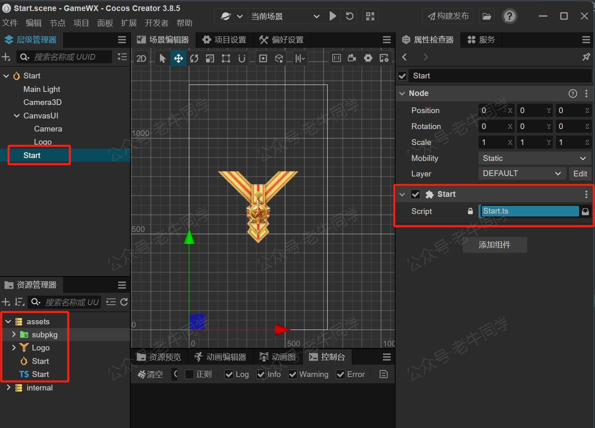

4. 在做好了主包之后，可以根据实际情况，进一步裁剪压缩包大小：“项目” -> “项目设置” -> “功能裁剪”。我们可以根据实际情况，去掉小游戏中没有用到的功能，包括：视频、WebView、2D 物理系统、粒子系统等。

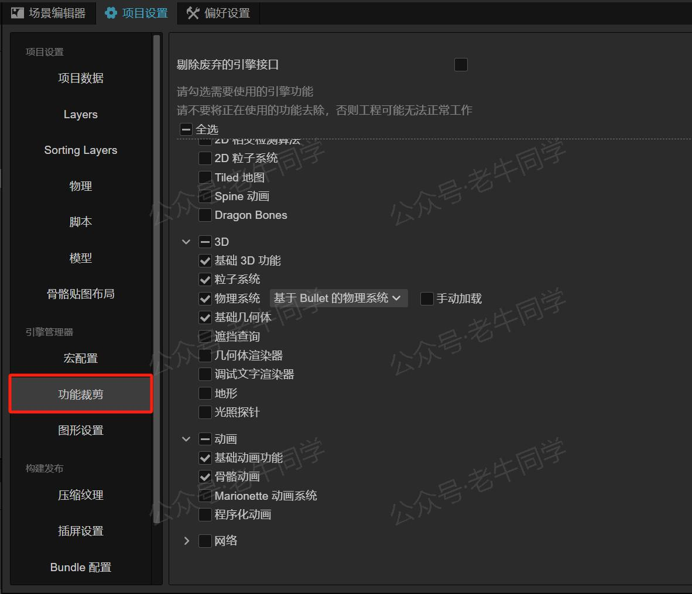

5. 网上还有一些其他的优化手段，包括：压缩图片质量、裁剪图片大小、压缩音频文件、去掉天空盒等，这样做确实可以缩小包大小，在万不得已的情况下，老牛同学不建议这样做，因为这样会降低游戏体验。

## Cocos Creator 项目构建配置

打开 Cocos Creator 项目构建设置：“项目” -> “构建发布”，我们可以看到`Start`场景为主包，原来的小游戏场景`GameX`为一个**Bundle**。在构建发布页面的底部**AppID**部分，填写注册的小游戏 AppID 即可开始构建（**APPID**也可以修改`project.config.json`文件的`appid`内容）

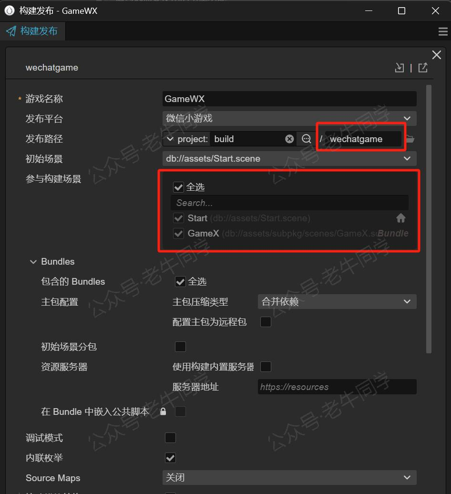

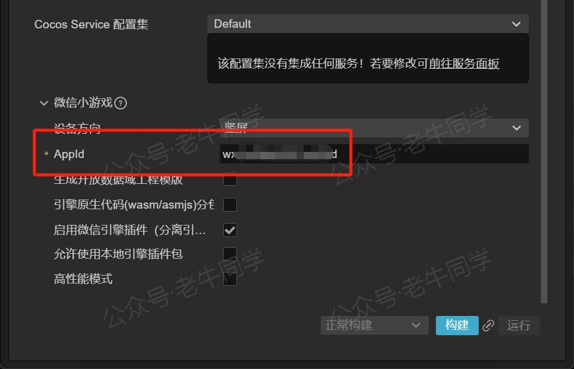

## 微信小游戏分包上传和体验

通过以上配置，我们可以在`game.json`中看到分包配置：

```json
{
    "deviceOrientation": "portrait",
    "networkTimeout": {
        "request": 5000,
        "connectSocket": 5000,
        "uploadFile": 5000,
        "downloadFile": 500000
    },
    "plugins": {
        "cocos": {
            "version": "3.8.5",
            "provider": "wx0446ba2621dda60a"
        }
    },
    "subpackages": [
        {
            "name": "subpkg",
            "root": "subpackages/subpkg/"
        }
    ]
}
```

其中，`subpackages`就是我们所有的分包配置。

通过以上配置，我们在次通过“微信开发者工具”就可以正常上传小游戏代码了。

上传成功之后，等了微信小程序后台，把上传的版本设置为“体验版”即可：

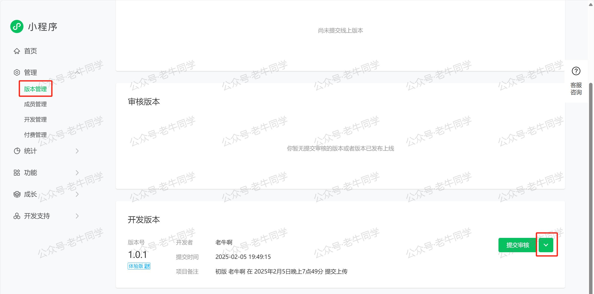

现在，就可以通过手机扫描，体验小游戏了~

# 最后，简单总结

节前制定的“新春小游戏计划”今天算是一个重要里程碑了，接下来就是不断优化打磨。这是老牛同学研发的第一款小游戏，而且是一款 3D 小游戏。做这款小游戏的初衷是**学习**，就是想改一改以往春节只是吃饭、睡觉、聊天和看手机的主旋律。总体来说，老牛同学感觉今年春节是过得比较充实的一个春节。

在“主包”的场景`Start`设计中，老牛同学只是放了一张图片，设计比较粗糙；同时通过`director.loadScene`进行场景切换比较突兀，在正式发布之前，建议进行美化。目前有几个思路，仅供参考：

1. 可以做成一个类似于加载页面，稍微不那么突兀
2. 场景功能调整，拆分主包的场景，主包真正就是主场景的一部分

其他的优化，老牛同学继续公开源代码，大家可随时下载和更新：打开“**老牛同学**”微信小程序->点击“**更多**”Tab->“**源代码**”获取下载链接。

---

Cocos 3D 小游戏：

<small>[01.技术选型](https://mp.weixin.qq.com/s/TlgNKvGYMuGMmU0dIBPn4A) 丨 [02.研发流程](https://mp.weixin.qq.com/s/qlOYpjREXBKb7vl1kuujlg) 丨 [03.小游戏框架](https://mp.weixin.qq.com/s/V3CIhswW3CVcTY1aPaALTw)丨 [04.核心架构设计](https://mp.weixin.qq.com/s/8f3GZNd7qjwIhfTcsVruYQ)</small>

Transformers 框架序列：

<small>[01.包和对象加载中的设计巧思与实用技巧](https://mp.weixin.qq.com/s/lAAIfl0YJRNrppp5-Vuusw)</small>

<small>[02.AutoModel 初始化及 Qwen2.5 模型加载全流程](https://mp.weixin.qq.com/s/WIbbrkf1HjVC1CtBNcU8Ow)</small>

<small>[03.Qwen2.5 大模型的 AutoTokenizer 技术细节](https://mp.weixin.qq.com/s/Shg30uUFByM0tKTi0rETfg)</small>

<small>[04.Qwen2.5/GPT 分词流程与 BPE 分词算法技术细节详解](https://mp.weixin.qq.com/s/GnoHXsIYKYFU1Xo4u5sE1w)</small>

<small>[05.嵌入（Embedding）机制和 Word2Vec 实战](https://mp.weixin.qq.com/s/qL9vpmNIM1eO9_lQq7QwlA)</small>

<small>[06.位置嵌入（Positional Embedding）](https://mp.weixin.qq.com/s/B0__TRnlI7zgwn0OhguvXA)</small>

Pipeline NLP 任务序列：

<small>[零·概述](https://mp.weixin.qq.com/s/FR4384AZV2FE2xtweSh9bA) 丨 [01.文本转音频](https://mp.weixin.qq.com/s/uN2BFIOxDFEh4T-W7tsPbg) 丨 [02.文本分类](https://mp.weixin.qq.com/s/9ccEDNfeGNf_Q9pO0Usg2w) 丨 [03.词元分类和命名实体识别](https://mp.weixin.qq.com/s/r2uFCwPZaMeDL_eiQsEmIQ) 丨 [04.问答](https://mp.weixin.qq.com/s/vOLVxRircw5wM1_rCqoAfg) 丨 [05.表格问答](https://mp.weixin.qq.com/s/Q0fWdw3ACVzQFldBScZ2Fw) | [06.填充蒙版](https://mp.weixin.qq.com/s/hMFCgYovHPVFOjOoihaUHw)</small>

往期推荐文章：

<small>[Cline 免费插件 + Qwen2.5 大模型，零经验也能开发“对联王”微信小程序](https://mp.weixin.qq.com/s/F-CUuaZwmqt6X7QkI_IrVA)</small>

<small>[使用 Cursor + Qwen2.5 大模型 零经验研发微信小程序：自由构建个性化节拍器应用实战](https://mp.weixin.qq.com/s/vraegr_5AJG7bPo6mBgvbQ)</small>

<small>[Bolt.new 用一句话快速构建全栈应用：本地部署与应用实战（Ollama/Qwen2.5 等）](https://mp.weixin.qq.com/s/Mq8CvZKdpokbj3mK-h_SAQ)</small>

<small>[基于 Qwen2.5-Coder 模型和 CrewAI 多智能体框架，实现智能编程系统的实战教程](https://mp.weixin.qq.com/s/8f3xna9TRmxMDaY_cQhy8Q)</small>

<small>[vLLM CPU 和 GPU 模式署和推理 Qwen2 等大语言模型详细教程](https://mp.weixin.qq.com/s/KM-Z6FtVfaySewRTmvEc6w)</small>

<small>[基于 Qwen2/Lllama3 等大模型，部署团队私有化 RAG 知识库系统的详细教程（Docker+AnythingLLM）](https://mp.weixin.qq.com/s/PpY3k3kReKfQdeOJyrB6aw)</small>

<small>[使用 Llama3/Qwen2 等开源大模型，部署团队私有化 Code Copilot 和使用教程](https://mp.weixin.qq.com/s/vt1EXVWtwm6ltZVYtB4-Tg)</small>

<small>[基于 Qwen2 大模型微调技术详细教程（LoRA 参数高效微调和 SwanLab 可视化监控）](https://mp.weixin.qq.com/s/eq6K8_s9uX459OeUcRPEug)</small>

<small>[ChatTTS 长音频合成和本地部署 2 种方式，让你的“儿童绘本”发声的实战教程](https://mp.weixin.qq.com/s/9ldLuh3YLvx8oWvwnrSGUA)</small>


