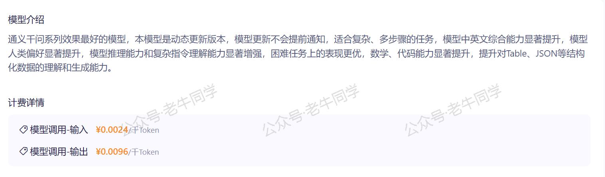
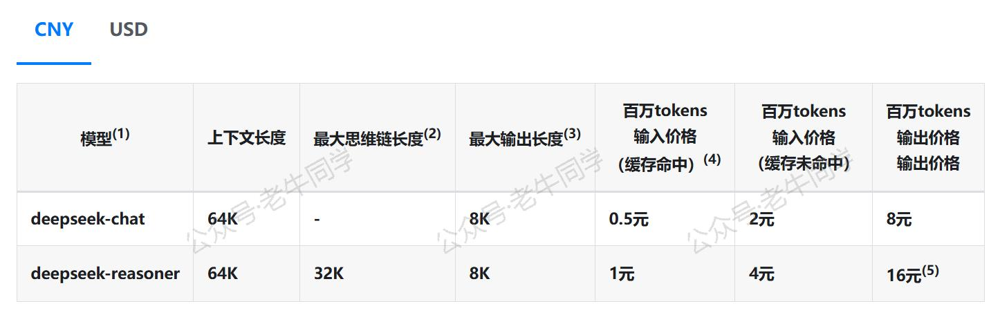
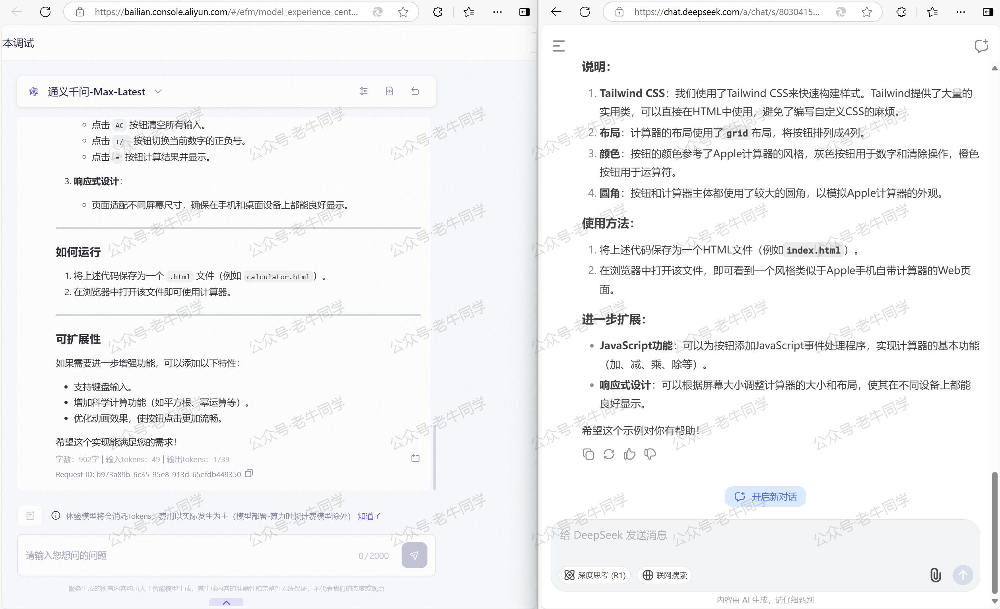
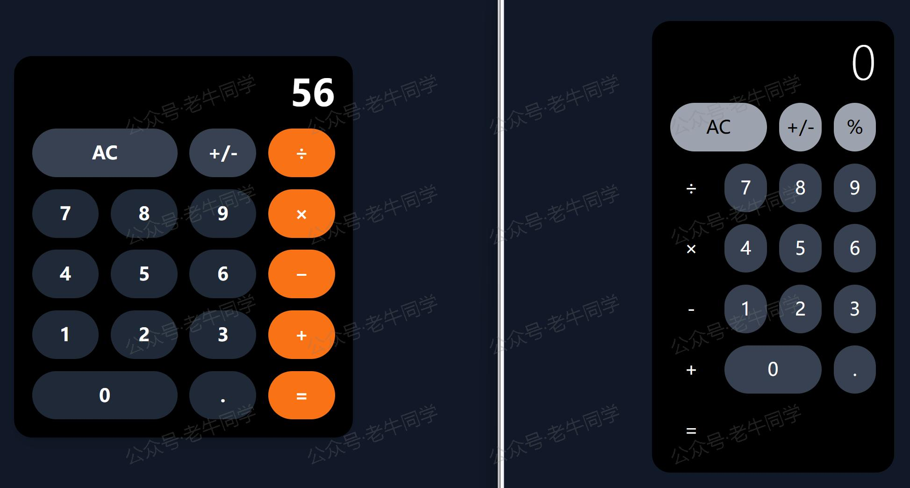
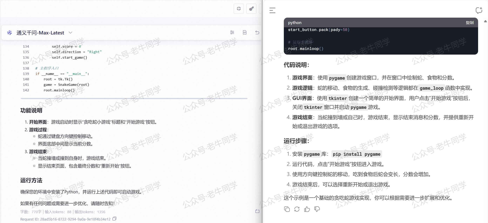
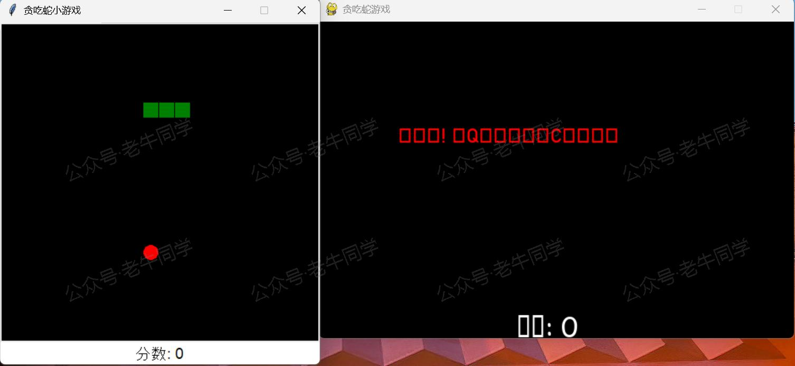
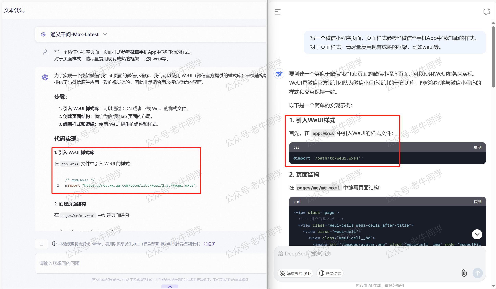
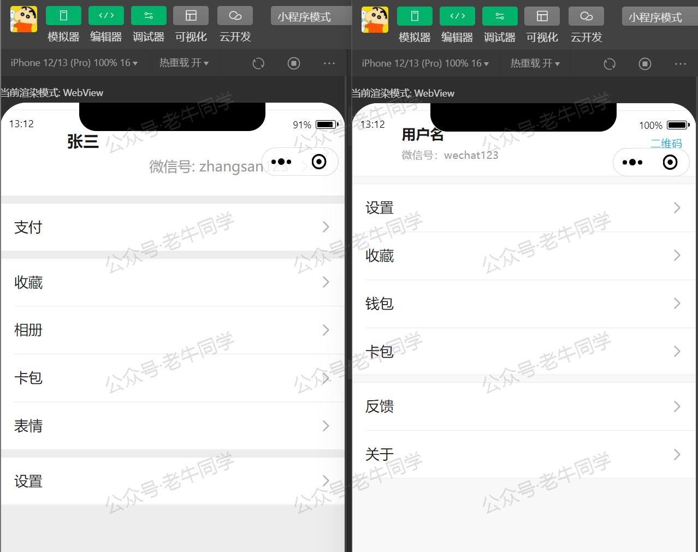
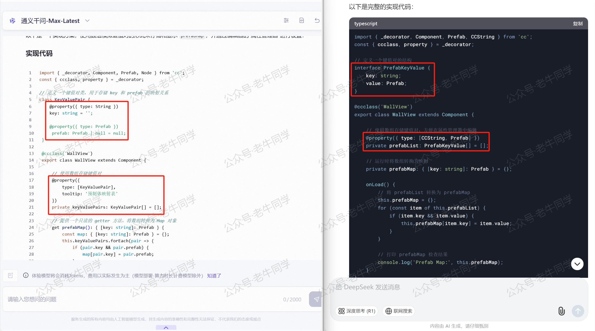

+++
slug = "2025020901"
date = "2025-02-09"
lastmod = "2025-02-09"
title = "DeepSeek vs. Qwen 大模型编程能力比拼，谁更适合你的 AI 辅助编程助手？"
description = "通过实际使用体验，对DeepSeek和Qwen大模型在价格、Web页面、Python、微信小程序和Cocos小游戏编程等方面进行了详细评测。结果显示，Qwen编程能力更胜一筹。特别是Web和Python编程测试中，Qwen的表现明显优于DeepSeek。文章还分享了具体的编程测试案例和源码，供读者参考和验证……"
image = "00.jpg"
tags = [ "AI", "DeepSeek", "Qwen", "大模型" ]
categories = [ "人工智能" ]
+++

整个春节假期，DeepSeek 与《哪吒 2》的消息接连不断，看完我总有种莫名的激动。一边是 DeepSeek 在基础技术领域的深耕细作，另一边则是《哪吒 2》对用户产品的精心打磨，两者多年来的默默努力和不懈追求，终于在今年春节实现了一飞冲天、一鸣惊人的突破！

老牛同学作为一名长期使用 Qwen 大模型Token服务的用户，目前余额所剩无几了，对购买的服务主要就三个追求：**价格**、**效率**、**效果**。

接下来，老牛同学将根据自己使用大模型的实际情况，对**DeepSeek**和**Qwen**分别进行以下几个方面的测验，哪个得分高，老牛同学后续就用哪个的 Token 服务。

1. 价格：说实话，现在大模型厂商都很卷，价格都很实惠。同时，Token 数量与分词算法相关，因此价格只要不超过 50%，老牛同学觉得都差多不。
2. 效率：敢作为服务拿出来卖，老牛同学觉得效率都不会差；同时，模型产出内容不一样，这里就没有一个严格标准，因此暂不做比较。
3. **效果**，这是老牛同学最关心的点，只有满足需求的服务，才是需要的服务。**编程**是老牛同学使用大模型服务最多的地方，因此将通过**Web 页面**、**Python**、**微信小程序**和**Cocos 小游戏**这 4 个方面编程结果进行评测。

- 为了消除历史消息对上下文的影响，每次编程老牛同学都使用全新的会话。
- 本次编程评测编程代码结果，老牛同学全部上传共享，大家可通过打开“**老牛同学**”微信小程序->点击“**更多**”Tab->“**源代码**”获取下载链接进行复验：


# Qwen 和 DeepSeek 服务价格（DeepSeek 更实惠）

老牛同学将以**Qwen-Max-Latest**和**DeepSeek-Chat**进行比较（Token 数量统一为**百万**），以下是 2 个大模型官网公布的价格：

- Qwen 价格：输入**¥2.4**，输出**¥9.6**
- DeepSeek 价格：输入缓存命中**¥0.5**，缓存未命中**¥2**，输出**¥8**





虽然 Qwen 和 DeepSeek 采用的分词算法可能不一样，但是考虑到都是以**百万**为单位，这些差异基本可以忽略。

从上述官网价格来看：**DeepSeek 更实惠**！

# Qwen 和 DeepSeek 编程能力

接下来，我们开始进行编程评测，分别通过**Web 页面**、**Python**、**微信小程序**和**Cocos 小游戏**这 4 个方面编程进行评测。

## Web 页面编程（Qwen 胜出）

**计算器**是一个很好的 Web 程序样例，老牛同学就选择它作为考题，提示词如下：

```plaintext
写一个**计算器**静态Web页面，计算器的风格参考Apple手机自带的计算器App。
对于CSS样式，请尽量复用现有的CSS框架，比如BootStrap、Tailwind CSS等等。
```



最终，老牛同学复制 2 个模型的输出 HTML 代码，通过浏览器打开：



2 个模型的 Web 编程结果分析：

- 风格：Qwen 更接近 Apple 手机自带的计算器。
- 功能：对于基本的加、减、乘、除功能，Qwen 输入框只展示了计算结果，没有显示过程算式；而 DeepSeek 点击无反应，也没有结果。

总结，老牛同学对 Web 页面编程评测结论：**Qwen 胜出**！

## Python 编程（Qwen 胜出）

**贪吃蛇**是一款经典的单机游戏，也是很多一部分学习 Python 编程技术的第一个完整程序，我们就以它作为考题，提示词如下：

```plaintext
使用Python，写一个带有GUI界面的**贪吃蛇**小游戏，要求：
1. 游戏开始，有“开始”操作界面，用户点击开始游戏
2. 游戏过程中，在界面底部中间，展示当前分数
3. 游戏结束，有一个结束页面，页面展示游戏分数，并有“重新开始”操作界面
```



最终，老牛同学在本机分别运行这 2 个小游戏，界面如下：



对于最终编程结果，评测分析如下：

- 功能：2 个大模型的结果，均能跑起来，有开始界面，正常展示。
- 游戏：Qwen 蛇的速度比较适中，基本还能玩起来。而 DeepSeek 蛇速度则很快，老牛同学手速没有那么快，基本玩不起来。
- 结果：Qwen 能正常展示中文，而 DeepSeek 展示就是乱码了（缺少`ttf`字体文件）。

总结，Python 编程评测结果：**Qwen 胜出**！

## 微信小程序编程（势均力敌）

接下来，我们进行微信小程序编程评测，老牛同学感觉比上面 2 个编程要稍微难一点：

```plaintext
写一个微信小程序页面，页面样式参考**微信**手机App中“我”Tab的样式。
对于页面样式，请尽量复用现有成熟的框架，比如weui等。
```



对于**weui**框架的`app.wxss`文件：Qwen 给的地址文件不存在，而 DeepSeek 给的是一个样例地址。老牛同学修复这个问题之后，最终小程序页面样式如下：



从最终小程序页面效果来看：**Qwen**和**DeepSeek**表现基本一致！

但有个**问题**：Qwen 和 DeepSeek 都是直接引用**weui**框架样式，这样势必会增加小程序包大小**170KB**左右。而**weui**最佳使用方式是作为扩展组件库的方式引入，这样就不会增加包大小了。

## Cocos 小游戏编程（Qwen 略胜）

最后，来一个 Cocos 小游戏编程。今年春节，老牛同学从 0 基础开始学习，使用 Cocos Creator 做了一款微信小游戏。过程中遇到了不少问题，我把其中一个问题拿出来作为考题：

```plaintext
我正在使用Cocos Creator 3.8.5研发一款微信小游戏，在一个`ts`组件类中，我需要一个名为`prefabMap`、类型是`{[key: string]:Prefab}`映射的属性，如下TypeScript代码：

@ccclass('WallView')
export class WallView extends Component {

    // 预制体映射
    private prefabMap: { [key: string]: Prefab } = {};
}

我希望可以通过“属性管理器”来设置**prefabMap**这个属性，包括映射`string`类型的Key和映射`Prefab`类型的Value，请帮忙实现这个代码。
```



从上面代码来看，**Qwen**和**DeepSeek**大模型思路基本一致：先定义一个 KeyValue 类/接口，通过“属性管理器”设置这个 KeyValue 列表，然后再组件启动`start`之后把 KeyValue 列表转化为映射对象。

它们两者的编程思路没有问题，可是编写的代码却是不生效的，均存在问题：

1. **Qwen**的问题：代码已经非常接近目标，一步之遥，可 Cocos 无法识别`KeyValuePair`这个类。有两种办法可以解决：`KeyValuePair`类增加注解`@ccclass('KeyValuePair')`，或者增加一行代码`@ccclass('KeyValuePair')(KeyValuePair)`均可。
2. **DeepSeek**的问题：相比 Qwen 来说，问题就多一些了，离目标也就更远一些：`PrefabKeyValue`是一个接口，Cocos 根本无法识别，同时内部的`key`和`value`没有`@property`注解，在“属性管理器”中也无法做到嵌套配置，`prefabList`也就无法达成目标了。

从上面分析来看，Qwen 更接近目标，因此 **Qwen 略胜一筹**！

# 最后，简单总结

综合上面分析和评测，我们可以看出：**DeepSeek**在价格上更优惠，而**Qwen**在编程效果上更胜一筹！

看到这儿，我相信大家和老牛同学一样，开始犯嘀咕：当前火爆全球、如日中天、大红大紫的**DeepSeek**大模型，竟然在编程效果上不及**Qwen**大模型？

从结果看，是的。也许是**DeepSeek**火爆点并不在编程效果上，也行是的提示词待优化，也许是所举样例不具备代表性，也许是需要我们再给 DeepSeek 一些时日……

但无论如何，老牛同学目前已经明确，接下来续费大模型 Token 调用费用，该往哪个平台了。

**提示：** 以上 2 个大模型辅助编程的源码，老牛同学已经上传（除微信小程序中，除修正了`app.wxss`样式文件的路径之外，老牛同学承诺对大模型编程结果未做任何一个字符的修改），大家可以下载复验（打开“**老牛同学**”微信小程序->点击“**更多**”Tab->“**源代码**”获取下载链接）。

---

Cocos 3D 小游戏：

<small>[01.技术选型](https://mp.weixin.qq.com/s/TlgNKvGYMuGMmU0dIBPn4A) 丨 [02.研发流程](https://mp.weixin.qq.com/s/qlOYpjREXBKb7vl1kuujlg) 丨 [03.小游戏框架](https://mp.weixin.qq.com/s/V3CIhswW3CVcTY1aPaALTw)丨 [04.核心架构设计](https://mp.weixin.qq.com/s/8f3GZNd7qjwIhfTcsVruYQ)丨 [05.分包构建发布](https://mp.weixin.qq.com/s/8jxPxJ2-9UnFsLMGh9h0fQ)</small>

Transformers 框架序列：

<small>[01.包和对象加载中的设计巧思与实用技巧](https://mp.weixin.qq.com/s/lAAIfl0YJRNrppp5-Vuusw)</small>

<small>[02.AutoModel 初始化及 Qwen2.5 模型加载全流程](https://mp.weixin.qq.com/s/WIbbrkf1HjVC1CtBNcU8Ow)</small>

<small>[03.Qwen2.5 大模型的 AutoTokenizer 技术细节](https://mp.weixin.qq.com/s/Shg30uUFByM0tKTi0rETfg)</small>

<small>[04.Qwen2.5/GPT 分词流程与 BPE 分词算法技术细节详解](https://mp.weixin.qq.com/s/GnoHXsIYKYFU1Xo4u5sE1w)</small>

<small>[05.嵌入（Embedding）机制和 Word2Vec 实战](https://mp.weixin.qq.com/s/qL9vpmNIM1eO9_lQq7QwlA)</small>

<small>[06.位置嵌入（Positional Embedding）](https://mp.weixin.qq.com/s/B0__TRnlI7zgwn0OhguvXA)</small>

Pipeline NLP 任务序列：

<small>[零·概述](https://mp.weixin.qq.com/s/FR4384AZV2FE2xtweSh9bA) 丨 [01.文本转音频](https://mp.weixin.qq.com/s/uN2BFIOxDFEh4T-W7tsPbg) 丨 [02.文本分类](https://mp.weixin.qq.com/s/9ccEDNfeGNf_Q9pO0Usg2w) 丨 [03.词元分类和命名实体识别](https://mp.weixin.qq.com/s/r2uFCwPZaMeDL_eiQsEmIQ) 丨 [04.问答](https://mp.weixin.qq.com/s/vOLVxRircw5wM1_rCqoAfg) 丨 [05.表格问答](https://mp.weixin.qq.com/s/Q0fWdw3ACVzQFldBScZ2Fw) | [06.填充蒙版](https://mp.weixin.qq.com/s/hMFCgYovHPVFOjOoihaUHw)</small>

往期推荐文章：

<small>[Cline 免费插件 + Qwen2.5 大模型，零经验也能开发“对联王”微信小程序](https://mp.weixin.qq.com/s/F-CUuaZwmqt6X7QkI_IrVA)</small>

<small>[使用 Cursor + Qwen2.5 大模型 零经验研发微信小程序：自由构建个性化节拍器应用实战](https://mp.weixin.qq.com/s/vraegr_5AJG7bPo6mBgvbQ)</small>

<small>[Bolt.new 用一句话快速构建全栈应用：本地部署与应用实战（Ollama/Qwen2.5 等）](https://mp.weixin.qq.com/s/Mq8CvZKdpokbj3mK-h_SAQ)</small>

<small>[基于 Qwen2.5-Coder 模型和 CrewAI 多智能体框架，实现智能编程系统的实战教程](https://mp.weixin.qq.com/s/8f3xna9TRmxMDaY_cQhy8Q)</small>

<small>[vLLM CPU 和 GPU 模式署和推理 Qwen2 等大语言模型详细教程](https://mp.weixin.qq.com/s/KM-Z6FtVfaySewRTmvEc6w)</small>

<small>[基于 Qwen2/Lllama3 等大模型，部署团队私有化 RAG 知识库系统的详细教程（Docker+AnythingLLM）](https://mp.weixin.qq.com/s/PpY3k3kReKfQdeOJyrB6aw)</small>

<small>[使用 Llama3/Qwen2 等开源大模型，部署团队私有化 Code Copilot 和使用教程](https://mp.weixin.qq.com/s/vt1EXVWtwm6ltZVYtB4-Tg)</small>

<small>[基于 Qwen2 大模型微调技术详细教程（LoRA 参数高效微调和 SwanLab 可视化监控）](https://mp.weixin.qq.com/s/eq6K8_s9uX459OeUcRPEug)</small>

<small>[ChatTTS 长音频合成和本地部署 2 种方式，让你的“儿童绘本”发声的实战教程](https://mp.weixin.qq.com/s/9ldLuh3YLvx8oWvwnrSGUA)</small>


