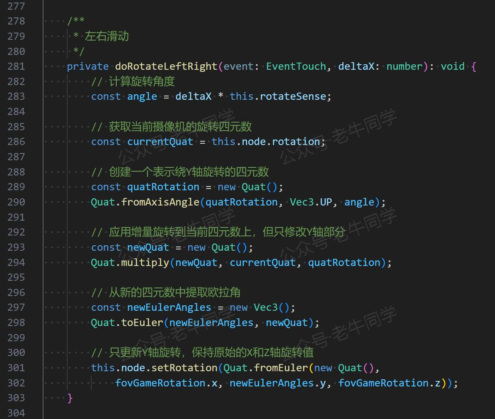
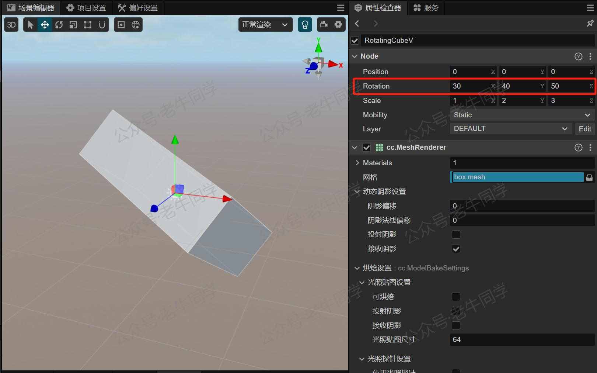
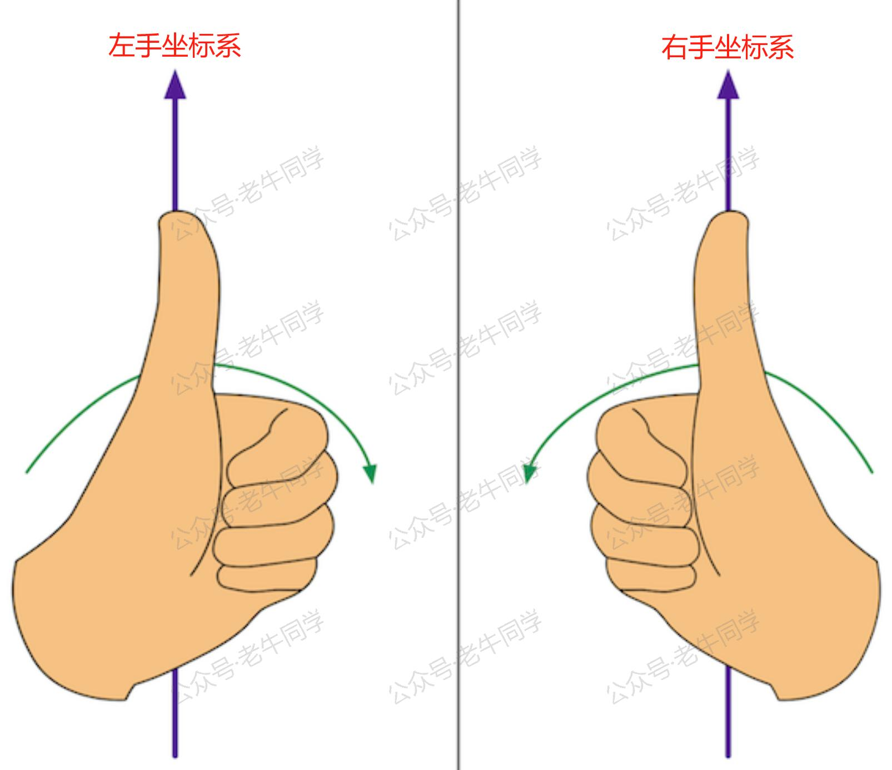
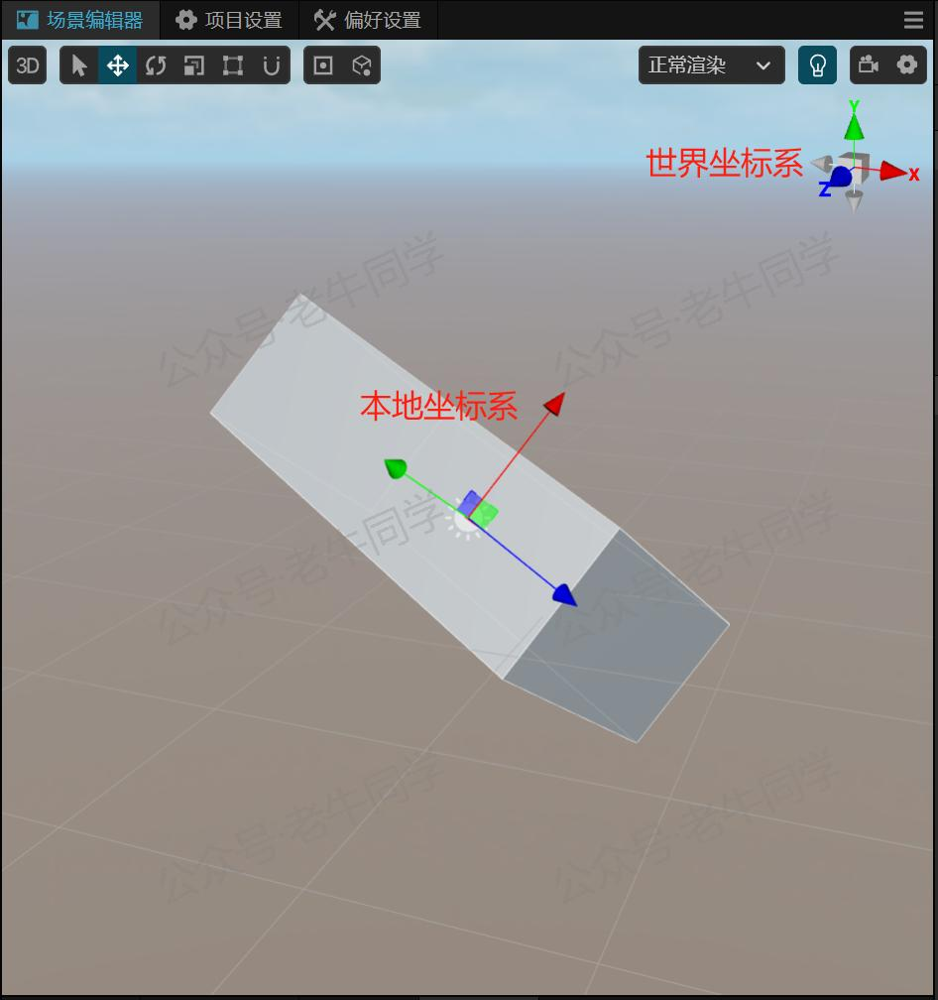
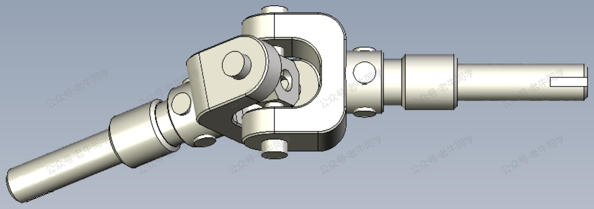
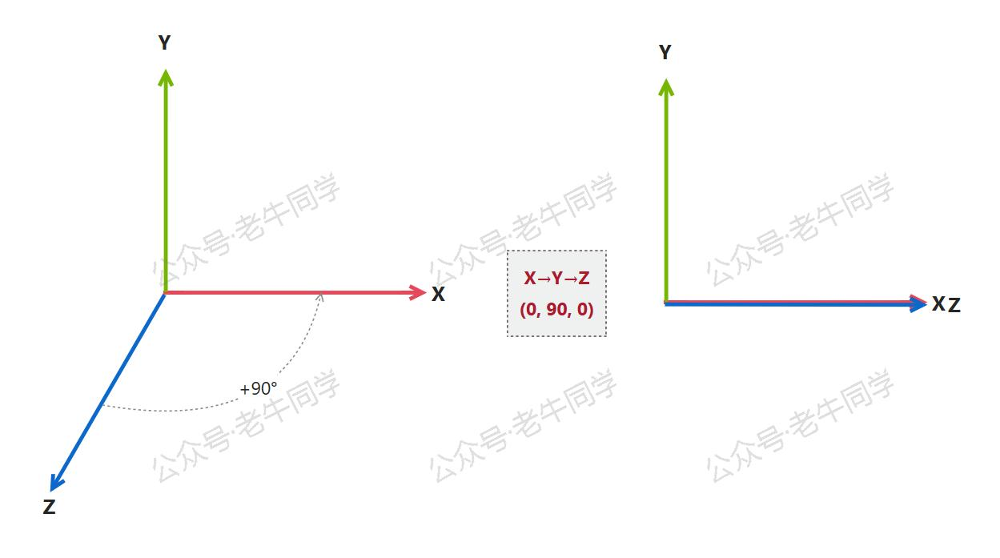
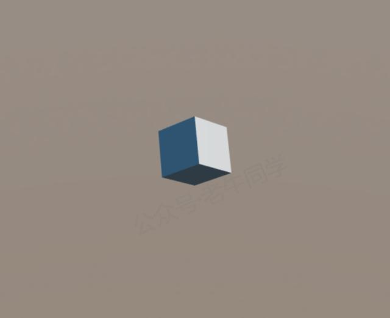

+++
slug = "2025021401"
date = "2025-02-14"
lastmod = "2025-02-14"
title = "欧拉角和四元数，3D 游戏开发中“旋转”难题的通俗讲解和应用实战"
description = "本文深入浅出地介绍了3D游戏开发中常用的旋转工具——欧拉角和四元数。通过生动的例子和代码演示，详细解释了它们的基本概念、应用场景以及如何解决万向锁、插值和计算效率等问题。无论你是初学者还是有经验的开发者，都能从中获得实用的知识和技巧……"
image = "00.jpg"
tags = [ "AI", "欧拉角", "四元数", "旋转" ]
categories = [ "人工智能" ]
+++

春节期间，老牛同学学习使用 Cocos Creator 研发了一款 3D 小游戏。开发过程中遇到了一些全新概念和用法，虽然借助大模型最终完成了小游戏功能的开发，但对这些概念却一知半解。

其中，在需要 3D 组件旋转的功能中，“**欧拉角**”和“**四元数**”就是研发过程中遇到的一个全新的概念。如下代码是大模型帮忙实现的“左右水平滑动”功能：



本文将对“欧拉角”和“四元数”进行尽可能详细的总结，尽可能不涉及数学证明公式，希望能给像我一样有困惑的朋友一些帮助：

- 基本概念：为什么对于 3D 物体旋转，大家都采用**欧拉角**和**四元数**来表示？为什么 1 个概念还不够，还需要 2 个？他们分别解决什么主要问题？
- 如何应用：在不同场景下，**欧拉角**和**四元数**如何应用旋转？它们如何应用到物体旋转？
- 实际应用：最后，用一个“让立方体的对角线垂直于地面并旋转”功能，演示如何让物体旋转后并不停的旋转起来。

本文代码和小游戏源代码均可免费下载：打开“**老牛同学**”微信小程序->点击“**更多**”Tab->“**源代码**”获取下载链接。


# 欧拉角和四元数存在的意义是什么？

首先，欧拉角和四元数都是用于**描述三维空间中物体旋转**的常用工具，它们只是工具，核心就是**三维**和**旋转**。

**欧拉角**最早由瑞士数学家**莱昂哈德·欧拉（Leonhard Euler）**于 18 世纪提出，他认为：三维空间中物体的任意**姿态**，都可以通过三个连续的旋转角度来描述（即：第一步绕某个轴旋转，第二步绕另一个轴旋转，第三步绕第三个轴旋转）。用 3 个数就可以表示旋转姿态，确实一种非常直观且易于理解的方法。

那么，对应到游戏开发中，欧拉角的就是我们最常见的**X 轴**、**Y 轴**和**Z 轴**旋转属性来表示了。如下所示，把一个长方体按照 X/Y/Z 旋转后的姿态：



注意的是，在三维空间中，我们一般用**姿态**或**位姿**来表示物体的当前旋转，它有两层含义：

1. 物体方向，或者朝向
2. 物体局部坐标系相当于世界坐标系的偏移量

**四元数**由爱尔兰数学家**威廉·罗文·汉密尔顿（William Rowan Hamilton）**于 1843 年提出。汉密尔顿希望找到一种用于描述三维空间旋转的数系。据说，汉密尔顿有一次在散步时突然想到了四元数的基本公式，并将其刻在了一座桥上。

四元数由一个实部和三个虚部组成，形式为：`Q = W + Xi + Yj + Zk`，其中`W`,`X`,`Y`,`Z`是实数，`i`,`j`,`k`是虚数单位。

既然欧拉角表示旋转已经足够优秀了，为什么还需要引入四元数呢？

原因在于，欧拉角虽然简单直观，但存在三个问题：**万向锁**问题（Gimbal Lock）、旋转过程中**插值**困难、**计算效率**较低的问题。

接下来，老牛同学根据自己的理解，逐一介绍欧拉角的这几个问题，同时看看四元数是如何解决的。

# 什么是旋转，什么是坐标系？

在介绍欧拉角和四元数之前，先了解一下旋转和坐标系。

**旋转**是指物体在三维空间中绕某个**轴**进行**角度**变化的**运动**：

- 轴：在三维空间中，我们一般 X 轴、Y 轴和 Z 轴表示。
- 角度：通常用角度或弧度来表示。
- 运动方向：分为**右手**坐标系或者**左手**坐标系。Cocos 3D 使用右手坐标系，Unity 3D 使用左手坐标系。默认情况下，轴默认配置：X 轴向右为正，Y 轴 向上为正，Z 轴朝屏幕外为正。

**右手**坐标系旋转方向：伸出右手，大拇指指向轴的正方向（如：围绕 X 轴旋转+30°，则大拇指指向 X 轴的正方向）；弯曲四指，四指弯曲的方向为旋转正方向（如：+30°），反过来手背方向便是负方向。

**左手**坐标系旋转方向：类似于右手坐标系，伸出左手即可。



**世界坐标系：** 三维空间的参考框架，所有物体的参考标准，它是固定不变的。

**本地坐标系：** 每个物体都有的自己的坐标系，用于描述其自身的姿态。



一般情况下，我们所说的旋转指的是**局部**坐标系，当然也可以相对于全局坐标系。

# 万向锁问题和解法

万向节常用在汽车动力传输上，它是汽车驱动系统关节，它可以围绕不同方向旋转：



在解释万向锁问题之前，有三个非常重要的概念**必须**理解：

1. 无论是欧拉角还是四元数，它们表示的是物体旋转后的姿态，是一个**描述**，它不是一个连续的动作。比如：欧拉角`(90,0,0)`代表围绕 X 轴旋转+90°，它表示的是这个物体旋转+90° 后的姿态，而不是表示物体围绕 X 轴，从 0°->1°->2°->……->90° 这个过程。因此，这里的“旋转”它**不是**指一个连续的动作！
2. 物体姿态与旋转的顺序密切相关，相同的角度，不同的旋转顺序，物体的姿态是不相同的。我们可以拿个快递盒子，做个简单的实验就能明白。如：围绕 X 轴旋转 90°，Y 轴 45°，**X→Y→Z**旋转顺序，和**Y→X→Z**旋转顺序，快递盒子的姿态是不同的。
3. 物体按照某个顺序依次旋转，前面的轴旋转时，会带动后面的轴一同旋转，而后面轴旋转却不会影响前面的轴。如：X→Y→Z 旋转顺序，当围绕 X 轴旋转时，本地坐标系 Y 轴和 Z 轴一同旋转；当围绕 Y 轴旋转时，Z 轴会一同旋转，但 X 轴是**不动**的；最后，当围绕 Z 轴旋转时，X 轴和 Y 轴都不会动！

**第 3 点**感觉非常的诡异，老牛同学就被这个不可思议的概念折磨了好久，直到彻底理解了**第 1 点**：永远记住，欧拉角和四元数这些表示**旋转**的工具，它们只是描述旋转后的**姿态**，并不是旋转动作（旋转在这里当名称理解），它没有动作过程，只是最终的瞬时的姿态！

如果大家理解了**第 1 点**，那么可以退一步想：X→Y→Z 旋转顺序，如果围绕 Y 轴旋转时，X 轴也跟着旋转，那么 X 轴最初的旋转不就白费了吗？

如果**第 3 点**无法理解的话，那么万向锁的问题是无法理解，因为它就是万向锁产生的前提！

至此，大家也可以到网上看看数学推导公式，在此老牛同学就不列举了！

**万向锁**定义：当两个旋转轴重合时，原本三个独立的旋转轴（X、Y、Z）变成了两个，导致自由度减少的现象。

我们先来看看，万向锁发生的场景：物体的任意旋转顺序（如：X→Y→Z，Y→X→Z 等），当围绕第 2 个轴旋转的角度为 ±90° 时，那么第 3 个轴就会和第 1 个轴就会重合。这样当物体围绕第 1 个轴旋转或者第 3 个轴旋转，姿态都是一样的，无法区分，这种现象就是“万向锁”问题。



如上图所示：X→Y→Z 旋转顺序，`(0, 90, 0)`旋转角度（X 轴和 Z 轴角度可以是任意值，此处便于理解设置为 0°），当围绕 Y 轴旋转 90° 之后，X 轴和 Z 轴重合了。这个时候，物体无论围绕 X 轴还是 Z 轴旋转，姿态都是一样的。

那么，四元数是如何解决欧拉角万向锁问题的呢：由上述公式可以看出，它没有旋转轴的概念，而是由四个数值表示旋转，表示方式为`cos(θ/2)+sin(θ/2)(xi+yj+zk)`；其中，θ 代表旋转的角度，(x,y,z)代表旋转轴方向。

# 插值和计算效率问题

**插值**问题的理解：插值是指物体旋转路径上的中间状态（即平滑过渡），欧拉角使用三个角度描述旋转，容易出现冗余或等效旋转的问题（如：`(0, 0, 0)`和`(360, 360, 360)`），导致旋转路径不自然，当发生万向锁问题的时候，就会发生异常。而四元数，它支持球面线性插值方法，能够生成平滑且自然的、稳定的旋转。

```typescript
// 插值比例
const t = 0.5;

// 1. 欧拉角线性插值
const startEuler = new Vec3(0, 0, 0);
const endEuler = new Vec3(90, 45, 0);

const interpolatedEuler = new Vec3(
    startEuler.x + (endEuler.x - startEuler.x) * t,
    startEuler.y + (endEuler.y - startEuler.y) * t,
    startEuler.z + (endEuler.z - startEuler.z) * t
);

console.log(`欧拉角线性插值: ${interpolatedEuler}`);

// 2. 四元数球面线性插值
const startQuat = new Quat();
const endQuat = new Quat();

Quat.fromEuler(startQuat, 0, 0, 0);
Quat.fromEuler(endQuat, 90, 45, 0);

const interpolatedQuat = new Quat();
Quat.slerp(interpolatedQuat, startQuat, endQuat, t);

console.log(`四元数球面线性插值: (${interpolatedQuat.w}, ${interpolatedQuat.x}, ${interpolatedQuat.y}, ${interpolatedQuat.z})`);
```

**计算效率**问题：主要是运算复杂度高，涉及大量的三角函数运算，计算效率比较低。而四元数，可通过简单的向量点积和叉积实现计算，计算效率较高。

# 欧拉角和四元数转换

在 Cocos 3D 中，欧拉角的使用简单且直观，使用`Vec3`对象表示：

```typescript
// 1. 获取欧拉角（单位：度）
const euler: Vec3 = this.node.eulerAngles;
console.log(`X: ${euler.x}°`);
console.log(`Y: ${euler.y}°`);
console.log(`Z: ${euler.z}°`);

// 2. 设置欧拉角（X/Y/Z，单位：度）
this.node.eulerAngles = new Vec3(45, 30, 15);
```

四元数使用`Quat`对象表示：

```typescript
// 3. 获取四元数
const quat1: Quat = this.node.getRotation();
console.log(`四元数 w: ${quat1.w}, x: ${quat1.x}, y: ${quat1.y}, z: ${quat1.z}`);

// 4. 设置四元数（w, x, y, z）
const quat2 = new Quat(0.707, 0, 0, 0.707);
this.node.setRotation(quat2);
```

欧拉角和四元数，也可以相互转换：

```typescript
// 5. 欧拉角转四元数
const quat3 = new Quat();
Quat.fromEuler(quat3, euler.x, euler.y, euler.z);
console.log(`欧拉角转四元数 w: ${quat3.w}, x: ${quat3.x}, y: ${quat3.y}, z: ${quat3.z}`);

// 6. 四元数转欧拉角
Quat.toEuler(euler, quat2);
console.log(`四元数转欧拉角: X=${euler.x}°, Y=${euler.y}°, Z=${euler.z}°`);
```

# 实战：垂直地面旋转立方体

接下来，我们来一个应用实战：旋转立方体，让对角线垂直于地面，然后围绕对角线不停地旋转！



让立方体的对角线垂直于地面，用欧拉角很难表示。从代码中可以看到，用四元数可以轻松实现。

首先，让立方体的对角线垂直于地面立起来：

```typescript
/**
 * 初始化：立起来
 */
protected start(): void {
    // 立方体对角线顶点向量
    const scale: number = this.node.scale.x;
    const localDiagonal = new Vec3(scale, scale, scale);

    // 归一化
    Vec3.normalize(localDiagonal, localDiagonal);

    // 本地对角线旋转到Y轴的旋转
    const targetDirection = new Vec3(0, 1, 0);
    const rotation = new Quat();
    Quat.rotationTo(rotation, localDiagonal, targetDirection);

    // 应用旋转，立起来
    this.node.setRotation(rotation);
}
```

然后，让立方体按照指定的弧度参数，沿着世界坐标系 Y 轴进行旋转（因为第一次旋转之后，立方体的本地坐标系已经发生了变化，但是世界坐标系是固定不变）：

```typescript
    /**
     * 帧更新：旋转
     */
    protected update(dt: number): void {
        const rotation = new Quat();
        Quat.fromAxisAngle(rotation, Vec3.UNIT_Y, this.rotateSpeed);
        this.node.rotate(rotation, Node.NodeSpace.WORLD);
    }
```

# 最后，简单总结

从上面分析我们可以看到，欧拉角和四元数这 2 个表示三维空间物体旋转的工具，它们有各自的使用场景：

- 欧拉角：直观，便于理解；在属性编辑器等调试场景，用欧拉角旋转；同时，对于简单的旋转操作（如：单一轴旋转），使用欧拉角就非常方便。
- 四元数：转换复杂，不直观；但它插值平滑，计算效率高，比较适合复杂的旋转场景。

欧拉角这么好，那如何克服“万向锁”问题：把旋转顺序的第二个轴（如：X→Y→Z 旋转顺序的 Y 轴），设置为不太容易旋转+90° 的轴。如在 Cocos 3D 等游戏研发中，Y 轴是第二个轴，它垂直于地面，因为在游戏过程中，摄像头一般都不会垂直于地面或者垂直于天空。

**提示：** 以上示例源代码，老牛同学已经上传，打开“**老牛同学**”微信小程序->点击“**更多**”Tab->“**源代码**”获取下载链接。


---

Cocos 3D 小游戏：

<small>[01.技术选型](https://mp.weixin.qq.com/s/TlgNKvGYMuGMmU0dIBPn4A) 丨 [02.研发流程](https://mp.weixin.qq.com/s/qlOYpjREXBKb7vl1kuujlg) 丨 [03.小游戏框架](https://mp.weixin.qq.com/s/V3CIhswW3CVcTY1aPaALTw)丨 [04.核心架构设计](https://mp.weixin.qq.com/s/8f3GZNd7qjwIhfTcsVruYQ)丨 [05.分包构建发布](https://mp.weixin.qq.com/s/8jxPxJ2-9UnFsLMGh9h0fQ)</small>

Transformers 框架序列：

<small>[01.包和对象加载中的设计巧思与实用技巧](https://mp.weixin.qq.com/s/lAAIfl0YJRNrppp5-Vuusw)</small>

<small>[02.AutoModel 初始化及 Qwen2.5 模型加载全流程](https://mp.weixin.qq.com/s/WIbbrkf1HjVC1CtBNcU8Ow)</small>

<small>[03.Qwen2.5 大模型的 AutoTokenizer 技术细节](https://mp.weixin.qq.com/s/Shg30uUFByM0tKTi0rETfg)</small>

<small>[04.Qwen2.5/GPT 分词流程与 BPE 分词算法技术细节详解](https://mp.weixin.qq.com/s/GnoHXsIYKYFU1Xo4u5sE1w)</small>

<small>[05.嵌入（Embedding）机制和 Word2Vec 实战](https://mp.weixin.qq.com/s/qL9vpmNIM1eO9_lQq7QwlA)</small>

<small>[06.位置嵌入（Positional Embedding）](https://mp.weixin.qq.com/s/B0__TRnlI7zgwn0OhguvXA)</small>

Pipeline NLP 任务序列：

<small>[零·概述](https://mp.weixin.qq.com/s/FR4384AZV2FE2xtweSh9bA) 丨 [01.文本转音频](https://mp.weixin.qq.com/s/uN2BFIOxDFEh4T-W7tsPbg) 丨 [02.文本分类](https://mp.weixin.qq.com/s/9ccEDNfeGNf_Q9pO0Usg2w) 丨 [03.词元分类和命名实体识别](https://mp.weixin.qq.com/s/r2uFCwPZaMeDL_eiQsEmIQ) 丨 [04.问答](https://mp.weixin.qq.com/s/vOLVxRircw5wM1_rCqoAfg) 丨 [05.表格问答](https://mp.weixin.qq.com/s/Q0fWdw3ACVzQFldBScZ2Fw) | [06.填充蒙版](https://mp.weixin.qq.com/s/hMFCgYovHPVFOjOoihaUHw)</small>

往期推荐文章：

<small>[Cline 免费插件 + Qwen2.5 大模型，零经验也能开发“对联王”微信小程序](https://mp.weixin.qq.com/s/F-CUuaZwmqt6X7QkI_IrVA)</small>

<small>[使用 Cursor + Qwen2.5 大模型 零经验研发微信小程序：自由构建个性化节拍器应用实战](https://mp.weixin.qq.com/s/vraegr_5AJG7bPo6mBgvbQ)</small>

<small>[Bolt.new 用一句话快速构建全栈应用：本地部署与应用实战（Ollama/Qwen2.5 等）](https://mp.weixin.qq.com/s/Mq8CvZKdpokbj3mK-h_SAQ)</small>

<small>[基于 Qwen2.5-Coder 模型和 CrewAI 多智能体框架，实现智能编程系统的实战教程](https://mp.weixin.qq.com/s/8f3xna9TRmxMDaY_cQhy8Q)</small>

<small>[vLLM CPU 和 GPU 模式署和推理 Qwen2 等大语言模型详细教程](https://mp.weixin.qq.com/s/KM-Z6FtVfaySewRTmvEc6w)</small>

<small>[基于 Qwen2/Lllama3 等大模型，部署团队私有化 RAG 知识库系统的详细教程（Docker+AnythingLLM）](https://mp.weixin.qq.com/s/PpY3k3kReKfQdeOJyrB6aw)</small>

<small>[使用 Llama3/Qwen2 等开源大模型，部署团队私有化 Code Copilot 和使用教程](https://mp.weixin.qq.com/s/vt1EXVWtwm6ltZVYtB4-Tg)</small>

<small>[基于 Qwen2 大模型微调技术详细教程（LoRA 参数高效微调和 SwanLab 可视化监控）](https://mp.weixin.qq.com/s/eq6K8_s9uX459OeUcRPEug)</small>

<small>[ChatTTS 长音频合成和本地部署 2 种方式，让你的“儿童绘本”发声的实战教程](https://mp.weixin.qq.com/s/9ldLuh3YLvx8oWvwnrSGUA)</small>


