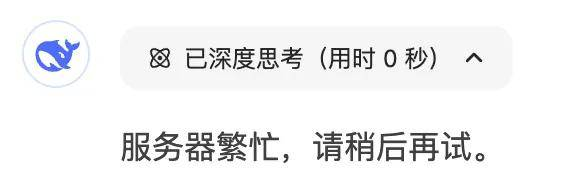
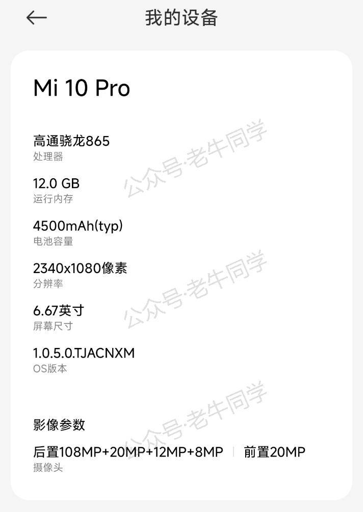
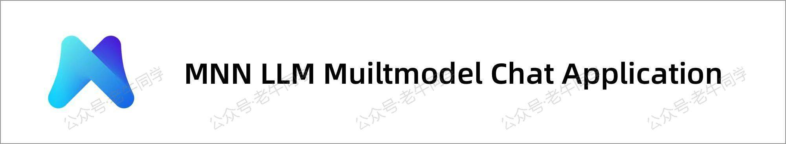
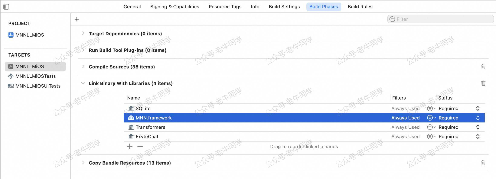
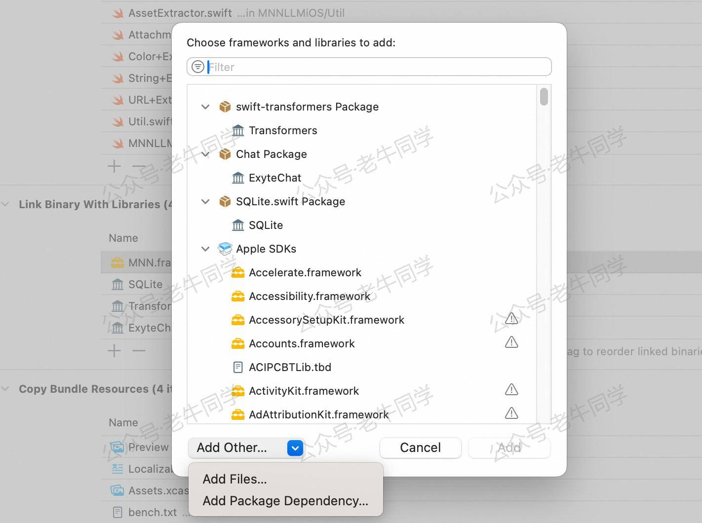
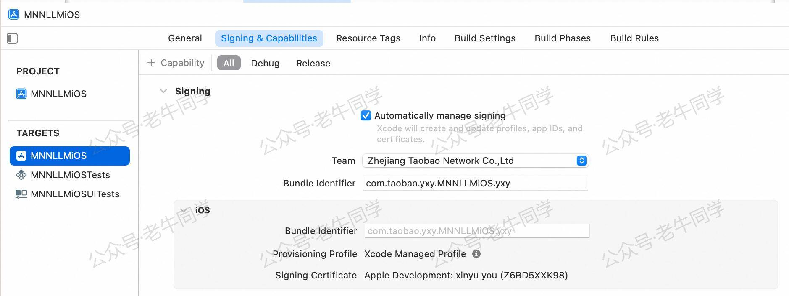
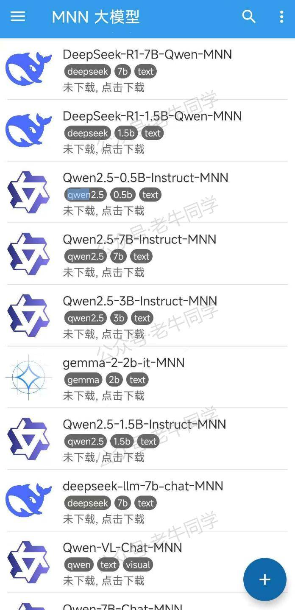
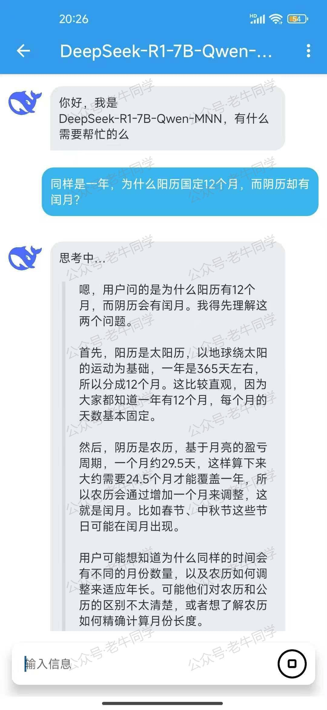
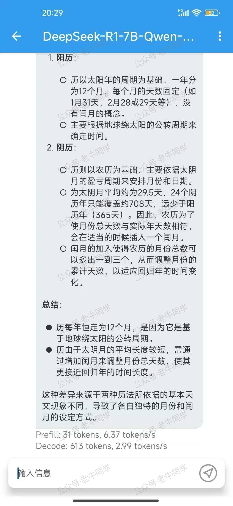
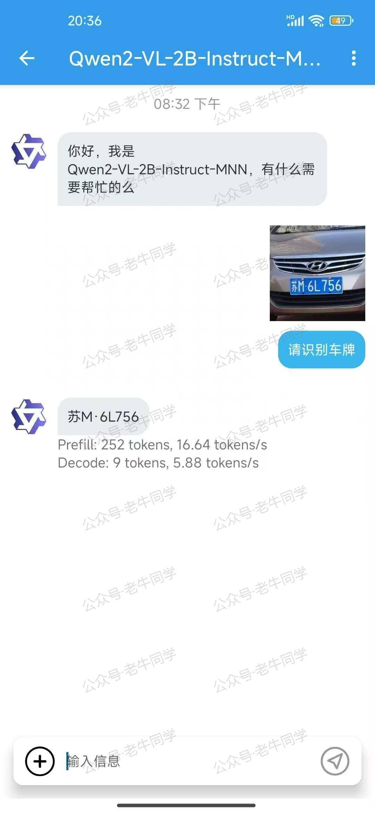

+++
slug = "2025022101"
date = "2025-02-21"
lastmod = "2025-02-21"
title = "MNN 手机本地部署 DeepSeek R1 和多模态大模型，告别服务器繁忙！"
description = "本文介绍了MNN Chat这款由阿里巴巴开源的多模态大模型应用。它支持本地运行，无需依赖外部服务器，确保数据隐私，同时兼容DeepSeek R1、Qwen等主流模型。通过实际测试，MNN Chat在文本生成、图像识别等任务中表现出色，推理速度远超传统方法。无论是车牌识别还是 Stable Diffusion 图像生成，MNN Chat都能为用户提供流畅的AI体验……"
image = "00.jpg"
tags = [ "AI", "MNN", "DeepSeek", "Qwen" ]
categories = [ "人工智能" ]
+++

在**Phi-3**大模型发布之际，我们基于**Termux**应用，在我的小米手机部署了**Phi-3**模型：[文章地址](https://mp.weixin.qq.com/s/bNxHM3B7HOLNvJtjwvt8iw)

**Termux**应用是一个终端模拟器，它允许我们安装 Linux 操作系统，然后在 Linux 操作系统中安装 Ollama，最后基于 Ollama 下载和推理大模型，虽然方法可行，但是存在一些局限：

- 操作步骤繁琐，用户体验较差：安装 Linux 操作系统、启动系统、安装和启动 Ollama 等操作，都需要通过命令行完成，体验较差。
- 资源消耗较大：手机内存有限，Termux 应用、Linux 操作系统、Ollama 框架等都需要消耗资源，推理速度较慢，资源吃紧

DeepSeek R1 很火爆，导致在使用 DeepSeek R1 时，老牛同学经常会遇到“服务器繁忙，请稍后重试。”的问题：



今天老牛同学推荐一款更加先进的应用：**MNN Chat**，它是由阿里巴巴开源的全功能多模态模型应用。

- 仅需一台手机即可运行： 完全在设备本地运行，确保数据隐私，无需将信息上传至外部服务器。
- CPU 推理优化： 在安卓平台上，MNN-LLM 展现了卓越的 CPU 性能，预填充速度相较于 llama.cpp 提高了 8.6 倍，相较于 fastllm 提升了 20.5 倍，解码速度分别快了 2.3 倍和 8.9 倍。
- 多模态支持： 提供多种任务功能，包括文本生成文本、图像生成文本、音频转文本及文本生成图像。
- 广泛的模型兼容性： 支持多种领先的模型提供商，包括 Qwen、Gemma、Llama（涵盖 TinyLlama 与 MobileLLM）、Baichuan、Yi、DeepSeek、InternLM、Phi、ReaderLM 和 Smolm 等。

官网地址：[https://www.mnn.zone](https://www.mnn.zone)

GitHub 源码地址：[https://github.com/alibaba/MNN](https://github.com/alibaba/MNN)

接下来，我们在手机上部署试用一下，老牛同学的手机配置如下：



# 1.安装 MNN 应用

对于 Android 手机，我们可以直接下载和安装最新版本：[下载地址](https://meta.alicdn.com/data/mnn/mnn_chat_d_0_2_2.apk)



或者，我们也可以按照以下步骤，自己编译 Android 和 iOS 应用：

## Android 编译和使用

- 克隆 MNN 源代码：`git clone https://github.com/alibaba/MNN.git`
- 构建库：

```shell
cd project/android
mkdir build_64
../build_64.sh "-DMNN_LOW_MEMORY=true -DMNN_CPU_WEIGHT_DEQUANT_GEMM=true -DMNN_BUILD_LLM=true -DMNN_SUPPORT_TRANSFORMER_FUSE=true -DMNN_ARM82=true -DMNN_USE_LOGCAT=true -DMNN_OPENCL=true -DLLM_SUPPORT_VISION=true -DMNN_BUILD_OPENCV=true -DMNN_IMGCODECS=true -DLLM_SUPPORT_AUDIO=true -DMNN_BUILD_AUDIO=true -DMNN_BUILD_DIFFUSION=ON -DMNN_SEP_BUILD=ON"
```

- 复制到 LLM Android 应用项目：

```shell
mkdir -p ../../../apps/Android/MnnLlmChat/app/src/main/jniLibs/arm64-v8a
find . -name "*.so" -exec cp {} ../../../apps/Android/MnnLlmChat/app/src/main/jniLibs/arm64-v8a \;
```

- 构建 Android 应用项目并安装：

```shell
cd ../../../apps/Android/MnnLlmChat
./gradlew installDebug
```

## iOS 应用编译和使用

- 克隆 MNN 源代码：`git clone https://github.com/alibaba/MNN.git`
- 编译 MNN.framework:

```shell
cd MNN/
sh package_scripts/ios/buildiOS.sh "-DMNN_ARM82=true -DMNN_LOW_MEMORY=true -DMNN_SUPPORT_TRANSFORMER_FUSE=true -DMNN_BUILD_LLM=true -DMNN_CPU_WEIGHT_DEQUANT_GEMM=true
-DMNN_METAL=ON
-DMNN_BUILD_DIFFUSION=ON
-DMNN_BUILD_OPENCV=ON
-DMNN_IMGCODECS=ON
-DMNN_OPENCL=OFF
-DMNN_SEP_BUILD=OFF
-DMNN_SUPPORT_TRANSFORMER_FUSE=ON"
```

- 拷贝 framework 到 iOS 项目中：

```shell
mv MNN-iOS-CPU-GPU/Static/MNN.framework /apps/iOS/MNNLLMChat/MNN.framework
```

确保 Link Binary With Libraried 中包含 MNN.framework，和其他三个 Framework:



如果没有包含，可以手动添加 MNN.framework:



- 修改 iOS 签名并编译项目

```shell
cd /apps/iOS/MNNLLMChat
open MNNLLMiOS.xcodeproj
```

在 Xcode 项目属性中 Signing & Capabilities > Team 输入自己的账号和 Bundle Identifier:



等待 Swift Package 下载完成之后，进行编译使用。

# 2.下载模型文件

手机上安装好**MNN Chat**应用之后，我们打开应用，就可以看到它所兼容的模型列表，包括文本、音频、图像等：



点击即可下载，老牛同学想体验一下文本和图片识别，下载了**DeepSeek-R1-7B-Qwen-MNN**和**Qwen2-VL-2B-Instruct-MNN**这 2 个大模型，等待下载完成。

# 3. MNN 模型推理

先试用一下**DeepSeek-R1-7B-Qwen-MNN**文本模型，输入提示词：

```plaintext
同样是一年，为什么阳历固定12个月，而阴历却有闰月？
```



DeepSeek R1 开始思考，分析阳历和阴历的计算方法，最终得出结论：



从手机的推理速率来看，总体还算不错，比通过**Termux**应用的方式推理效率高多了。

接下来，看看**Qwen2-VL-2B-Instruct-MNN**图片多模态大模型，老牛同学让它进行车牌识别：



可以看到，识别的结果是很不错的！

还有其他的大模型，包括音频、图片生成（Stable Diffusion）等，大家可以体验一下。

---

Cocos 3D 小游戏：

<small>[01.技术选型](https://mp.weixin.qq.com/s/TlgNKvGYMuGMmU0dIBPn4A) 丨 [02.研发流程](https://mp.weixin.qq.com/s/qlOYpjREXBKb7vl1kuujlg) 丨 [03.小游戏框架](https://mp.weixin.qq.com/s/V3CIhswW3CVcTY1aPaALTw)丨 [04.核心架构设计](https://mp.weixin.qq.com/s/8f3GZNd7qjwIhfTcsVruYQ)丨 [05.分包构建发布](https://mp.weixin.qq.com/s/8jxPxJ2-9UnFsLMGh9h0fQ)</small>

Transformers 框架序列：

<small>[01.包和对象加载中的设计巧思与实用技巧](https://mp.weixin.qq.com/s/lAAIfl0YJRNrppp5-Vuusw)</small>

<small>[02.AutoModel 初始化及 Qwen2.5 模型加载全流程](https://mp.weixin.qq.com/s/WIbbrkf1HjVC1CtBNcU8Ow)</small>

<small>[03.Qwen2.5 大模型的 AutoTokenizer 技术细节](https://mp.weixin.qq.com/s/Shg30uUFByM0tKTi0rETfg)</small>

<small>[04.Qwen2.5/GPT 分词流程与 BPE 分词算法技术细节详解](https://mp.weixin.qq.com/s/GnoHXsIYKYFU1Xo4u5sE1w)</small>

<small>[05.嵌入（Embedding）机制和 Word2Vec 实战](https://mp.weixin.qq.com/s/qL9vpmNIM1eO9_lQq7QwlA)</small>

<small>[06.位置嵌入（Positional Embedding）](https://mp.weixin.qq.com/s/B0__TRnlI7zgwn0OhguvXA)</small>

Pipeline NLP 任务序列：

<small>[零·概述](https://mp.weixin.qq.com/s/FR4384AZV2FE2xtweSh9bA) 丨 [01.文本转音频](https://mp.weixin.qq.com/s/uN2BFIOxDFEh4T-W7tsPbg) 丨 [02.文本分类](https://mp.weixin.qq.com/s/9ccEDNfeGNf_Q9pO0Usg2w) 丨 [03.词元分类和命名实体识别](https://mp.weixin.qq.com/s/r2uFCwPZaMeDL_eiQsEmIQ) 丨 [04.问答](https://mp.weixin.qq.com/s/vOLVxRircw5wM1_rCqoAfg) 丨 [05.表格问答](https://mp.weixin.qq.com/s/Q0fWdw3ACVzQFldBScZ2Fw) | [06.填充蒙版](https://mp.weixin.qq.com/s/hMFCgYovHPVFOjOoihaUHw)</small>

往期推荐文章：

<small>[Cline 免费插件 + Qwen2.5 大模型，零经验也能开发“对联王”微信小程序](https://mp.weixin.qq.com/s/F-CUuaZwmqt6X7QkI_IrVA)</small>

<small>[使用 Cursor + Qwen2.5 大模型 零经验研发微信小程序：自由构建个性化节拍器应用实战](https://mp.weixin.qq.com/s/vraegr_5AJG7bPo6mBgvbQ)</small>

<small>[Bolt.new 用一句话快速构建全栈应用：本地部署与应用实战（Ollama/Qwen2.5 等）](https://mp.weixin.qq.com/s/Mq8CvZKdpokbj3mK-h_SAQ)</small>

<small>[基于 Qwen2.5-Coder 模型和 CrewAI 多智能体框架，实现智能编程系统的实战教程](https://mp.weixin.qq.com/s/8f3xna9TRmxMDaY_cQhy8Q)</small>

<small>[vLLM CPU 和 GPU 模式署和推理 Qwen2 等大语言模型详细教程](https://mp.weixin.qq.com/s/KM-Z6FtVfaySewRTmvEc6w)</small>

<small>[基于 Qwen2/Lllama3 等大模型，部署团队私有化 RAG 知识库系统的详细教程（Docker+AnythingLLM）](https://mp.weixin.qq.com/s/PpY3k3kReKfQdeOJyrB6aw)</small>

<small>[使用 Llama3/Qwen2 等开源大模型，部署团队私有化 Code Copilot 和使用教程](https://mp.weixin.qq.com/s/vt1EXVWtwm6ltZVYtB4-Tg)</small>

<small>[基于 Qwen2 大模型微调技术详细教程（LoRA 参数高效微调和 SwanLab 可视化监控）](https://mp.weixin.qq.com/s/eq6K8_s9uX459OeUcRPEug)</small>

<small>[ChatTTS 长音频合成和本地部署 2 种方式，让你的“儿童绘本”发声的实战教程](https://mp.weixin.qq.com/s/9ldLuh3YLvx8oWvwnrSGUA)</small>


