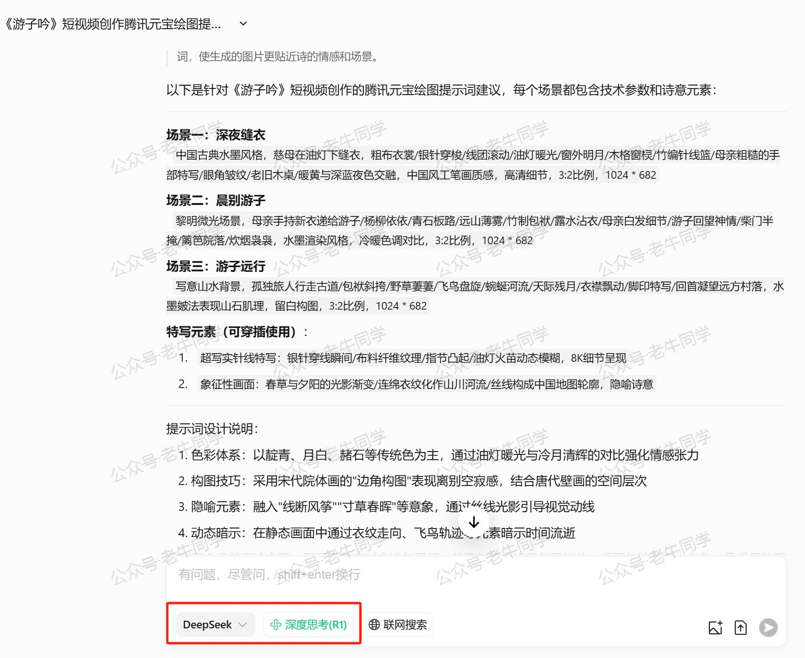
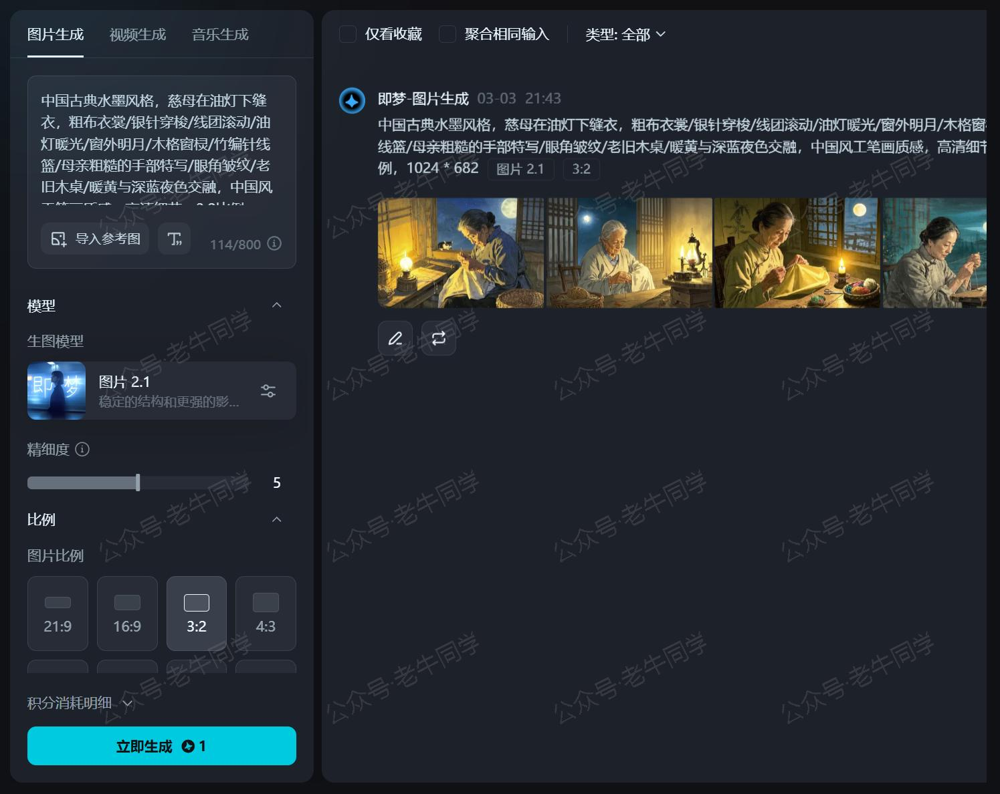
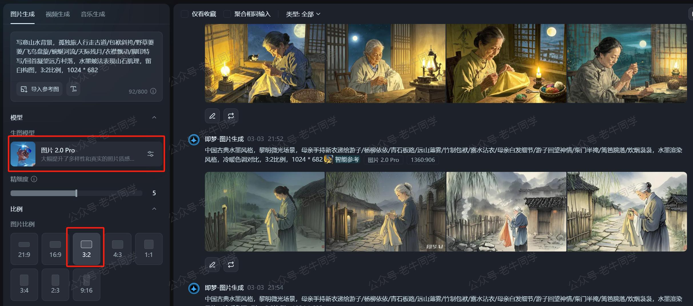
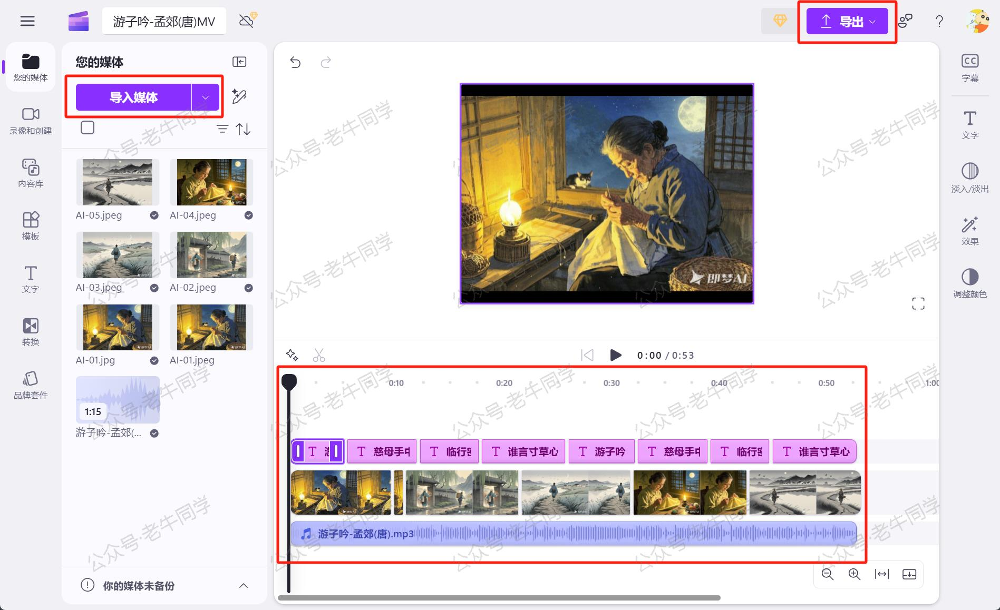

+++
slug = "2025030301"
date = "2025-03-03"
lastmod = "2025-03-03"
title = "让孩子爱上古诗词，用AI把唐诗变成歌曲+视频，诗词本来就是唱的！"
description = "【AI魔法让古诗会唱歌！】利用免费AI工具，带你把《游子吟》变成音乐动画：用豆包AI生成国风歌曲，Python提取音频；用即梦AI制作3:2古风插画；电脑自带软件合成MV。无需专业基础，三步打造视听盛宴，让孩子在旋律中轻松记忆古诗……"
image = "00.jpg"
tags = [ "AI", "文生图", "AI音乐", "AI视频" ]
categories = [ "人工智能" ]
+++

新学期了，为了帮小朋友们更好的记忆和学习生字、词语和古诗词，“**老牛同学**”微信小程序特意上线了“爱学习”模块。但当问小朋友们“怎么样”时，得到的答复却是“不怎么样”！

上周，同事使用豆包生成了一首歌曲，这给老牛同学带来了一点灵感：如果古诗词能以歌唱的形式呈现，小朋友们是否会更感兴趣呢？小朋友告诉我说：在古代，古诗词就是唱出来的，可以试试看！

对啊，为何不试试看呢？接下来，老牛同学将借助各大厂商的免费大模型，创作一首唐诗《游子吟》歌曲，总体分为以下三步：

1. 生成音乐：把古诗制作成音乐，先给唱出来
2. 图片制作：通过 DeepSeek/Qwen 等大模型，根据我们的需求生成图片提示词，然后使用文生图大模型生成对应的图片
3. 制作短视频：最后一步，合成音乐和图片内容，制作短视频

【请到“老牛同学”公众号预览视频】

# 1. 唱出古诗内容

文本生成音乐，目前比较好的模型是**Suno**：[https://suno.com](https://suno.com)，它是收费的且需要通畅的网络。

老牛同学本次使用字节的豆包：[https://www.doubao.com/chat/](https://www.doubao.com/chat/)

点击“音乐生成” - “自定义歌词”，采用“国风”的音乐风格，表达“怀旧”的情形：


为了能产生更好的效果，我们可以通过 **(主歌)**、**(副歌)**、**(前奏)**、**(尾奏)** 和 **(间奏)** 等结构组织歌词内容，老牛同学歌词内容如下：

```plaintext
(前奏)

(主歌)
慈母手中线，
游子身上衣。
临行密密缝，
意恐迟迟归。
谁言寸草心，
报得三春晖。

(间奏)

(主歌)
慈母手中线，
游子身上衣。
临行密密缝，
意恐迟迟归。

(副歌)
谁言寸草心，
报得三春晖。

(尾奏)
```

提交之后，一首音乐很快就生成好了。试听一下，如果不满意可以多次提交生成音乐。对于满意的音乐，我们可以修改音乐名称，并下载保存：


豆包生成音乐确实又快又好，但是有个问题：即使增加了提示词，同样的歌词每次生成的音乐效果仍可能不同！

生成的音乐文件默认为`mp4`格式，为了提取纯净的音频部分，老牛同学利用 Python 编写了一个脚本将其转换为`mp3`格式。：

```python
# 需提前安装ffmpeg库
import ffmpeg

def extract_audio_ffmpeg_lib(mp4_file, mp3_file):
    stream = ffmpeg.input(mp4_file)
    stream = ffmpeg.output(stream.audio, mp3_file, format='mp3', **{'q:a': '0'})
    ffmpeg.run(stream)

if __name__ == "__main__":
    input_mp4 = "游子吟-孟郊(唐).mp4"  # MP4文件路径
    output_mp3 = "游子吟-孟郊(唐).mp3" # MP3文件路径
    extract_audio_ffmpeg_lib(input_mp4, output_mp3)
    print(f"音频已成功提取到 {output_mp3}")
```

# 2. 制作视频图片

接下来，我需要制作几张与音乐相匹配的图片，以便更好的生成音乐 MV 视频，这里需要使用文生图大模型。

我们首先通过元宝的 DeepSeek-R1 产出提示词：[https://yuanbao.tencent.com/chat](https://yuanbao.tencent.com/chat)

```plaintext
我需要把《游子吟》这首唐诗做成短视频，需要短视频图片素材。请为我提供腾讯元宝绘图的提示词。
要求：图片高清，比例3:2，尺寸为1024*682像素
```



DeepSeek-R1 把视频分成了 3 个场景，与古诗的意境一一对应。

接下来，我们根据提示词，使用文生图大模型生成图片。老牛同学尝试了豆包和元宝的绘图功能，生成的图片都不理想，发现免费模型的图片生成效果有限。

最后采用抖音的即梦 AI，一样的提示词，感觉效果就好多了：[https://jimeng.jianying.com/ai-tool/image/generate](https://jimeng.jianying.com/ai-tool/image/generate)



把几个场景都生成一下图片，然后挑选几张感觉还不错的图片，作为接下来视频的图片：



# 3. 合成古诗视频

有了以上图片和音乐素材，我们就可以剪辑成视频了。视频剪辑软件有很多，但大多数都需要付费使用，比如比较流行的“剪映”软件。

其实我们也可以使用电脑自带的免费软件进行剪辑，比如苹果电脑有**iMovie**，Windows 电脑有**Clipchamp**都是非常好用的剪辑软件：

1. 导入素材，图片和音乐文件
2. 拖到编辑器中，对于图片可以调整时长，对于音乐可以截掉头尾
3. 根据音乐内容，增加对应字幕
4. 最后，导出视频文件即可



导出视频，保存到本地即可！

到此整个制作流程已经结束，总体来说比较简单，大家可以动手试下哈，如果有不清楚的地方，请留言沟通交流！

# 4. 结尾

最终导出 《游子吟》 唐诗视频，我已经上传到视频号里，大家也可以搜索收看。

本次制作的视频，图片都是静态，下次老牛同学继续优化！


