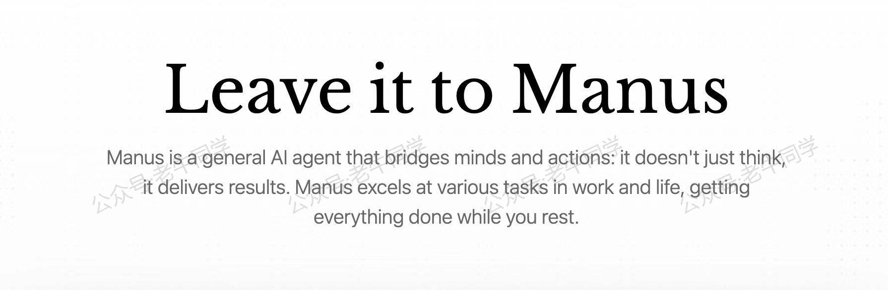

+++
slug = "2025030701"
date = "2025-03-07"
lastmod = "2025-03-07"
title = "没有 Manus 邀请码？Qwen + OpenManus 开源替代方案一样能领略 AI 智能体的力量"
description = "OpenManus 出自 MetaGPT 团队成员开源的通用AI智能体框架，凭借 QwQ-32B 基座模型实现了接近商用级Manus的表现。本文详解其三大核心优势：1）本地执行代码/浏览器操作的真实环境交互能力 2）基于Python的轻量化部署方案 3）与千亿参数模型媲美的任务完成度。通过CRM企业分析案例实测对比，展示开源智能体如何突破商用产品限制，为开发者提供可落地的AI解决方案……"
image = "00.jpg"
tags = [ "AI", "Manus", "QwQ", "Qwen" ]
categories = [ "人工智能" ]
+++

以下是一篇关于OpenManus通用AI智能体的技术分享文章内容，即将在微信公众号上发表。现在需要生成一张头图，请提供混元大模型文生图的提示词：

----------------------------------------

本以为 **QwQ-32B** 的发布定会“炸街”，毕竟它的评测结果与 **DeepSeek-R1-671B** 满血版不相上下，而之前 **DeepSeek-R1** 横扫了整个地球，还持续扫了这么久：


万万没有想到，冲出来的这匹强劲黑马竟然是 **Manus** ，号称：**全球首款通用型 AI 智能体**，它不仅能产出创意，更重要的是还能**交付结果**。



在官方介绍视频中，**Manus** 在简历筛选评估、房地产信息检索和股票分析上，均表现出了惊人的能力。可惜的是，Manus 并未对所有人开放，需要有邀请码方可注册体验使用：


幸运的是，不管是 **QwQ-32B** 还是 **Manus**，它们都是我们中国人的产品，为这些产品背后的技术大佬们致敬！

下面是 1 个使用 **Manus** 的样例：[https://manus.im/share/kTEHmnYgfqqubhiSAUwZR7?replay=1](https://manus.im/share/kTEHmnYgfqqubhiSAUwZR7?replay=1)

没有 **Manus** 邀请码，我们就无法体验到 **Manus** 强大能力。

但幸运的是，**OpenManus** 为我们提供了一个开源的替代方案。接下来，我们就来使用 **QwQ-32B** 大模型体验一下 **OpenManus** 的能力：

1. OpenManus 和 Manus 比较，源代码走读分析
2. OpenManus 本地部署和配置
3. 使用与 **Manus** 样例中相同的提示词，体验 OpenManus 功能

# 1. OpenManus 源代码分析

OpenManus 源代码地址：[https://github.com/mannaandpoem/OpenManus](https://github.com/mannaandpoem/OpenManus)

OpenManus 研发成员来自 MetaGPT 智能体团队。关于 MetaGPT 的使用，可以参考老牛同学之前文章：[Agent(智能体)和 MetaGPT，一句话实现整个需求应用代码](https://mp.weixin.qq.com/s/ZfyCnCOqjtLGcPUfPq7JLQ)

把源代码下载到本地：

```shell
git clone https://github.com/mannaandpoem/OpenManus.git
cd OpenManus
```

其中，`main.py`是主入口文件，它初始化`Manus`代理类并处理输入的提示词；而`Manus`代理使用工具集合，包括`PythonExecute`、`BrowserUseTool`、`FileSaver`、`Terminate`和`GoogleSearch`等。

这些工具的功能，说明了 OpenManus 可以在本地执行 Python 代码、使用浏览器、操作本地文件、执行终端命令和搜索等。

我们可以打开源代码目录，看到这些工具定义：`./app/tool`

同时，我们通过`requirements.txt`文件可以看到，OpenManus 也依赖了一些组件：图像处理、文件操作、浏览器操作等。

由此可见，OpenManus 借助其他工具，执行并完成用户的任务！

# 2. OpenManus 本地配置

简单了解了 OpenManus 主要设计之后，接下来我们本地部署起来。

首先，安装 Conda 工具，用于管理 Python 虚拟环境。可以参考文章：[大模型应用研发基础环境配置](https://mp.weixin.qq.com/s/P_ufvz4MWVSqv_VM-rJp9w)

然后，创建 Python 虚拟环境（环境名：`OpenManus`），并激活环境：

```shell
# 创建虚拟环境
conda create -n OpenManus python=3.12

# 激活虚拟环境
conda activate OpenManus
```

最后，安装 OpenManus 依赖：

```shell
pip install -r requirements.txt
```

接下来，我们配置大模型 API，我们将使用 **QwQ-32B** 作为 OpenManus 底层大模型。

先复制一份配置文件：`config/config.toml`

```shell
cp config/config.example.toml config/config.toml
```

然后，修改配置文件内容，把其中基础大模型配置成 **QwQ-32B** 基座模型，把视觉模型配置成 **Qwen-Max** 最新模型：

```toml
# 全局模型配置
[llm]
model = "qwen-max-latest"
base_url = "https://dashscope.aliyuncs.com/compatible-mode/v1"
api_key = "sk-..."  # 替换为真实 API 密钥
max_tokens = 4096
temperature = 0.0

# 视觉模型配置
[llm.vision]
model = "qwen-max-latest"
base_url = "https://dashscope.aliyuncs.com/compatible-mode/v1"
api_key = "sk-..."  # 替换为真实 API 密钥
```

**注意**：`llm.model`不能使用**QwQ**模型（感觉有点翻车了），原因在于 QwQ 仅支持流式输出：

```plaintext
2025-03-07 21:00:32.259 | ERROR    | app.llm:ask_tool:250 - API error: Error code: 400 - {'error': {'code': 'invalid_parameter_error', 'param': None, 'message': 'This model only support stream mode, please enable the stream parameter to access the model. ', 'type': 'invalid_request_error'}, 'id': 'chatcmpl-dbc286db-797d-9e3f-8cf1-b3adf15abc1a', 'request_id': 'dbc286db-797d-9e3f-8cf1-b3adf15abc1a'}
```

# 3. OpenManus 功能体验

配置完毕，就可以开始使用了：`python main.py`

```plaintext
>python main.py
INFO     [browser_use] BrowserUse logging setup complete with level info
INFO     [root] Anonymized telemetry enabled. See https://docs.browser-use.com/development/telemetry for more information.
Enter your prompt (or 'exit' to quit):
```

为了和 **Manus** 结果进行比较，我们输入提示词：`Identify 20 CRM companies in the market and gather their slogans along with their branding stories.`

从日志可以看出，总共分为**30 个推理步骤**：

```plaintext
2025-03-07 20:58:43.891 | WARNING  | __main__:main:15 - Processing your request...
2025-03-07 20:58:43.891 | INFO     | app.agent.base:run:137 - Executing step 1/30
```

执行完成之后，看到进行了总结：

```plaintext
### Summary:

We have now gathered the slogans and branding stories for the following CRM companies:

1. Salesforce
2. HubSpot
3. Zoho CRM
4. Microsoft Dynamics 365
5. SAP CRM
6. Oracle CRM
7. SugarCRM
8. Pipedrive
9. Freshsales
10. Insightly
11. Nimble
12. Agile CRM
13. Capsule CRM
14. Copper (formerly ProsperWorks)
15. Infusionsoft (by Keap)
16. Zendesk Sell (formerly Base CRM)
17. Really Simple Systems CRM
18. Apptivo CRM
19. Bitrix24
20. Vtiger CRM

This information is saved in the file `crm_companies_info.txt`.
```

最终结果保存在本地文件：`crm_companies_info.txt`

打开本地结果文件，并且和 **Manus** 结果进行简单对比：


# 4. 总结

从最终结果看，**Manus** 的结果更加丰富一些，更像一份报告，包括：简介、目录，每个上市公司的品牌故事说明内容和格式也更加丰富和易于阅读；而 **OpenManus** 的结果就简洁多了，每个公司就包括核心的 3 个主要信息：公司名、Slogan 和品牌故事。

目前还不好说谁更加优秀，但有一点可以肯定的是：通用智能体离我们越来越近了！


<small>[Agent(智能体)和 MetaGPT，一句话实现整个需求应用代码](https://mp.weixin.qq.com/s/ZfyCnCOqjtLGcPUfPq7JLQ)</small>

<small>[基于 Qwen2.5-Coder 模型和 CrewAI 多智能体框架，实现智能编程系统的实战教程](https://mp.weixin.qq.com/s/8f3xna9TRmxMDaY_cQhy8Q)</small>

<small>[使用Llama3/Qwen2等开源大模型，部署团队私有化Code Copilot和使用教程](https://mp.weixin.qq.com/s/vt1EXVWtwm6ltZVYtB4-Tg)</small>

<small>[Bolt.new 用一句话快速构建全栈应用：本地部署与应用实战（Ollama/Qwen2.5 等）](https://mp.weixin.qq.com/s/Mq8CvZKdpokbj3mK-h_SAQ)</small>

<small>[大模型应用研发基础环境配置（Miniconda、Python、Jupyter Lab、Ollama等）](https://mp.weixin.qq.com/s/P_ufvz4MWVSqv_VM-rJp9w)</small>


